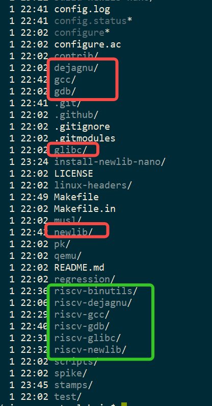
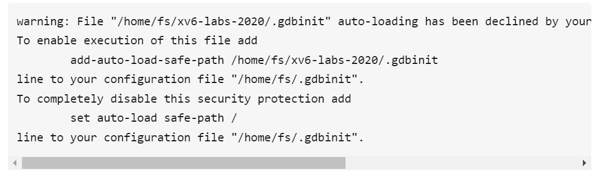
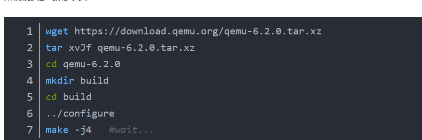

# 1.1 xv6编译及实验环境搭建

## 1. 前言

前面的部分是安装**2020年**课程的环境，最近**2023年**的课程环境，在最后面有补充~

## 2. **目的：**

MIT 6.S081 课程实验 

https://pdos.csail.mit.edu/6.S081/2020/schedule.html

## 3. **准备：**

1. Vmware 上用专业模式安装 ubuntu-20.04.5-desktop-amd64.iso
2. 换源：

cat /etc/apt/sources.list

```shell
deb https://mirrors.ustc.edu.cn/ubuntu/ focal main restricted universe multiverse
deb https://mirrors.ustc.edu.cn/ubuntu/ focal-updates main restricted universe multiverse
deb https://mirrors.ustc.edu.cn/ubuntu/ focal-backports main restricted universe multiverse
deb https://mirrors.ustc.edu.cn/ubuntu/ focal-security main restricted universe multiverse
```

​       

## 4. **第一步：**


### **1. 安装必要环境依赖：**

```shell
sudo apt-get install git build-essential gdb-multiarch qemu-system-misc gcc-riscv64-linux-gnu binutils-riscv64-linux-gnu 
```


注：20.04上用apt-get qemu版本直接可用，无需调整

> mit_6s081$ qemu-system-riscv64 --version
>
> QEMU emulator version 4.2.1 (Debian 1:4.2-3ubuntu6.23)

SourceURL:file:///home/uto_ykf/下载/手动搭建实验环境.docx

### **2. 下载 xv6-labs-2020/**

```shell
git clone git://g.csail.mit.edu/xv6-labs-2020
cd xv6-labs-2020
git checkout util
```

编译验证

执行：**make qemu**

如果一直没有报错：打印如下就说明内核编译通过了


## 5. **第二步：安装调试工具**

安装调试工具：riscv-gnu-toolchain/

### **1. 使用码云上下载**

git clone  https://gitee.com/mirrors/riscv-gnu-toolchain

cd riscv-gnu-toolchain

SourceURL:file:///home/uto_ykf/下载/手动搭建实验环境.docx

### **2. 下载子模块**

如果连接外网ok，直接下载即可：

git submodule update --init --recursive

否则：确定当前版本子模块的版本，因为这些子模块也需要用码云下载，否则太慢了

> riscv-binutils：riscv-binutils-2.35
>
> riscv-dejagnu：master
>
> riscv-gcc：riscv-gcc-10.2.0
>
> riscv-gdb：fsf-gdb-10.1-with-sim
>
> riscv-glibc：riscv-glibc-2.29
>
> riscv-newlib：master


注：这个是我2022-11月下载时选择的分支(**tag: 2022.10.11**)，


应该不会变化很多，如果后面用其他tag,编译报错，需要大家去仓库中选出当前commit对应的分支


SourceURL:file:///home/uto_ykf/下载/手动搭建实验环境.docx

(**tag: 2022.10.11**)对应的下载命令：

```sh
git clone https://gitee.com/mirrors/riscv-dejagnu

git clone -b riscv-gcc-10.2.0 https://gitee.com/mirrors/riscv-gcc

git clone -b riscv-glibc-2.29 https://gitee.com/mirrors/riscv-glibc

git clone https://gitee.com/mirrors/riscv-newlib

git clone -b riscv-binutils-2.35 https://gitee.com/mirrors/riscv-binutils-gdb riscv-binutils

git clone -b fsf-gdb-10.1-with-sim https://gitee.com/mirrors/riscv-binutils-gdb riscv-gdb
```


###  **3. 编译：**

**这里时最关键的地方**！很多文章这里没有说清楚

```sh
./configure --prefix=/usr/local
```

**然后替换Makefile文件**

因为直接用码云下载的子模块，文件名和原来代码中子模块的文件名不同



所以需要对生成的Makefile进行修改，主要是文件名的替换，两个地方


修改后进行编译：

sudo make -j2  // 我虚拟机用2个核编译，性能好的可以提高核心数


### **4. 导入环境变量**

vim  ~/.bashrc

在最后添加： export PATH="/usr/local/bin":$PATH


## 6. **第三步：**

### **验证环境：**


增加 riscv64-unknown-elf-gdb的启动配置信息

```sh
cd xv6-labs-2020
riscv64-unknown-elf-gdb kernel/kernel
```

会报错：



需要将

xv6-labs-2020/.gdbinit 的加载放在启动bash中：

1. 创建 ~/.gdbinit 文件，
2. 添加  

add-auto-load-safe-path /home/fs/xv6-labs-2020/.gdbinit

 

这样是为了配置调试环境，可以直接用gdb连接到xv6内核环境中


验证环境

```sh
cd xv6-labs-2020

make qemu-gdb
```

在另外一个窗口中：

```sh
cd xv6-labs-2020

gdb-multiarch kernel/kernel 
```

第一个窗口显示：


第二个窗口显示：


则说明配置完整了

## 7. 参考：

https://zhuanlan.zhihu.com/p/331492444

https://pdos.csail.mit.edu/6.S081/2020/tools.html

https://blog.csdn.net/limanjihe/article/details/122373942

https://blog.csdn.net/ALLap97/article/details/106345045


## 8. 2023-02-25 后记:


再次在ubuntu20.04上安装了一遍，基本上有以下几个改进：

1. 用最新的2023 开始学习：https://pdos.csail.mit.edu/6.S081/2023/schedule.html

现有的环境也可以支持编译和使用


2. ubuntu20.04 默认安装 qemu 版本是4.x

可以卸载


然后重新安装一个6.1.0的版本




3. 有时候在编译：riscv-gnu-toolchain时，可能需要安装一些库：

   ```sh
   sudo apt-get install gawk
   
   sudo apt-get install texinfo
   
   sudo apt-get install flex
   ```

   

4. 用上面的 riscv-gnu-toolchain **tag: 2022.10.11** 其实够用了，其他tag，不确定有没有坑。。