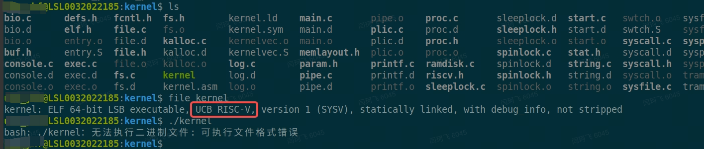
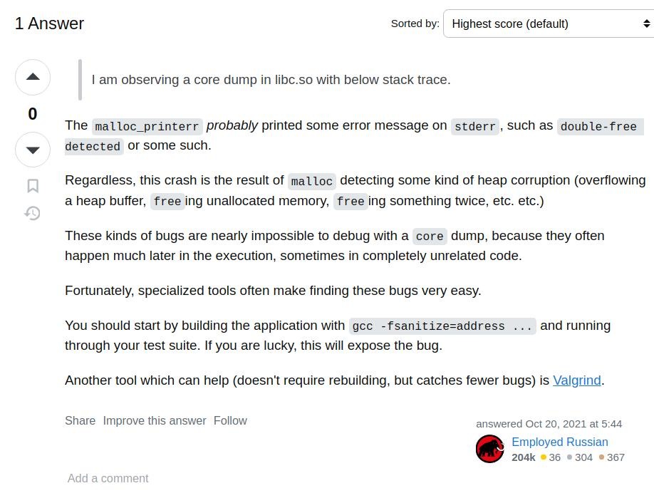

# riscv64 资料


## 介绍：

RISC-V 是一种基于精简指令集（RISC）原则设计的开源指令集架构（ISA），RISC-V 是开源的指令集架构


## 编译环境：

目前使用的编译环境：环境搭建的步骤：（todo）

### 工具：

```Makefile
riscv64-unknown-elf-gcc  
riscv64-unknown-elf-ld
riscv64-unknown-elf-objcopy
riscv64-unknown-elf-objdump
```

也就是通过 riscv64-unknown-elf- 前缀工具编译而成的文件，是不能在x86-64上运行的，但是可以在Qemu的模拟器环境上运行。



### 1. riscv64-unknown-elf-objcopy 选项

riscv64-unknown-elf-objcopy   -S  -O  binary initcode.out initcode   这个命令的作用是什么

> 这个命令的作用是将名为`initcode.out`的目标文件转换为二进制格式，并输出为名为`initcode`的二进制文件。具体参数解释如下：
>
> - `riscv64-unknown-elf-objcopy`: 这是一个用于处理目标文件的命令，通常用于裁剪、转换和重新定位目标文件。
> - `-S`: 表示在拷贝时不复制符号表。
> - `-O binary`: 表示输出格式为二进制。
> - `initcode.out`: 输入的目标文件名。
> - `initcode`: 输出的二进制文件名。
>
> 因此，该命令的作用是将`initcode.out`转换为二进制格式，并输出为`initcode`文件，同时不包含符号表信息。

### 2. riscv64-unknown-elf-ld  链接选项

`ld -z max-page-size=4096` 是一个用于链接器（ld）的选项，用于设置最大页大小为 4096 字节（4KB）。

链接器（ld）是用于将目标文件连接成可执行文件或共享库的工具。`-z max-page-size` 选项用于指定链接器在生成可执行文件时使用的最大页大小。在这种情况下，设置最大页大小为 4096 字节，意味着链接器将尽可能地对代码和数据进行 4KB 的对齐，以便更好地利用系统的页面机制。

```Plain
ld -T   kernel.ld  // 读取链接脚本
```

### 3. riscv64-unknown-elf-gcc   编译器选项

```Makefile
CFLAGS = -Wall -Werror -O -fno-omit-frame-pointer -ggdb -gdwarf-2
CFLAGS += -MD
CFLAGS += -mcmodel=medany
CFLAGS += -ffreestanding -fno-common -nostdlib -mno-relax
CFLAGS += -I.
CFLAGS += $(shell $(CC) -fno-stack-protector -E -x c /dev/null >/dev/null 2>&1 && echo -fno-stack-protector)

# Disable PIE when possible (for Ubuntu 16.10 toolchain)
ifneq ($(shell $(CC) -dumpspecs 2>/dev/null | grep -e '[^f]no-pie'),)
CFLAGS += -fno-pie -no-pie
endif
ifneq ($(shell $(CC) -dumpspecs 2>/dev/null | grep -e '[^f]nopie'),)
CFLAGS += -fno-pie -nopie
endif 
```

这段代码是一个编译kernel时， Makefile 中的变量设置部分，用于指定编译器选项（CFLAGS）。下面是每个选项的解释：

1. `-Wall`: 开启所有警告信息。
2. `-Werror`: 将警告视为错误，编译过程中如果有警告信息会导致编译失败。**重要，后面编译时，需要处理所有告警**
3. `-O`: 启用优化。
4. `-fno-omit-frame-pointer`: 禁用省略帧指针优化，保留函数调用栈帧指针。
5. `-ggdb`: 生成适用于 GNU Debugger (GDB) 的调试信息。
6. `-gdwarf-2`: 使用 DWARF 版本 2 格式的调试信息。
7. `-MD`: 生成依赖关系文件，用于自动检测源文件之间的依赖关系。
8. `-mcmodel=medany`: 指定内存模型为 medium any。这个选项用于限制代码和数据的大小，以适应特定的内存架构。
9. `-ffreestanding`: 声明程序在无操作系统支持的环境中运行。
10. `-fno-common`: 禁止全局变量的重复定义。
11. `-nostdlib`: 不使用标准库。
12. `-mno-relax`: 禁用指令优化。
13. `-I.`: 添加当前目录到头文件搜索路径中。
14. `$(shell $(CC) -fno-stack-protector -E -x c /dev/null >/dev/null 2>&1 && echo -fno-stack-protector)`: 这行代码使用 shell 命令来检查编译器是否支持 `-fno-stack-protector` 选项，并将其添加到 CFLAGS 中。

> `-fno-stack-protector` 是 GCC 编译器的一个选项，用于禁用栈保护功能。栈保护是一种编译器级别的安全功能，旨在检测和防止栈溢出攻击。
>
> 当启用栈保护功能时，编译器会在生成的可执行文件中插入一些代码，用于在函数调用过程中检测栈是否溢出。如果检测到潜在的栈溢出情况，程序将会触发异常或终止，以防止潜在的安全漏洞被利用。
>
> 通过使用 `-fno-stack-protector` 选项，编译器将不再插入这些栈保护代码，从而关闭栈保护功能。这可能会降低程序的安全性，因为栈溢出攻击有可能成功，导致程序受到损害。然而，在某些特定情况下，禁用栈保护功能可能是必要的，例如对于一些特殊需求或优化目的。

后面的两个 ifneq 语句用于在可能的情况下禁用 PIE（位置无关执行）选项，这通常是为了与特定工具链兼容，如 Ubuntu 16.10 的工具链。


#### **附： 三个常用的GCC选项：**

#### 1. **`-fsanitize=thread` 和 `-fno-inline` **

   是 GCC 编译器的两个选项，用于特定的目的：

**`-fsanitize=thread`**：

- 启用线程检测器（Thread Sanitizer）。
- Thread Sanitizer 是一个运行时工具，用于检测多线程程序中的数据竞争和其他并发错误。使用这个选项可以帮助发现并调试线程之间的竞争条件。
- 当使用这个选项编译程序时，GCC 会插入额外的代码来检查并发问题。在运行时，如果检测到数据竞争或其他并发问题，程序会报告这些问题的详细信息。

**`-fno-inline`**：

- 禁用函数内联优化。
- 内联优化是编译器将函数调用替换为函数体，从而减少函数调用的开销并提高性能。但是，内联可能会使得调试信息变得更加复杂。
- 使用 `-fno-inline` 可以强制编译器不对函数进行内联，有助于调试和分析代码，特别是在与 `-fsanitize=thread` 一起使用时，可以提高问题检测的准确性和报告的可读性。

 总结起来，这两个选项一起使用时，`-fsanitize=thread` 用于启用线程检测，找出多线程程序中的并发问题，而 `-fno-inline` 禁用内联优化，使得线程检测工具可以更准确地报告问题的源头和位置。


 #### **2. 检测数据竞争的用法 `-fsanitize=thread` **

**`在 lock的lab中有用到`**

启用 ThreadSanitizer（通过 `-fsanitize=thread` 选项）后，编译器会在生成的代码中插入一系列专用的函数，这些函数用于帮助检测和报告线程错误，特别是数据竞争问题。下面是一些关键的函数及其作用的详细解释。

**关键插入函数及其作用**

1. `__tsan_read` 和 `__tsan_write` 系列函数：
   1. `__tsan_read1`, `__tsan_read2`, `__tsan_read4`, `__tsan_read8`, `__tsan_read16`： 用于监视相应大小（1、2、4、8、16 字节）的内存读取操作。
   2. `__tsan_write1`, `__tsan_write2`, `__tsan_write4`, `__tsan_write8`, `__tsan_write16`： 用于监视相应大小的内存写入操作。
   3. 作用：这些函数会在程序的每个内存读取或写入操作时被调用，ThreadSanitizer 会使用这些信息来跟踪内存访问，并检测是否存在数据竞争。
2. `__tsan_func_entry` 和 `__tsan_func_exit`：
   1. 作用：这些函数用于跟踪函数调用的进入和退出。它们帮助 ThreadSanitizer 维护调用栈信息，以便在检测到问题时提供更准确的错误报告。
3. `__tsan_init`：
   1. 作用：用于初始化 ThreadSanitizer 的运行时环境。在程序开始执行之前，这个函数会设置好必要的内部数据结构和监控机制。
4. `__tsan_vptr_update` 和 `__tsan_vptr_read`：
   1. 作用：这些函数用于监视虚函数表（vtable）的更新和读取。它们特别用于 C++ 程序，以检测对象的类型和虚函数调用时的竞争情况。
5. `__tsan_atomic` 系列函数：
   1. 作用：这些函数用于监视原子操作，确保 ThreadSanitizer 能正确处理 C++11 中的原子操作和内存序列（memory order）语义。例如，`__tsan_atomic8_load`, `__tsan_atomic8_store` 等。

**插入函数的作用机制**

当启用 ThreadSanitizer 后，编译器在每个内存访问点插入适当的函数调用。例如：

- 对于读取一个 `int` 型变量（假设是 4 字节），编译器会插入 `__tsan_read4`。
- 对于写入一个 `int` 型变量，编译器会插入 `__tsan_write4`。

这些函数被插入到汇编代码中，当程序运行时，它们会被调用。ThreadSanitizer 的运行时库会捕获这些调用，并记录下每个内存访问的详细信息，包括访问的线程、内存地址、访问类型（读或写）、访问的大小等。


####  3. **检测数据安全的用法： `-fsanitize=address`**



用于检测 malloc  free 出现内存越界问题的场景
