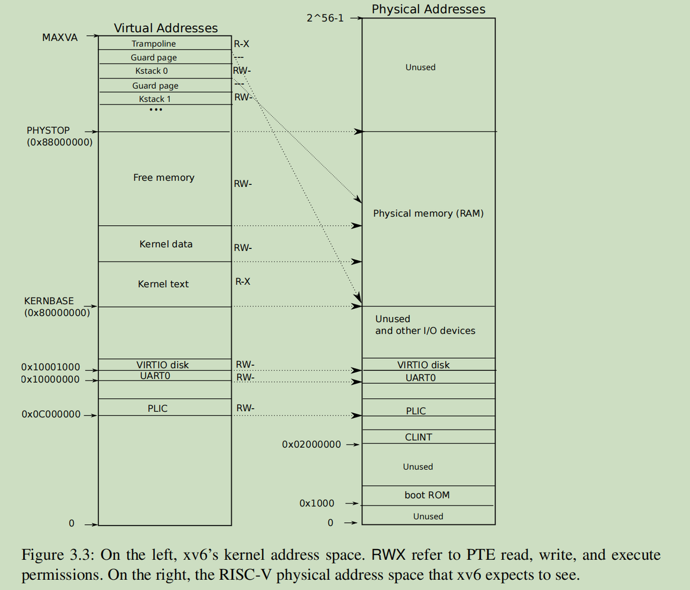
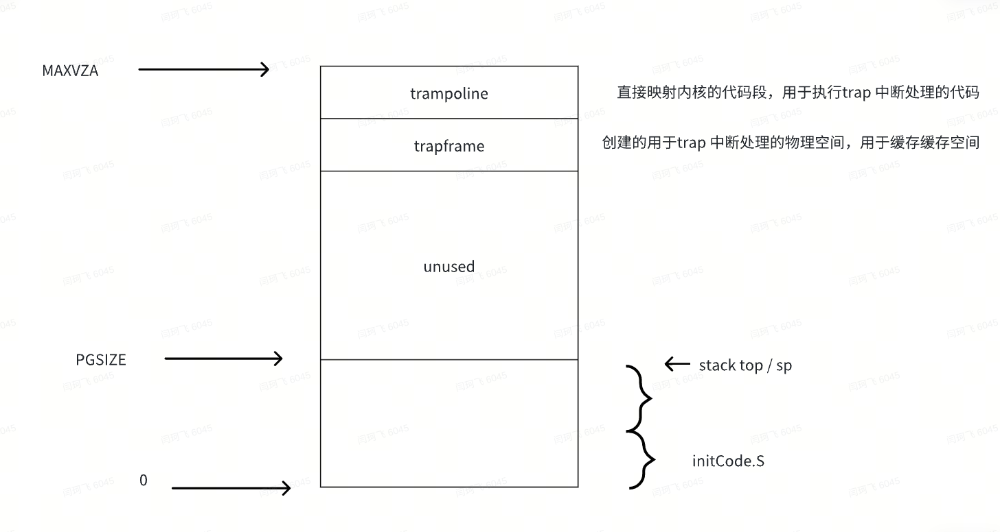
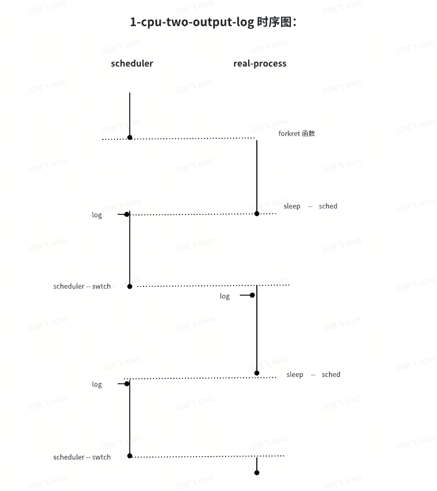
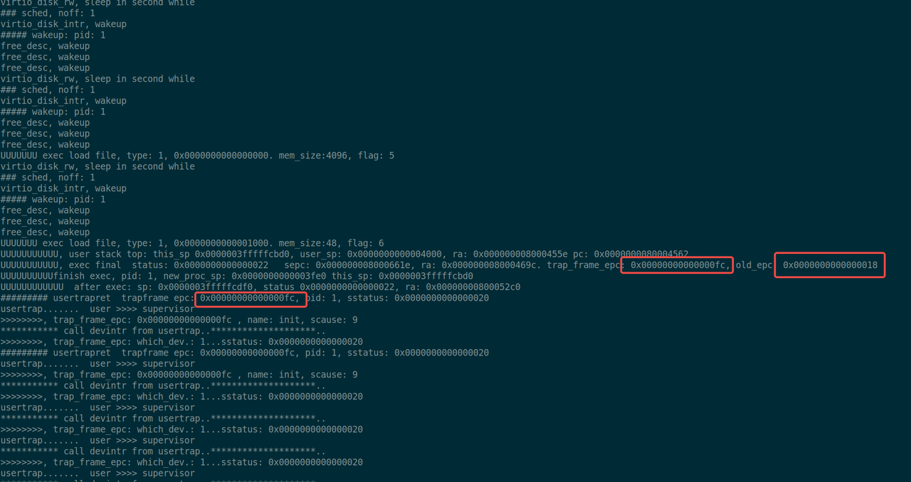

# 2.5 系统启动的流程

xv6 操作系统是如何启动的？下面会详细加以描述


## 1. 前言：真实操作系统的启动：

一般操作系统的 boot loader 程序在启动时会执行以下主要过程：

1. 启动引导加载程序：计算机在启动时会加载 boot loader 程序，这个程序通常存储在硬盘、固态硬盘或其他可引导设备的特定位置（比如主引导记录）。计算机在启动时会首先加载这个 boot loader 程序。
2. 硬件初始化：boot loader 程序会进行一些基本的硬件初始化工作，包括检测和配置内存、处理器、外设等硬件设备，以确保它们处于可用状态。
3. 加载操作系统内核：boot loader 程序的主要任务是加载操作系统内核到内存中，并将控制权转交给内核。这通常涉及**读取内核文件系统中的操作系统镜像**，并**将其复制到内存中的适当位置**。
4. 传递控制权：一旦内核被加载到内存中，boot loader 程序会将处理器的控制权转交给操作系统内核，使得操作系统能够接管计算机的控制权并继续系统的启动过程。

总的来说，boot loader 程序在计算机启动时扮演着关键的角色，负责进行硬件初始化、加载操作系统内核，并将控制权传递给内核，从而启动操作系统。

> When the RISC-V computer powers on, it initializes itself and runs a boot loader which is stored in read-only memory. **The boot loader loads the xv6 kernel into memory.** Then, in machine mode, the CPU executes xv6 starting at ***_entry (kernel/entry.S:7)***. The RISC-V starts with paging hardware disabled: virtual addresses map directly to physical addresses.

boot loader 只读程序 -->   entry.S（里面会有起始地址：_entry） --> start.c（start 函数）  --> main.c( main 函数)


## 2. qemu启动：

会模拟出一个内核镜像文件已经被加载的状态，并把控制权交给内核程序


## 3. **临时栈空间**



它是在kernel 内存空间的 bss段(data)的大数组中，充当一个临时的堆栈使用的。

地址范围： `0x000000008001a200` - `0x00000000800201e0`

布局如下：


也就是说，后面 main函数，以及schdueler函数的执行，都是在 上面bss 段临时的一个大数组中，作为栈使用的。

临时的栈地址大致位置如下：

```C
xv6 kernel is booting, pid: 0, stack0: 0x000000008001a200, sp: 0x000000008001b1e0
hart 5 starting, sp: 0x00000000800201e0
hart 3 starting, sp: 0x000000008001e1e0
hart 2 starting, sp: 0x000000008001d1e0
hart 4 starting, sp: 0x000000008001f1e0
hart 1 starting, sp: 0x000000008001c1e0
```


## 4. **在临时栈空间中运行的函数：**

下面的函数，都将在这个临时的栈空间中运行，而且一开始，用户地址空间都还不完整，不过只需要栈指针 sp，对应的栈空间，以及待执行的指令，程序也是可以运行起来的。

1. entry.S
2. start函数
3. main 函数
4. userinit 函数 （hart == 0）
5. scheduler 函数
6. initcode.s （由scheduler 调度来执行）


### 1. entry.S

The instructions at _entry set up a stack so that xv6 can run C code.

为什么操作系统的启动会从这个 `_entry` 开始？ 因为 kernel.ld 的链接脚本中，已经定义了系统的入口


目前可以确定，在XV6的启动过程中，每一个CPU都会从入口 _entry处开始执行的，所以初始化的堆栈

也就随之需要 NCPU 个了。

```C
# entry.S needs one stack per CPU.
# __attribute__ ((aligned (16))) char stack0[4096 * NCPU];  // NCPU 8


        # qemu -kernel loads the kernel at 0x80000000（协助加载kernel）
        # and causes each hart (i.e. CPU) to jump there.
        # kernel.ld causes the following code to
        # be placed at 0x80000000.
.section .text
.global _entry
_entry:
        # set up a stack for C.
        # stack0 is declared in start.c,
        # with a 4096-byte stack per CPU.
        # sp = stack0 + (hartid * 4096)    
        # stack0 = 0x000000008001a160 -  0x000000008001a180
        # 位于 内核空间的bss段中，随着代码的变动，位置可能也会变更
        
        la sp, stack0
        li a0, 1024*4
        csrr a1, mhartid   # 从 mhartid 中读取并加载到a1中，mhartid 从0递增
        # 为什么a1 在第一轮就从1开始，是因为需要先递增到栈顶，然后才能向下递增。。
        # , because the stack on RISC-V grows down
     
        addi a1, a1, 1  # 将a1 增加立即数1，然后保存到a1
        mul a0, a0, a1   # 乘法指令，将 a0 * a1, 然后保存到a0
        add sp, sp, a0   # 将sp 和 a0 相加，然后存回sp
        # jump to start() in start.c
        call start
spin:  # 表示循环开始
        j spin    #无限循环指令，表示完成start后不结束
```

所以，这个函数主要作用是在静态变量 stack0中初始化堆栈，开始调用 `start` 函数


### 2. start 函数

会在全局变量中，也就是data段中，声明了一个大小为 32KB 的字符数组 `stack0`，并要求编译器将该数组在内存中的起始地址按照 16 字节对齐，用作初始化的栈信息

而且会给每一个CPU一个4K的栈空间，来执行初始化操作

```C
// entry.S needs one stack per CPU.
__attribute__ ((aligned (16))) char stack0[4096 * NCPU];


// entry.S jumps here in machine mode on stack0.
void
start()
{
  // set M Previous Privilege mode to Supervisor, for mret.
  unsigned long x = r_mstatus();
  x &= ~MSTATUS_MPP_MASK;
  x |= MSTATUS_MPP_S;
  w_mstatus(x);

  // set M Exception Program Counter to main, for mret.
  // requires gcc -mcmodel=medany
  // 设置了每个cpu的起始执行点的地址，main函数
  w_mepc((uint64)main);

  // disable paging for now.
  // 关闭内存分页，开启时，只需要重新设置satp寄存器即可
  w_satp(0);

  // delegate all interrupts and exceptions to supervisor mode.
  w_medeleg(0xffff);
  w_mideleg(0xffff);
  w_sie(r_sie() | SIE_SEIE | SIE_STIE | SIE_SSIE);

  // configure Physical Memory Protection to give supervisor mode
  // access to all of physical memory.
  w_pmpaddr0(0x3fffffffffffffull);
  w_pmpcfg0(0xf);

  // ask for clock interrupts.
  timerinit();

  // keep each CPU's hartid in its tp register, for cpuid().
  int id = r_mhartid();
  w_tp(id);

  // switch to supervisor mode and jump to main().
  // 可以从当前的 machine 跳转到 supervisor 
  // pc 指向 main地址
  asm volatile("mret");
}
```


### 3. main 函数

只会有一个CPU的进程有额外的初始化操作外，所有进程都直接调用了 scheduler 函数，准备开始调度，那么说明临时栈空间，也会在后面调度时用到，很难想象，后面所有内核进程的执行切换，都其实需要依赖这个最原始的临时栈空间！

所以这里也隐藏了一个很惊人的事实：所有xv6的进程子所以会执行，就源自这里，将每一个cpu都启动了一个执行流，进程只不过是执行流上执行的一个基本单位而已。

```C
volatile static int started = 0;

// start() jumps here in supervisor mode on all CPUs.
void
main()
{
  if(cpuid() == 0){
    consoleinit();
    printfinit();
    printf("\n");
    printf("xv6 kernel is booting\n");
    printf("\n");
    kinit();         // physical page allocator
    kvminit();       // create kernel page table
    kvminithart();   // turn on paging
    // 这里会设置内核空间中，对应进程绑定栈空间的地址
    procinit();      // process table
    trapinit();      // trap vectors
    trapinithart();  // install kernel trap vector
    plicinit();      // set up interrupt controller
    plicinithart();  // ask PLIC for device interrupts
    binit();         // buffer cache
    iinit();         // inode table
    fileinit();      // file table
    virtio_disk_init(); // emulated hard disk
    userinit();      // first user process  开起第一个程序
    __sync_synchronize();
    started = 1;
  } else {
    while(started == 0)
      ;
    __sync_synchronize();
    printf("hart %d starting\n", cpuid());
    kvminithart();    // turn on paging
    trapinithart();   // install kernel trap vector
    plicinithart();   // ask PLIC for device interrupts
  }

  scheduler();        
}
```


### 4. userinit函数

问题：这个函数的作用是什么？

在还不满足执行exec的时候，将 initcode的代码加载到特殊的用户空间中，并让它满足执行 initcode.S的完整条件，因为后面会在 scheduler中调度了。当我们拥有了完整进程的执行条件后，需要做什么呢？对了，正式执行exec, 让之后的所有进程开始走上正确的轨道


问题：程序加载了initcode的内容到内存后，在什么地方真实地在用户空间来运行它呢？ 我推测，应该是 userinit 退出后，在start中的 **scheduler** 中来进行调度的

是的，uvmfirst 函数会将代码段加载到 0地址，而且简单地只映射了一个PAGE页面，而且后面 epc 和 sp 分别设置的是0，以及PGSIZE。

所以应该是从0地址来加载下面的这部分代码段，后面等调用ecall后，进而才会陷入内核态，开始执行sys_exec 函数，所以说，initcode 确实在一个用户空间中执行的，执行了之后，才有之后exec的事情。

命令 `od -t xC ../user/initcode` 的各部分含义如下：

- `od`: 命令名，表示要执行的是一个数据显示操作。
- `-t xC`: 这个选项指定了数据的显示格式。
  - `-t`: 选项用来指定后面跟随的格式。
  - `xC`: 表示以十六进制形式显示文件内容，并尝试将字节解释为ASCII字符。`x` 表示十六进制，`C` 表示字符。
- `../user/initcode`: 指定了要操作的文件路径。这里的路径意味着从当前目录的父目录中进入`user`目录，然后操作名为`initcode`的文件。

`od -t xC ../user/initcode` 这个命令会以十六进制形式显示`../user/initcode`文件的内容，并尽可能地将每个字节的数据解释成对应的ASCII字符。这对于查看或调试二进制文件中的内容非常有用。

```C
// a user program that calls exec("/init")
// assembled from ../user/initcode.S
// od -t xC ../user/initcode  // 这个是如何获取下面这段二进制内容的方法
uchar initcode[] = {
  0x17, 0x05, 0x00, 0x00, 0x13, 0x05, 0x45, 0x02,
  0x97, 0x05, 0x00, 0x00, 0x93, 0x85, 0x35, 0x02,
  0x93, 0x08, 0x70, 0x00, 0x73, 0x00, 0x00, 0x00,
  0x93, 0x08, 0x20, 0x00, 0x73, 0x00, 0x00, 0x00,
  0xef, 0xf0, 0x9f, 0xff, 0x2f, 0x69, 0x6e, 0x69,
  0x74, 0x00, 0x00, 0x24, 0x00, 0x00, 0x00, 0x00,
  0x00, 0x00, 0x00, 0x00
};

// Set up first user process.
void
userinit(void)
{
  struct proc *p;
  // 在这个函数的结尾，也会执行 context.ra的值为forkret， sp的值为 kstack + PGSIZE,
  // 所以，实际上，后面initCode函数的加载，也是会经过 forkret函数的 context的ra寄存器的设置
  p = allocproc();
  initproc = p;
  
  // allocate one user page and copy initcode's instructions
  // and data into it.
  // 会在0号虚拟地址映射一个大小为PGSIZE的页，然后将initCode.S 的内容拷贝进去
  // 这个是initproc中，除了trapframe页，pagetable 根页面 外，申请的第三个 PGSIZE的物理空间
  // 不过后面等initCode 调用了 exec后，这些过度状态，都会被清理掉，然后加载上 init 进程的一些信息
  uvmfirst(p->pagetable, initcode, sizeof(initcode));
 

  // 重要，因为后面exec的时候，还需要进行释放，
  // 第一个进程，sz只能设置为默认值，而后面其他进程是由exec加载可执行程序来设置的sz值
  p->sz = PGSIZE;

  // prepare for the very first "return" from kernel to user.
  // 重要，相当于在一个PGSIZE的大小中，0地址的地方放置 initCode的代码段
  //      在PGSIZE的顶部位置，方式一个sp的指针，完成了一个简陋的地址空间的搭建
  p->trapframe->epc = 0;      // user program counter
  p->trapframe->sp = PGSIZE;  // user stack pointer

  safestrcpy(p->name, "initcode", sizeof(p->name));
  p->cwd = namei("/");

  p->state = RUNNABLE;

  release(&p->lock);  // 正常情况下 allocproc返回的结果是不release lock的
}
```


#### 第一个进程的特殊用户空间：

进程空间如下所示， 完全是由userinit 函数构建的，代码段和堆栈共用一个 PGSIZE页。注意，当执行完userinit之后，和一般用fork + exec加载的用户空间非常不一样，而且目前根据观察，在执行initcode.S 的时候，sp指针直到执行exec时，trapframe_sp的值还是 `0x0000000000001000`



问题：为什么pid为1的第一个进程，不能直接exec init.c 用户进程的信息，而需要先创建一个特殊的用户进程，以及对应的用户空间呢？

- 第一个最重要的原因，是exec也是需要现有一个进程，它才能进行覆盖操作
- 在scheduler之后创建，那么所有创建的进程逻辑，都能得到统一处理。


### 5. scheduler

这个函数的作用是进程执行的调度，详细请看后面相关章节

这里需要说明的是，这个函数在操作系统整个声明周期中的执行，是在临时栈空间中完成的

```c
// Per-CPU process scheduler.
// Each CPU calls scheduler() after setting itself up.
// Scheduler never returns.  It loops, doing:
//  - choose a process to run.
//  - swtch to start running that process.
//  - eventually that process transfers control
//    via swtch back to the scheduler.
void
scheduler(void)
{
  struct proc *p;
  struct cpu *c = mycpu();

  c->proc = 0;
  for(;;){
    // The most recent process to run may have had interrupts
    // turned off; enable them to avoid a deadlock if all
    // processes are waiting.
    intr_on();

    for(p = proc; p < &proc[NPROC]; p++) {
      acquire(&p->lock);
      if(p->state == RUNNABLE) {
        // Switch to chosen process.  It is the process's job
        // to release its lock and then reacquire it
        // before jumping back to us.
        p->state = RUNNING;
        c->proc = p;
        swtch(&c->context, &p->context);

        // Process is done running for now.
        // It should have changed its p->state before coming back.
        c->proc = 0;
      }
      release(&p->lock);
    }
  }
}
```


### 6. initcode.S

上面的4个步骤，就是为了执行 initcode.S 的内容，也就是去使用exec创建一个真正意义的进程，当 exec 一个 `init` 入口程序后，后面shell的进程都会在init 程序中再次创建

在经过scheduler 调度后，initcode.S的执行过程，因为代码是汇编指令，所以在用户空间时，内存空间如上，是一个比较特殊的用户态空间。

当执行到ecall之后，就会进入kernel态的空间

```Assembly
# Initial process that execs /init.
# This code runs in user space.  疑问，为什么会在user space 里面来执行这个代码？
#                                是因为等调度到这个进程的执行时，还是会先执行：forkret，那么就会从
#                                usertrapret 函数返回，从而正式从s模式进入U模式

#include "syscall.h"

# exec(init, argv)
.globl start
start:
        la a0, init        // 将 下面init字符串的地址加载到a0，
                           // a0 用语存放 exec 系统调用的第一个参数，即要执行的程序路径
        la a1, argv        // 将 argv数组的地址放在a1中，a1 是exec的第二个参数，传参给程序
        li a7, SYS_exec    // 将 SYS_exec的值加载到a7
        ecall

# 一旦上面的 /init 程序执行完，接下来的代码就会执行 下面的 `exit`系统调用退出程序
# 而实际上,代码是不会执行到下面的,因为在exec之后，旧的页表信息会全部被回收，也就是之前 在init为1的
# 进程中，在0地址映射的一个PAGE的那部分物理内存
#
# 程序退出
# for(;;) exit();
exit:
        li a7, SYS_exit
        ecall
        # jal exit 跳转回exit标签，形成一个无限循环。理论上，ecall执行exit系统调用后，
        # 程序应该已经退出，不会再执行到这一步。这个循环是一种保险，以确保如果出于某种
        # 原因系统调用失败，程序不会继续执行下去，而是停留在这个循环中。
        jal exit

# char init[] = "/init\0";
init:
  .string "/init\0"

# char *argv[] = { init, 0 };
.p2align 2   // 保证 argv数组在内存中正确对齐
argv:
  .long init    // 在数组中放入 `init` 字符串的地址，作为第一个参数
  .long 0       // 用一个空指针标记数组的结束
```

基本上只要第一个临时进程exec了 init程序，那么就会启动正式的进程，整个初始化过程也就完成了，同时也会将之前的那个userinit创建的临时进程（即使用了特殊用户空间）清理掉


## 5. 进入Kernel 态栈空间：

在main函数中，`procinit` 方法用于初始化所有预分配进程的内核态栈空间，所有进入内核态的进程，都会在这个这些栈空间中运行，默认预分配64个进程的栈空间

基本在 `0x0x0000003fffffc000` -  `0x0000003ffff7e000`  这个地址范围

```C
kstack...  index: 0, kstack: 0x0000003fffffc000
kstack...  index: 1, kstack: 0x0000003fffffa000
kstack...  index: 2, kstack: 0x0000003fffff8000
kstack...  index: 3, kstack: 0x0000003fffff6000
kstack...  index: 4, kstack: 0x0000003fffff4000
kstack...  index: 5, kstack: 0x0000003fffff2000
kstack...  index: 6, kstack: 0x0000003fffff0000
kstack...  index: 7, kstack: 0x0000003ffffee000
......
kstack...  index: 56, kstack: 0x0000003ffff8c000
kstack...  index: 57, kstack: 0x0000003ffff8a000
kstack...  index: 58, kstack: 0x0000003ffff88000
kstack...  index: 59, kstack: 0x0000003ffff86000
kstack...  index: 60, kstack: 0x0000003ffff84000
kstack...  index: 61, kstack: 0x0000003ffff82000
kstack...  index: 62, kstack: 0x0000003ffff80000
kstack...  index: 63, kstack: 0x0000003ffff7e000
```

在initcode.S 中，经过ecall后，陷入trap后，进入内核态，执行 usertrap，然后接着执行 syscall 函数，，也就是 SYS_exec 的执行在kernel 态的栈中执行，包括整个的 `sys_exec` 和 `exec` 函数。

因为打印发现，初始化时，执行exec 函数，sp指针位于  `0x0000003fffffcbd0`，而pc 寄存器和 ra寄存器表示当前的代码是位于内核栈的text段中，ra: `0x0000000080004476` pc: `0x000000008000447a`,（比临时栈空间地址小)

而当exec执行完毕，那么会将initcode.S 原有的页表映射的物理内存全部清理掉，并将trapframe->epc（sepc 寄存器将是一个后面后面trap结束后，任务开始的地方）设置为init 可执行文件的入口地址：`0x00000000000000fc`,，而之前的epc是：0x0000000000000018，应该是之前 initcode.S 里面的exit的地址，不过基本上永远不会执行到这个地方。

当exec退出，syscall退出后，执行 `usertrapret` 函数，恢复epc等信息到寄存器，然后调用汇编指令：`userret`，返回用户模式，进而开始执行用户进程init。（这部分请参考后面 trap部分的内容，这里只描述整个start的流程）


## 6. 最终，使用标准的用户态栈空间：


在xv6的系统中，stack的top一般地址为： `0x0000000000004000`，可能是一般  data 和  text 段比较小，所以栈的位置是靠近底部的

第一个真正意义的用户进程，是init进程：


### 1. init.c 进程，以及完成启动

疑问，为什么会在user space 里面来执行这个代码？

因为执行完exec后，会先退出syscall函数，然后进入`usertrapret`函数，恢复epc等相关的信息，那么CPU将跟进epc等寄存器，自动进入用户空间来执行 /init 的process，而且更重要的，init.c里面的内容已经不属于内核管理的范围，可以放在用户程序中来完成，如需使用系统调用接口，直接调用即可。

下面的这句原文说的比较简单：

> Once the kernel has completed exec, it returns to user space in the /init process

```C
char *argv[] = { "sh", 0 };

int
main(void)
{
  int pid, wpid;

  if(open("console", O_RDWR) < 0){
    mknod("console", CONSOLE, 0);
    open("console", O_RDWR);
  }
  dup(0);  // stdout
  dup(0);  // stderr

  for(;;){
    printf("init: starting sh\n");
    pid = fork();
    if(pid < 0){
      printf("init: fork failed\n");
      exit(1);
    }
    if(pid == 0){
      exec("sh", argv);
      printf("init: exec sh failed\n");
      exit(1);
    }

    for(;;){
      // this call to wait() returns if the shell exits,
      // or if a parentless process exits.
      wpid = wait((int *) 0);
      if(wpid == pid){
        // the shell exited; restart it.
        break;
      } else if(wpid < 0){
        printf("init: wait returned an error\n");
        exit(1);
      } else {
        // it was a parentless process; do nothing.
      }
    }
  }
}
```

然后会在里面 fork一个进程，然后exec 上 sh，sh 就是交互的shell中断进程。 到此，正式拉起了所有必要服务,  **xv6 正式启动了~~~**


## 7. 从一些日志打印中，观察整体过程描述：

Ref;   [xv6_init_2024_0412.log](./log_file/xv6_init_2024_0412.log) （早期日志）

启用一个CPU的情况

Ref:   [xv6-start-2024-0423.log](./log_file/xv6-start-2024-0423.log) (1cpu-log)  

[1_cpu_1_output.txt](./log_file/1_cpu_1_output.txt)  

[04-26-one-cpu-two-output.log](./log_file/04-26-one-cpu-two-output.log) (1cpu-two-output-log)



启用三个CPU的情况

Ref: [0426_3_cpu_2_output.log](./log_file/0426_3_cpu_2_output.log)    [04-26_3_cpu_3_output.log](./log_file/04-26_3_cpu_3_output.log)

关键的日志：



TODO

通过日志分析，在main函数中，直到执行了 scheduler 函数后，在函数userinit 中，注册的初始化代码 initcode 也还没有执行到，是需要在后面的调度中，才被执行，但是在之前initcode的代码之前，竟然还执行了 一些  virtio_disk_rw 所引起的一些sleep 和 wakeup的操作，需要对 disk的一些操作做一些探究。具体的部分，会在 **driver 部分**中进行介绍
