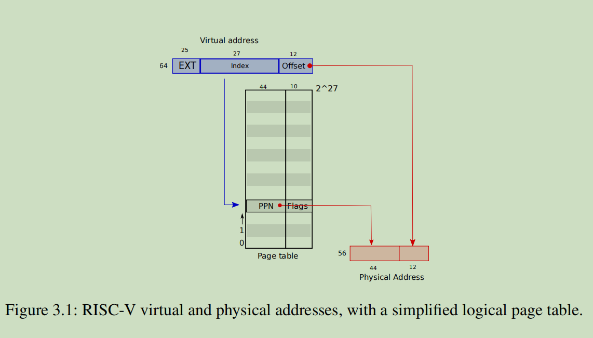
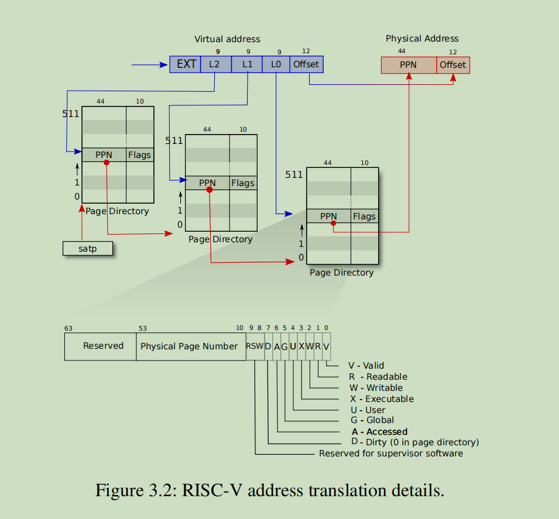

# 3.1 Address translation(地址映射)

内存管理在xv6 里面的实现，是非常精巧以及轻量化的，这对于想对这部分内容有一个初步理解，便于将来对工业级操作系统，如linux 里面的内存管理做更进一步的学习，起到了促进作用

## 基本信息：

RISC-v架构，只用到64位中的**`前39位`**虚拟地址，39位中，**`低12位`**表示偏移量，中间的**`27位`**来映射页表条目。

物理地址上的一个page 页，目前是4096bytes大小，4k. 对齐的，可以由物理地址来直接访问。

- **Q**：page页的划分，是如何进行的？可以肯定，不是由虚拟地址的指向来完成的，因为虚拟地址可能是任意一个地址

  **A**：由物理地址来直接指定的，物理地址中高44位来指向物理页的索引，见（下面单级和多级映射的图片），这也是PPN（physical page number）名称的由来

## 第一版：直接映射

PTEs: 页表条目，为了和虚拟地址中的27位对应上，所以页表的大小有 2^27 个entry. 
           一个entry的是54位，高44位包含PPN(physical page number), 低10位用来包含属性flags.
具体映射时，将PTE中包含的PPN以及虚拟地址低12位offet拼接起来，组成一个56-bit 的物理地址，如下图所示：
虚拟地址：还有 64-39 = 25 bite的预留位，总的虚拟地址大小：2^39 = 512GB，够用
物理地址：还有 64-54 = 10 bite的预留位

## 第二版：多级映射

不是由上面的一次PPN映射，而是由三次PPN映射，来获取到物理地址的PPN

- **Q**：如何保存page table ?

​	**A**: 在三次PPN映射中，每一次映射的page table 的大小为512，目前保存在一个独立的page中。也就是说，构建映射过程的工具空间，也统一用page来存放。

- **Q**:一个page为何是4096个字节？

​	**A**: 可能和这个有关系：因为地址的最后12个字节表示偏移量，其他的位数都用来在 page table 中进行寻址，所以最后12位可能存在数学上的含义，可以对地址在这个范围内进行增减，而12个字节，刚好可以活动的范围就是4096字节，也就是一个page的大小，获取偏移量12个字节的大小，就是这样设计出来的。

>To tell a CPU to use a page table, ***the kernel must write the physical address of the root page table page into the satp register.*** A CPU will translate all addresses generated by subsequent instructions using the page table pointed to by its own **satp**. Each CPU has its own **satp** so that different CPUs can run different processes, each with a private address space described by its own page table.

## 两种映射方式的比较

多级映射：可以有效节约非必要的 PTEs 申请。需要512 * 512 * 512 = 2^27 个条目信息，但是不需要一次全部申请，尤其当只只涉及低地址时，可以节约非常多的条目内存信息。

直接映射：需要一次申请 2^27 个 页表条目

参考：

> 1. 直接映射（Direct Mapping）：
>    1. 优点：直接映射方式简单高效，每个虚拟页面都直接对应一个物理页面，查找速度快。
>    2. 缺点：直接映射需要大量的物理内存空间，当虚拟地址空间较大时，需要更多的物理内存来进行映射。此外，在某些情况下，如果虚拟地址空间中的页面并未充分利用，会导致物理内存的浪费。
> 2. 多级映射（Multilevel Mapping）：
>    1. 优点：多级映射可以节省物理内存，只在需要时分配物理页面。它通过使用层次结构的页表来减小页表的大小，从而节省了内存空间。
>    2. 缺点：多级映射比直接映射复杂一些，需要额外的开销来处理多级页表结构。这可能会导致访问页表的速度变慢，因为需要多次查找和访问内存。

TLB： Translation Look-aside Buffer

因为采用了多次页表的映射，所以需要提前获取到每一级的PTEs, 虽然能够有效地节约每一个进程的页表内存，但是也会增加访问的频率，有必要使用一个缓存，来保存之前访问过的 page table  entries. 也就产生了TLB
