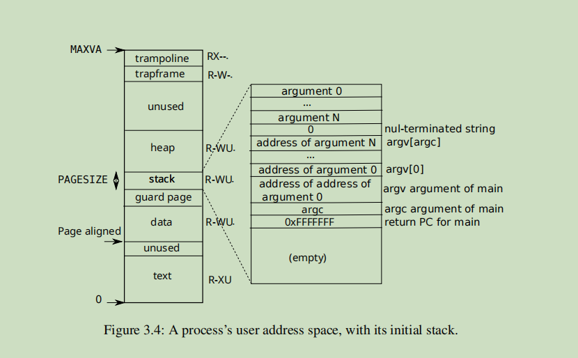

# 3.3 User address space

## 1. 用户地址空间信息：

```C
#define TRAMPOLINE (MAXVA - PGSIZE)          // 0x4000 000000L - 4096
// User memory layout.
// Address zero first:
//   text
//   original data and bss
//   fixed-size stack
//   expandable heap
//   ...
//   TRAPFRAME (p->trapframe, used by the trampoline)
//   TRAMPOLINE (the same page as in the kernel)
#define TRAPFRAME (TRAMPOLINE - PGSIZE)   # 
```


### 1. 用户空间的图示：



> the kernel maps a page  with trampoline code at the top of the user address space (without PTE_U), thus a single page of physical memory shows up in **all address spaces（应该是所有用户进程的地址空间中）**, but can be used only by the kernel.


- **Q**：**当用户空间往一个文件或者地址写入东西的时候，什么时候会直接写入？什么时候会跳到内核空间写入？以及什么时候会做内存映射**？

关于内存部分

- **硬件（MMU）**：负责在运行时将虚拟地址转换为物理地址，主要通过页表和 TLB 来完成。
- **操作系统**：负责建立和维护页表，处理页缺失，管理 TLB 刷新等工作。

实际的地址转换操作在大多数情况下是由硬件来完成的，而操作系统主要在管理和异常处理（如页缺失）中发挥作用。

2. 关于文件等描述符

这些都是在内核中进行读写的


## 2. 关键函数

### 1. growproc 函数

**Q：growproc 函数里面，如何控制申请内存的大小是否突破了进程地址空间的大小**？

1. 首先，growproc函数针对申请内存大小的限制，全部在 uvmalloc函数的 kalloc 函数，为何这样说？

首先用户进程的地址空间很大，从栈 + heap 直到  trapframe 页，都是这个区域，地址空间的上限在 MAXVA ，也就是 0x0000004000000000  38位，很大

​      但是所有空间都需要从内核中映射，也就是 从 kalloc函数中获取，这个空间有:

​      end （内核的数据段，代码段等） 到  PHYSTOP   0x88000000L 的空间，比可用的用户空间小太多了


2. 根据上面的大小比较，很容易得出，整个申请内存的上限由 kalloc函数来支撑，所以代码中无需考虑映射的虚拟地址超过上限，因为实际从内核申请的内存不允许这样做。

3. 所以整个过程，只需要关注 kalloc 申请是否成功就可以了，无需关注  process->sz 的大小范围

```C
// Grow or shrink user memory by n bytes.
// Return 0 on success, -1 on failure.
int
growproc(int n)
{
  uint64 sz;
  struct proc *p = myproc();

  // sz 表示进程占用的内存空间的大小，这个表示什么含义？用于后面进程释放虚拟内存的PTE等结构，以及实际对应的物理内存
  sz = p->sz;
  if(n > 0){
    if((sz = uvmalloc(p->pagetable, sz, sz + n, PTE_W)) == 0) {
      return -1;
    }
  } else if(n < 0){
    sz = uvmdealloc(p->pagetable, sz, sz + n);
  }
  p->sz = sz;
  return 0;
}
```


#### 1.1 --uvmalloc 函数

```Plain
uvmalloc 的过程是将  4096 到 8192 这部分进行处理，  oldsz  newsz 都不需要对齐 page，但
oldsz到 4096 这部分就丢掉了，没有理解很明确

有一个解释的角度：
目前从makefile文件来看，连接的文件，各个段都是对齐 0x1000的，所以oldsz必然是对齐page，而且后面
递增也是按照page大小来递增，所以不会有问题，而且在exec中，也会专门对这个addr是否对齐做校验的，
所以也不会有问题，查看elf各段的信息，如下图片所示：

-                       8192(fainal )
//
//
//
-------------           newsz: 7000
//
//
-                       4096

---------------         oldsz
```


```C
// Allocate PTEs and physical memory to grow process from oldsz to
// newsz, which need not be page aligned.  Returns new size or 0 on error.
// 为什么不需要对齐？因为内部已经做过了处理
// 作用：将从oldsz 到 news这段的虚拟地址，映射到实际的物理内存上
uint64
uvmalloc(pagetable_t pagetable, uint64 oldsz, uint64 newsz, int xperm)
{
  char *mem;
  uint64 a;

  if(newsz < oldsz)
    return oldsz;

  // 对齐向上递增的下一个PAGE位 ？ 为什么
  // 详细说：
  // 一开始 p->sz 是对齐的，所以第一次申请的时候，物理内存是PGSIZE的对齐格式，即使oldsz到newsz
  // 的大小不到PGSIZE，那么也已经完成了物理内存的提前申请，只要访问，就能访问到
  // 那么后面再申请物理内存的时候，也就无需重复申请了，申请新的物理内存也就足够，所以这里向上做了对齐
  oldsz = PGROUNDUP(oldsz);
  // 对于 newsz, 按照这种方式，一定会对齐，最多最后一个page的顶部有些浪费，也无妨
  for(a = oldsz; a < newsz; a += PGSIZE){
    mem = kalloc();
    if(mem == 0){
      uvmdealloc(pagetable, a, oldsz);
      return 0;
    }
    // 主要这个地方，也就是说，所有申请的物理内存，首先的一件事情，就是将内存给清0
    memset(mem, 0, PGSIZE);
    // 如果kalloc成功，那么将 mem开始的pa， 映射到 a开始的va上
    if(mappages(pagetable, a, PGSIZE, (uint64)mem, PTE_R|PTE_U|xperm) != 0){
      kfree(mem);
      uvmdealloc(pagetable, a, oldsz);
      return 0;
    }
  }
  return newsz;
}
```

#### 1.2 --uvmdealloc 函数

```Plain
uvmdealloc 的过程是将  4096 到 8192 这段都进行了处理，多清理了上面的部分

应该就是 uvmalloc，每次向上对齐的多余部分了？？ 是的，因为在uvmalloc的逻辑，对现在的
oldsz(uvmalloc 里面的 newsz)，已经做过了向上对齐的操作

-                       8192
//
//
---------------         oldsz
//
//
-                       4096

---------------         newsz
```

```C
// Deallocate user pages to bring the process size from oldsz to
// newsz.  oldsz and newsz need not be page-aligned, nor does newsz
// need to be less than oldsz.  oldsz can be larger than the actual
// process size.  Returns the new process size.

// newsz <  oldsz
//  [newsz  < oldsz]
uint64
uvmdealloc(pagetable_t pagetable, uint64 oldsz, uint64 newsz)
{
  if(newsz >= oldsz)
    return oldsz;

  // 将newsz 向上 ，oldsz也向上， 那么清理的区域就是包含了 oldsz以上的部分
  // 详细说：
  // [0][1- 4096][4097-8192]
  // 如果 newsz 和 oldsz 在一个PGSIZE里面的时候,其实按照这个算法，是不会进入清理逻辑的
  // 即使 newsz 和 oldsz ，一个是4097， 一个是8192， 也不会清理
  // 只有当newsz 降到4096的时候，那么oldsz 即使是4097，那么也会清理掉[4096-8091]这个区域的数据
  // 对边界计算地非常清楚，非常巧妙的方法
  
  /*
  int a = 0;  // 0
  int a_ = 4095;   // 4096
  int b = 4096;    // 4096
  int b_ = 8191;   // 8192
  printf("%d, %d\n", PGROUNDUP(a), PGROUNDUP(a_));   // 0  4096
  printf("%d, %d\n", PGROUNDUP(b), PGROUNDUP(b_));   // 4096  8192
  */
  
  if(PGROUNDUP(newsz) < PGROUNDUP(oldsz)){
    int npages = (PGROUNDUP(oldsz) - PGROUNDUP(newsz)) / PGSIZE;
    // 将 va 对应的物理内存都清理掉， 1表示 free
    uvmunmap(pagetable, PGROUNDUP(newsz), npages, 1);
  }

  return newsz;
}
```


### 2. uvmfree 函数

```C
// Free user memory pages,
// then free page-table pages.
void
uvmfree(pagetable_t pagetable, uint64 sz)
{
  if(sz > 0)
    // 释放所有映射的物理内存页， do_free 置为 1
    uvmunmap(pagetable, 0, PGROUNDUP(sz)/PGSIZE, 1);
  // 执行前，需要保证叶子节点已经被释放了
  freewalk(pagetable);
}
```


#### 2.1 --uvmunmap 函数

简单来说，是将所有之前映射虚拟内存的PTE结构全部查找，并释放（do_free 置为非0）

```C
#define PTE_FLAGS(pte) ((pte) & 0x3FF)    //  取最后的10位


// Remove npages of mappings starting from va. va must be
// page-aligned. The mappings must exist.
// Optionally free the physical memory.

// walk的另外一个作用是将 page table 页的内容全部置为0清理掉，所以也是一种unamp的方式
void
uvmunmap(pagetable_t pagetable, uint64 va, uint64 npages, int do_free)
{
  uint64 a;
  pte_t *pte;

  if((va % PGSIZE) != 0)
    panic("uvmunmap: not aligned");

  for(a = va; a < va + npages*PGSIZE; a += PGSIZE){
    // 将alloc的参数设置为0
    if((pte = walk(pagetable, a, 0)) == 0)
      panic("uvmunmap: walk");
    if((*pte & PTE_V) == 0)
      panic("uvmunmap: not mapped");
    // 不应该只有一个 PTE_V，还有很多其他的类型
    if(PTE_FLAGS(*pte) == PTE_V)
      panic("uvmunmap: not a leaf");

    if(do_free){
      uint64 pa = PTE2PA(*pte);
      kfree((void*)pa);
    }
    *pte = 0;
  }
}
```

#### 2.2 -- freewalk 函数

```C
// Recursively free page-table pages.
// All leaf mappings must already have been removed.
void
freewalk(pagetable_t pagetable)
{
  // there are 2^9 = 512 PTEs in a page table.
  for(int i = 0; i < 512; i++){
    pte_t pte = pagetable[i];
    // 判断  pte & PTE_V 表示可用
    // 判断 pte & (PTE_R|PTE_W|PTE_X) 的结果是否为0， 为0 表示是一个非叶子节点的page
    if((pte & PTE_V) && (pte & (PTE_R|PTE_W|PTE_X)) == 0){
      // this PTE points to a lower-level page table.
      uint64 child = PTE2PA(pte);
      freewalk((pagetable_t)child);
      pagetable[i] = 0;
    } else if(pte & PTE_V){
      panic("freewalk: leaf");
    }
  }
  kfree((void*)pagetable);
}
```


### 3. copyout 函数

copy data to and from user virtual addresses provided as system call arguments

```C
-----     dstva + len                    （最后一次循环，将剩余的部分进行拷贝）

------    4096 * 3    dst_va_   va_  pa0 （第二次循环，拷贝到这个位置）


-----      8192        dstva_  va0_  pa0  (第一次循环，拷贝到这个位置)


-----      dstva                          （开始的位置）

-----      4096        va0   pa0
```

Src 是内核空间的地址，可以直接访问，dstva是用户空间的数据，需要先转换为内核空间可以访问的地址

从dstva开始查找映射在哪一个页表中，然后直接针对物理内存的页表进行处理

内核空间访问物理页表是可以直接访问的

```C
// Copy from kernel to user.
// Copy len bytes from src to virtual address dstva in a given page table.
// Return 0 on success, -1 on error.
int
copyout(pagetable_t pagetable, uint64 dstva, char *src, uint64 len)
{
  uint64 n, va0, pa0;

  while(len > 0){
    // 这里的对齐，是处理开始第一次循环，不对齐的问题
    va0 = PGROUNDDOWN(dstva);
    pa0 = walkaddr(pagetable, va0);
    if(pa0 == 0)
      return -1;
    n = PGSIZE - (dstva - va0);

    // 保证n 为单次拷贝的长度
    if(n > len)
      n = len;
    // 一开始的时候，处理不对齐的问题
    // 后面就是以PGSIZE为单位进行处理了
    memmove((void *)(pa0 + (dstva - va0)), src, n);

    len -= n;
    src += n;
    dstva = va0 + PGSIZE;
  }
  return 0;
}
```


**Q**: 为什么内核的代码，就可以直接访问物理的页表地址呢？因为不需要映射页表？

是的，可以直接访问物理地址，比如kalloc.c中，是可以直接对物理内存做申请的, 因为都在内核空间中
