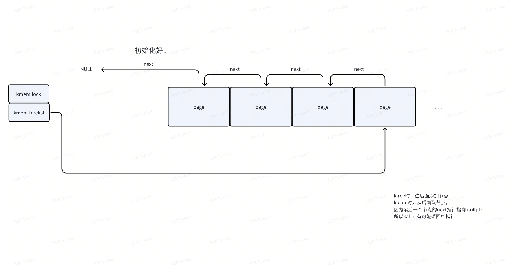

# 3.4 Physical memory allocator

## 针对节点结构体的描述：

```Go
struct run {
  struct run *next;
};
```

如果page已经交给了使用者，那么整个4096个字节的部分，都会被完整的交给使用者，如果使用完毕，那么里面头部的8字节内容会被初始化为指针，用于结构的保存，所以这个结构体的样子才定义为这样。


## 初始化过程

```C
extern char end[]; // first address after kernel.
                   // defined by kernel.ld.  
                   // 目前在的位置，位于内核空间中  Free Memory 和 Kernel data 之间的间隔区域

struct run {
  struct run *next;
};

struct {
  struct spinlock lock;
  struct run *freelist;
} kmem;

void
kinit()
{
  initlock(&kmem.lock, "kmem");
  freerange(end, (void*)PHYSTOP);  // 初始化整个 Free Memory的区域
}

void
freerange(void *pa_start, void *pa_end)
{
  char *p;
  p = (char*)PGROUNDUP((uint64)pa_start);   // 向上对齐一个 page的地址
  for(; p + PGSIZE <= (char*)pa_end; p += PGSIZE)
    kfree(p);
}
```

初始化完成，内存布局：一个单链表



## free 函数

```C
// Free the page of physical memory pointed at by pa,
// which normally should have been returned by a
// call to kalloc().  (The exception is when
// initializing the allocator; see kinit above.)
void
kfree(void *pa)
{
  struct run *r;

  if(((uint64)pa % PGSIZE) != 0 || (char*)pa < end || (uint64)pa >= PHYSTOP)
    panic("kfree");

  // Fill with junk to catch dangling refs.
  memset(pa, 1, PGSIZE);

  r = (struct run*)pa;

  acquire(&kmem.lock);
  r->next = kmem.freelist;
  kmem.freelist = r;
  release(&kmem.lock);
}
```


## kalloc 函数

```C
// Allocate one 4096-byte page of physical memory.
// Returns a pointer that the kernel can use.
// Returns 0 if the memory cannot be allocated.
void *
kalloc(void)
{
  struct run *r;

  acquire(&kmem.lock);
  r = kmem.freelist;
  if(r)
    kmem.freelist = r->next;
  release(&kmem.lock);

  if(r)
    memset((char*)r, 5, PGSIZE); // fill with junk
  return (void*)r;
}
```