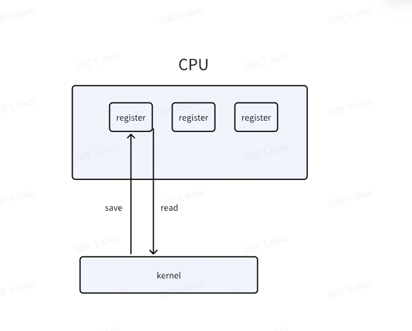

# 5.2: Trap 介绍

## 1. Trap handle 的工作场景

There are three kinds of event which cause the CPU to set aside ordinary execution of instructions  and force a transfer of control to special code that handles the event. 

One situation is a system call, when a user program executes the ecall instruction to ask the kernel to do something for it. 

第一种是 systemcall， 也就是需要用ecall来触发

Another situation is an *exception*: an instruction (user or kernel) does something illegal, such as divide by zero or use an invalid virtual address.

第二种是异常：后面虚拟内存的管理主要用到内存访问的异常状态来触发

 The third situation is a device *interrupt*, when a device signals that it needs attention, for example when the disk hardware finishes a read or write request.

第三种是设备中断，通常由设备发出，表示当前设备读写的状态，I/O过程主要使用设备中断信号来交互，在driver部分有详细描述

## 2. trap处理的四个基本步骤

一般来说，trap的触发到处理，会经过下面三个步骤：

1. 首先，trap发生后，由CPU触发 stvec 寄存器中的处理函数，保存用户当前的寄存器信息，进入内核地址空间
2. 进入内核空间后，会根据具体的trap类型，然后做判断和处理
3. 处理后，重新设置trap相关寄存器，也同时恢复保存的用户寄存器，返回到用户空间继续执行

也就是教科书中的下面四步，基本上涵盖了前两个步骤，没有涉及到最后一个步骤

> Hardware actions taken by the RISC-V CPU 

1. 硬件操作由CPU触发

> Some assembly instructions that prepare the way for kernel C code.

2. 一些汇编指令可以为C语言做准备

> A C function that decides what to do with the trap.

3. c语言函数可以选择用trap来做什么

> The system call or device-driver service routine.

4. 系统调用或设备驱动程序服务例程

Kernel code (assembler or C) that processes a trap is often called a ***handler***;

## 3. 详细过程

由CPU中的寄存器变量来指导出现了何种异常，以及如何处置

> Each RISC-V CPU has a set of control registers that the kernel writes to tell the CPU how to handle traps, and that the kernel can read to find out about a trap that has occurred.

### 1. Register list

- **stvec**

The kernel writes the address of its trap handler here; the RISC-V jumps to the  address in **stvec** to handle a trap.

- **sepc**

When a trap occurs, RISC-V saves the program counter here (since the **pc** is then overwritten with the value in **stvec**). The **sret** (return from trap) instruction copies **sepc** to the **pc**. The kernel can write **sepc** to control where **sret** goes. 

sepc 将是一个后面后面trap结束后，任务开始的地方，注意，这里的pc可能不会自动保存 到sepc中，需要手动将pc存储在sepc中。

- **scause**

RISC-V puts a number here that describes the reason for the trap. 

- **sscratch**

The trap handler code uses **sscratch** to help it avoid overwriting user registers before saving them. 

避免在保存用户寄存器之前覆盖它们

- **sstatus**

The SIE bit in **sstatus** controls whether device interrupts are enabled. If the kernel clears SIE, the RISC-V will defer device interrupts until the kernel sets SIE. The SPP bit indicates whether a trap came from user mode or supervisor mode, and controls to what mode **sret** returns.

SIE: 控制是否 device interrupt 打开 

SPP: 控制trap来自user mode 还是 supevisor mode, 以及用什么模式从 sret返回

关于运行模式的说明：

> The above registers relate to traps handled in **supervisor mode**, and they cannot be read or written in user mode.
>
> There is a similar set of control registers for traps handled in **machine mode**; xv6 uses them only for the special case of **timer interrupts.**

### 2. RISC-V的详细trap步骤如下

All  trap types (*other than timer interrupts*)

- If the trap is a device interrupt, and the **sstatus** SIE bit is clear, don’t do any of the following. 
  -  （判断是否应该开始trap的处理）

- Disable interrupts by clearing the SIE bit in **sstatus**. (用于当前trap的独占时间)

- Copy the **pc** to **sepc**. （确保能从当前位置返回，避免pc丢失）

- Save the current mode (user or supervisor) in the **SPP** bit in **sstatus**.  （确保能从当前模式返回）

- Set **scause** to reflect the trap’s cause. （设置 trap的属性）

- Set the mode to supervisor. （主动进入supervisor模式）

- Copy **stvec** to the **pc**. （将当前trap handle的地址传给pc）

- Start executing at the new **pc**. (从pc处，也就是 trap handle的地方开始执行)

> Note that the CPU doesn’t switch to the kernel page table, doesn’t switch to a stack in the kernel, and doesn’t save any registers **other than the pc**. Kernel software must perform these tasks.

### 3. 一部分关于trap的结论：

结合代码和实际的运行打印，目前有如下结论：

1. 从trap handle退出的时候， SPIE 是必须要设置的，否则将导致后续运行停止，推测，从trap退出后，Qemu将SPIE赋值给了SIE，也就是开启了中断处理
2. 进入 trap handle 之后，SIE 被自动清理掉，只留下了SPIE，设置好了SPP信息在 sstatus，也设置好了 scause.

