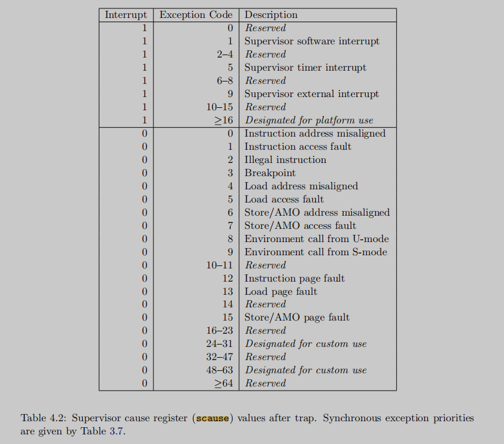

# 5.4 七：常用寄存器整理：

## 专用寄存器：

### **stvec**

保存trap handler address

### **sepc**

sepc 将是一个后面后面trap结束后，任务开始的地方，注意，这里的pc(program counter)可能不会自动保存 到sepc中，需要手动将pc存储在sepc中。

### **scause**

描述 trap 的原因. 

在RISC-V架构中，`scause`寄存器记录了最后一次异常或中断的原因。这个寄存器的值可以帮助异常处理程序（trap handler）确定发生了什么类型的事件，从而采取相应的处理措施。`scause`寄存器的值包含两部分：最高位（MSB）表示异常类型（1表示中断，0表示异常），其余位表示异常或中断的具体原因。

下面是一些可能被赋值到`scause`寄存器的状态：

异常（Exception）

异常是由于程序执行中的错误或特定指令触发的同步事件。对于异常，`scause`寄存器的MSB为0。




- Instruction Address Misaligned (0x0)：指令地址未对齐
- Instruction Access Fault (0x1)：指令访问错误
- Illegal Instruction (0x2)：非法指令
- Breakpoint (0x3)：断点（由`ebreak`指令触发）
- Load Address Misaligned (0x4)：加载地址未对齐
- Load Access Fault (0x5)：加载访问错误
- Store/AMO Address Misaligned (0x6)：存储/原子内存操作地址未对齐
- Store/AMO Access Fault (0x7)：存储/原子内存操作访问错误
- Environment Call from **U-mode (0x8)** / **S-mode (0x9)** / M-mode (0xb)：来自U模式/S模式/M模式的环境调用（由`ecall`指令触发）
- Instruction Page Fault (0xc)：指令页错误, 12
- **Load Page Fault (0xd)**：加载页错误, 13

常见于内存页的权限缺失，比如只有U，没有W,R 等权限

- Store/AMO Page Fault (0xf)：存储/原子内存操作页错误, 15

常见于内存页的无法写入

详细描述：

**Load Page Fault (0xD)**：当处理器尝试加载一个虚拟地址的内容时，如果页表条目不存在或不允许读取，会触发此异常。

**Store/AMO Page Fault (0xF)**：当处理器尝试存储一个虚拟地址的内容或进行AMO操作时，如果页表条目不存在或不允许写入，会触发此异常。


中断（Interrupt）

中断是由外部事件触发的异步事件。对于中断，`scause`寄存器的MSB为1。（下面是32位的信息，64位的话，也是最高位设置为1）

- User Software Interrupt (0x80000000)：用户软件中断
- Supervisor Software Interrupt (0x80000001)：监督者软件中断
- Machine Software Interrupt (0x80000003)：机器软件中断
- User Timer Interrupt (0x80000004)：用户定时器中断
- Supervisor Timer Interrupt (0x80000005)：监督者定时器中断
- Machine Timer Interrupt (0x80000007)：机器定时器中断
- User External Interrupt (0x80000008)：用户外部中断
- Supervisor External Interrupt (0x80000009)：监督者外部中断
- Machine External Interrupt (0x8000000b)：机器外部中断

以上列出的是一些标准的异常和中断原因代码，具体可能会根据RISC-V的不同扩展和特定的硬件实现有所变化。了解这些`scause`寄存器的值对于开发操作系统和异常处理程序至关重要。

### **sscratch**

一个寄存器的通用缓存，避免在保存用户寄存器之前覆盖它们,


### **sstatus**

表示supervisor status register 的状态

一个表示状态的寄存器，主要用下面两个bit位

SIE: 控制是否 device interrupt 打开 

SPP: 控制trap来自user mode 还是 supevisor mode, 以及用什么模式从 sret返回

请注意：这个字段只是说明了trap来自哪个模式，但没有明确表示当前位于哪个模式，具体看当前处于U还是S， 需要看看当前执行时，处于哪个地址空间

```C
// Supervisor Status Register, sstatus

#define SSTATUS_SPP (1L << 8)  // Previous mode, 1=Supervisor, 0=User  256 

// 这个0x20的位感觉在qemu中，会莫名其妙地被赋值，暂时忽略，只关注下面 （SSTATUS_SIE）0x2 的值
#define SSTATUS_SPIE (1L << 5) // Supervisor Previous Interrupt Enable 32  
#define SSTATUS_UPIE (1L << 4) // User Previous Interrupt Enable       16

#define SSTATUS_SIE (1L << 1)  // Supervisor Interrupt Enable          2
#define SSTATUS_UIE (1L << 0)  // User Interrupt Enable                1


// 进入 user space 的时候，首先会将SPP设置为0，并且将 SPIE打开，表示开启 supervisor 的中断

// 下面的三个函数，也会对 ssstatus的状态进行修改和调整

// enable device interrupts
// 打开SIE, 
static inline void
intr_on()
{
  w_sstatus(r_sstatus() | SSTATUS_SIE);
}

// disable device interrupts
static inline void
intr_off()
{
  w_sstatus(r_sstatus() & ~SSTATUS_SIE);
}

// are device interrupts enabled?
static inline int
intr_get()
{
  uint64 x = r_sstatus();
  return (x & SSTATUS_SIE) != 0;
}
```


#### SPP

`SPP`位的功能：

- `SPP`位是`sstatus`寄存器的一部分，用于记录进入S模式异常处理程序之前CPU所处的权限模式。`SPP`位只有一位，具有两种可能的状态：
  - `0`：表示异常或中断发生前CPU处于U模式。
  - `1`：表示异常或中断发生前CPU处于S模式。

`SSTATUS_SPP`赋值时机：

当从用户模式（U模式）或监督者模式（S模式）触发异常或中断，并且系统进入监督者模式下的异常处理程序时，

**硬件会自动设置** **`SSTATUS_SPP`** 位!!!!!!!!!!!!

这个过程主要发生在两种情况下：

1. **从U模式进入S模式的异常处理程序：** 如果异常或中断发生时CPU处于U模式，`SSTATUS_SPP`将被硬件设置为`0`，表示异常处理程序完成后应返回到U模式。
2. **从S模式进入S模式的异常处理程序：** 如果异常或中断发生时CPU已经处于S模式，`SSTATUS_SPP`将被硬件设置为`1`，表示异常处理程序完成后应返回到S模式。

`SSTATUS_SPP`清空时机：

当异常处理程序执行完毕，准备通过`sret`指令返回到之前的模式（U模式或S模式）时，`sret`指令的执行会根据`SSTATUS_SPP`位的值恢复CPU的权限模式，并清空`SSTATUS_SPP`位。具体行为如下：

- 如果`SSTATUS_SPP`为`0`，CPU返回到U模式，`SSTATUS_SPP`随后被清空。
- 如果`SSTATUS_SPP`为`1`，CPU返回到S模式，`SSTATUS_SPP`随后被清空。

为下一次异常或中断处理准备。

这个机制确保了异常或中断处理的正确返回行为，允许操作系统安全地管理权限模式的切换，并保证在处理完异常或中断后能够恢复到正确的执行上下文。

总结来说，`SSTATUS_SPP`位的赋值和清空由硬件在进入和退出异常处理时自动管理，这是RISC-V体系结构中处理异常和中断的重要机制之一。


#### SIE

SSTATUS_SIE（Supervisor Interrupt Enable）        1L << 1

- 功能：`SSTATUS_SIE`位用于控制在S模式下中断是否被允许。如果此位设置为1，则表示在S模式下中断可以被接受和处理；如果设置为0，则中断被禁止，即使中断线被激活也不会触发中断处理程序。
- 用途：在正常操作中控制S模式的中断接受状态。例如，操作系统可能在执行关键代码时暂时禁用中断，以避免中断处理程序中断关键操作。

SSTATUS_SPIE（Supervisor Previous Interrupt Enable）    1L << 5

- 功能：`SSTATUS_SPIE`位用来保存进入中断或异常处理前`SSTATUS_SIE`的状态。也就是说，当异常或中断发生，导致处理器进入异常处理模式时，当前的`SSTATUS_SIE`值会被自动保存到`SSTATUS_SPIE`。
- 用途：当执行`SRET`指令从异常或中断处理程序返回到常规执行流程时，`SSTATUS_SPIE`的值会被**自动恢复**到`SSTATUS_SIE`，这样可以恢复到进入异常或中断处理前的中断使能状态。这是为了保证系统的稳定性和中断处理的正确性，确保在处理完中断或异常后，系统能够回到原先的中断使能状态。

关键区别

- 使用时机：`SSTATUS_SIE`是当前的中断使能位，直接影响当前S模式下是否接受中断；而`SSTATUS_SPIE`是用于保存进入异常或中断处理前`SSTATUS_SIE`的值，用于在之后恢复状态。
- 行为：**在发生异常或中断时，****`SSTATUS_SIE`****会被清零（禁用中断）**，防止新的中断打断异常处理程序，而`SSTATUS_SIE`的原始值则会被存储到`SSTATUS_SPIE`。当从异常或中断返回时，`SSTATUS_SIE`会被设置为`SSTATUS_SPIE`的值，恢复原来的中断使能状态。


### **mstatus**

表示machine status register 的状态

```C
// Machine Status Register, mstatus

#define MSTATUS_MPP_MASK (3L << 11) // previous mode.      6144
#define MSTATUS_MPP_M (3L << 11)                        // 6144
// 也就是在从start开始， mstatus 将设置为下面的这个值
#define MSTATUS_MPP_S (1L << 11)                        // 2048
#define MSTATUS_MPP_U (0L << 11)                        // 0
// 同时也将这个值打开，表示将触发 machine-mode 下的interrupt的开关
#define MSTATUS_MIE (1L << 3)    // machine-mode interrupt enable. // 8
```

### ra 

在RISC-V架构中，`ra`寄存器（返回地址寄存器）主要用于存储函数调用时的返回地址。这允许程序在函数执行完成后返回到调用点继续执行。`ra`寄存器的使用遵循RISC-V的调用约定

也就是执行完当前函数后，退出，应该去的地方

### pc：

pc寄存器是表示当前进程执行的代码段的位置

### stval :

在RISC-V架构中，`stval`寄存器是用于存储发生访存异常时的导致异常的存储地址。当发生存储异常（如访问未映射的地址）时，处理器将异常地址存储在`stval`寄存器中，以便于异常处理程序可以了解到导致异常的具体存储地址。

主要用于 **copy-on-write fork** 缺页中断时的功能


## 通用寄存器：

> The kernel trap code saves user registers to the current process’s trap frame, where kernel code can find them.

- a0

系统调用的返回值，目前在用户空间中，会返回给 trapframe的a0，最终会设置给a0寄存器

- a1

- a2

- a3

- a4

- a5

上面的a0 到 a5 均是用于系统调用传参所使用，可以传值，也可以传地址

- a7

常用于系统调用时，传入系统调用编号


## 常用汇编指令的区别

- la   

la a0, init              // 将 init的**地址**加载到a0

- sd  a3,   16(a0)   // 将 a3 保存到  a0 + 16的**地址**中

- ld   a1   24(a0)   //   # 将地址寄存器 a0 中的值加上 24，然后将得到的**地址处的内容**加载到a1中

- li

li a7, SYS_exec     // 将 SYS_exec的**值**加载到a7

- csrr

csrr a1, mhartid

是 RISC-V 汇编语言中的一条特权指令，用于将当前硬件线程的 Hart ID（硬件线程标识符）加载到通用寄存器 a1 中。

`csrr`: 这是 RISC-V 汇编指令中的一个缩写，表示 "CSR read"，用于从控制状态寄存器（CSR，Control and Status Register）中读取内容。

- ret

在RISC-V汇编语言中，`ret`指令是一个伪指令，用于从函数返回到调用者。实际上，`ret`伪指令等价于`jalr`指令的一个特定用法，即跳转回到`ra`（返回地址寄存器，通常是`x1`寄存器）中保存的地址。因此，执行`ret`指令意味着当前执行流将返回到`ra`寄存器中存储的地址，也就是之前调用当前函数的地点。

用于xv6的  `swtch` 的过程：

- sret

`sret`指令

- `sret`（Supervisor Return）指令用于从监督者模式（S模式）的异常或中断处理程序返回到之前的特权级别。这是一条特权指令，用于在处理S模式下的异常或中断后，根据`sstatus`寄存器中的SPP（Supervisor Previous Privilege）位返回到S模式或U模式。
- `sret`指令会根据`sstatus`寄存器的SPP位来恢复CPU的特权级别。如果SPP位设置为0，表明在异常或中断发生前CPU处于U模式，那么执行`sret`后CPU将返回到U模式。如果SPP位为1，CPU将保持在S模式。
- `sret`执行时还会恢复其他由`sstatus`寄存器控制的状态，如中断使能状态。

ret 和 sret 的差异

主要差异

- 使用上下文：`ret`主要用于常规函数调用的返回，而`sret`用于从S模式的异常或中断处理程序返回到之前的执行模式。
- 特权级别：`ret`不涉及特权级别的改变，`sret`则用于在特权级别之间切换，尤其是从S模式返回到U模式或保持在S模式。
- 控制寄存器：`ret`基于`ra`寄存器进行跳转，而`sret`的行为由`sstatus`寄存器的状态（如SPP位）控制。

理解这两个指令的区别对于编写和理解在不同特权级别运行的RISC-V程序很重要，尤其是在涉及异常和中断处理时。


# 八： PLIC机制

在RISC-V架构中，PLIC（Platform-Level Interrupt Controller）是负责管理和分配外部中断的组件。PLIC作为中断控制器，其主要职责是接受来自外部设备的中断信号，然后根据中断优先级和配置将中断传递给处理器核心。

当一个中断被PLIC发送到CPU，并且CPU成功地接受并处理这个中断时，会涉及到PLIC寄存器的一些修改。这些修改可能包括：

1. **中断处理登记**：当CPU接受并开始处理一个中断时，相应的中断在PLIC中可能被标记为“正在服务”（Claimed）。
2. **中断优先级**：中断服务程序可能会修改PLIC中的优先级寄存器，以改变不同中断源的优先级。
3. **中断完成**：当中断处理完成后，

**CPU通过写入PLIC的一个特定寄存器来通知PLIC中断已经被处理（Completed），这样PLIC就可以清除该中断的“正在服务”状态，并准备接收来自同一中断源的下一个中断信号!!!**

1. **使能和配置**：中断处理程序可能会根据需要在PLIC中启用或禁用特定中断源，或者更改配置，以适应系统的动态需求。

所以，是的，PLIC确实会根据中断的处理情况进行相应的寄存器修改。这些修改是由处理器在中断处理的不同阶段执行的，用以管理整个中断生命周期，从接收、处理到标记为完成。这确保了系统可以正确地响应接下来的中断请求。

## SCLAIM:

监督模式下，中断声明

在RISC-V中，PLIC（Platform-Level Interrupt Controller）负责管理外部中断。其中，`SCLAIM`寄存器是用于监督模式（Supervisor Mode）的中断声明（claim）和完成（complete）的。

### `SCLAIM`寄存器的赋值：

当一个外部中断被PLIC路由到处理器，并且处理器处于准备好接受中断的状态时，中断服务例程通常开始于读取`SCLAIM`寄存器。这个读取操作执行两个主要功能：

1. **声明中断**：告诉PLIC处理器正在开始处理哪一个中断。`SCLAIM`寄存器读取的值是当前最高优先级中断的ID。这个ID用于识别是哪个外部设备触发了中断。
2. **获取中断**：从PLIC的角度看，读取`SCLAIM`寄存器意味着处理器正在认领一个中断。一旦处理器读取了`SCLAIM`寄存器，PLIC会认为该中断正在被处理，并不会再次将其发送到任何处理器，直到该中断被显式地完成（cleared）。

### `SCLAIM`寄存器的清理：

一旦处理器完成了中断处理，它必须向PLIC指示该特定中断已被处理完毕。这通常是通过写入`SCLAIM`寄存器完成的：

1. **写入中断ID**：处理器将处理完成的中断ID写回`SCLAIM`寄存器，这个操作通知PLIC特定的中断处理已经结束。
2. **清除声明状态**：写入`SCLAIM`寄存器通知PLIC可以清除对应中断的“正在服务”状态，并且相应的中断源可以再次被认领。

通过读写`SCLAIM`寄存器来声明和完成中断，PLIC与处理器之间能够协调中断处理的生命周期，确保每个中断只被处理一次，并且在处理完成之前不会重复触发。这是一种同步机制，确保了中断处理的正确性和系统的稳定性。


在RISC-V的PLIC（Platform-Level Interrupt Controller）中，`SCLAIM`不是一个特定的物理寄存器名称，而是通常用于指代与监督者模式相关的中断“认领”（claim）和“完成”（complete）寄存器的操作。这些操作通常是通过读取和写入同一个特定的内存映射地址来完成的，而具体的行为（认领或完成）则取决于访问的是读操作还是写操作。

**当处理器从这个地址读取时，它会从PLIC中认领一个等待处理的中断**，该操作会返回引起中断的设备的唯一标识符（即中断源ID）。处理器用这个ID来处理相应的中断。

**完成对中断的处理之后，处理器会通过向同一个地址写入中断源ID来告诉PLIC中断处理已经完成。这样，PLIC知道可以清除此中断的状态，并且如果有必要，可以再次对其进行处理。**

在RISC-V的文档和开发中，`SCLAIM`是一种抽象概念，代表了监督者模式下进行中断认领和完成的操作，而不是一个特定的硬件寄存器。对于`SCLAIM`的读写访问通常会通过内存映射的IO来实现，并且这个地址通常由操作系统或者中断处理库来管理。

在RISC-V体系结构中，Platform-Level Interrupt Controller（PLIC）是负责管理多个中断源的组件。它的设计旨在允许软件查询中断源、设置中断优先级、使能中断，并且控制中断到处理器核心的分配。以下是PLIC中涉及的一些关键寄存器及其作用：


1. Priority Registers

- **作用**：这些寄存器为每个中断源设置优先级。中断优先级决定了中断处理的顺序，具有更高优先级的中断会首先被处理。
- Pending Bit Array

- **作用**：这个寄存器数组指示哪些中断源目前是待处理的。如果某个中断源是活跃的并且尚未被处理，相应的位会被设置。
- Enable Registers

- **作用**：这些寄存器用于使能或禁用中断。通过这些寄存器，软件可以控制是否允许中断源产生中断。
- Threshold Register

- **作用**：这个寄存器设置当前处理器的中断接受阈值。只有优先级高于这个阈值的中断才能被送达给处理器。
- Claim/Complete Registers（例如`SCLAIM`）

- **作用**：读取这些寄存器可以声明处理器将要处理的下一个可用中断。处理完成后，写回这个寄存器可以标记中断已完成。
- Interrupt Source ID Registers

- **作用**：这些寄存器包含被认领的中断源的ID，可以帮助确定哪个设备产生了中断。
- Context or Hart-Specific Registers

- **作用**：这些寄存器为每个处理器核心（或硬件线程，hart）提供了上述功能的上下文。这允许PLIC为每个核心管理中断。

在RISC-V的PLIC中，这些寄存器是通过内存映射的输入/输出进行访问的，意味着PLIC的寄存器被映射到处理器的地址空间内，软件可以通过读写内存地址来读写PLIC寄存器。

不同的RISC-V实现可能会对PLIC进行定制，因此提供的功能和寄存器可能会有所不同。上面列出的是PLIC的基本组成部分，在特定的RISC-V实现中，可能还有其他与中断管理相关的寄存器。
