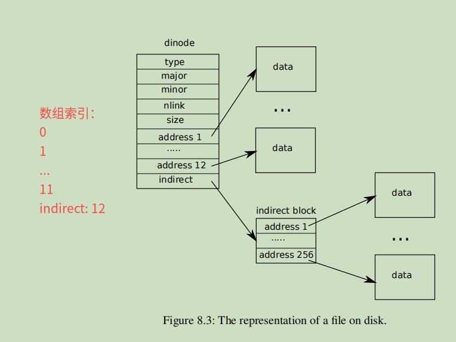

# 8.4 inode

## 1. 一句话描述

​     inode 和 dinode 分别用来做什么？一句话描述：

inode 的工作：在内存中预分配50个固定数量，用来表示一个文件应该映射哪些磁盘的data block信息，主要记录这个映射关系

​      dinode的作用，和inode类似，只不过是将这个文件映射不同data  block 块的信息，记录在磁盘中，在磁盘中，预分配了200个dinode块，共占13个block

 

首先介绍磁盘中的文件布局：dinode节点

磁盘文件中的布局

​      **文件大小不超过  268kb**



 **问题：indirect block的结构体放在哪里**？

其实就是一个普通的block节点，大小1024， 里面包含了256个4字节的地址，所以也是放在最后面  data blocks  的磁盘部分的，单独占一个block节点。

**问题：如果一个indirect block里面的256个地址没有用完，那么这个indirect block 剩余部分是不是就只是置空**？

通过代码，确实如果大小不足，就会置空

**问题：inode结构体里面的ref 引用计数字段，作用是什么**？

Inode的ref是针对**文件层面**的，如果读取文件一次，那么ref便会 ++ 一次。也就是说，如果有多个进程同时调用的话，那么也只有在最后一个进程退出时，才会彻底将 内存中，磁盘中读取到的文件信息释放掉。


一段注释：

> Referencing in table: an entry in the inode table is free if **ip->ref** is zero. Otherwise **ip->ref** tracks the number of in-memory pointers to the entry (**open files and current directories**). **iget()** finds or creates a table entry and increments its ref; **iput()** decrements ref.

调用 iget 的地方，分别是 ialloc， dirlookup 以及 namex 函数。确实是用于 open files ，以及current directories中使用了。调用之后，就会递增 inode的ref


## 2. inode 层的设计：

### 1. inode层的使用范式：

Thus a typical sequence is:

```C++
  ip = iget(dev, inum)
  ilock(ip)
  ... examine and modify ip->xxx ...
  iunlock(ip)
  iput(ip)
```


### 2. inode 层的设计逻辑

An inode and its in-memory representation go through a sequence of states before they can be used by the rest of the file system code.

- Allocation: an inode is allocated if its type (on disk) is non-zero. ialloc() allocates, and iput() frees if the reference and link counts have fallen to zero.

> **查询，以及创建一个inode的table entry 的时候，都会递增ref, iput 会递减ref**

- Referencing in table: an entry in the inode table is free if ip->ref is zero. Otherwise ip->ref tracks the number of in-memory pointers to the entry (open files and current directories). iget() finds or creates a table entry and increments its ref; iput() decrements ref.

- Valid: the information (type, size, &c) in an inode table entry is only correct when ip->valid is 1. ilock() reads the inode from the disk and sets ip->valid, while iput() clears ip->valid if ip->ref has fallen to zero.

> **只有执行lock后，才能修改  inode 和里面的内容**

- Locked: file system code may only examine and modify the information in an inode and its content if it has first locked the inode.

> **ilock（）与iget（）是分开的，这样系统调用就可以获得对inode的长期引用（就像打开文件一样），并且只在短时间内锁定它（例如，在read（）中）。这种分离还有助于避免路径名查找过程中的死锁和竞争。iget（）递增ip->ref，这样索引节点就留在表中，指向它的指针也保持有效。**

- ilock() is separate from iget() so that system calls can get a long-term reference to an inode (as for an open file) and only lock it for short periods (e.g., in read()). The separation also helps avoid deadlock and races during pathname lookup. iget() increments ip->ref so that the inode stays in the table and pointers to it remain valid. 

​	Many internal file system functions expect(期望) the caller to have locked the inodes involved; this lets callers create multi-step atomic operations.

> **下面介绍的是锁的设计，存在两种锁， itable.lock 和  ip->lock， 锁的作用和类型，与 buf cache层的完全相同，**
>
>  **itable.lock 是自旋锁，保护分配 itable的节点，具体来说，保护  ip->ref，ip->inum,  ip->dev**

- The itable.lock spin-lock protects the allocation of itable entries. Since ip->ref indicates whether an entry is free, and ip->dev and ip->inum indicate which i-node an entry holds, one must hold itable.lock while using any of those fields.

> **ip->lock是 sleep锁，保护除了  ref, inum, dev 之外的所有字段** 
>
> **ip->lock 的加锁过程，是函数 ilock完成的**

- An ip->lock sleep-lock protects all ip-> fields other than ref, dev, and inum.  One must hold ip->lock in order to read or write that inode's ip->valid, ip->size, ip->type, &c.


### 3. inod 对应的磁盘 结构体dinode

superblock 节点信息

```C++
// mkfs computes the super block and builds an initial file system. The
// super block describes the disk layout:
struct superblock {
  uint magic;        // Must be FSMAGIC
  // 操作系统的 blocks 块数
  uint size;         // Size of file system image (blocks)

  uint nblocks;      // Number of data blocks
  // data blocks 的块数，一般是13, 因为默认inode结构体数量为200
  uint ninodes;      // Number of inodes.
  // loc blocks 的块数，一般是30
  uint nlog;         // Number of log blocks
  // log blocks 从磁盘block的起始块
  uint logstart;     // Block number of first log block
  // inode blokcs 从磁盘block的起始块
  uint inodestart;   // Block number of first inode block
  uint bmapstart;    // Block number of first free map block
};
```


dinode 节点的大小为64字节， 在磁盘中，dinode的节点个数为：200个

```C
#define NDIRECT 12

// On-disk inode structure
struct dinode {
  short type;           // File type
  short major;          // Major device number (T_DEVICE only)
  short minor;          // Minor device number (T_DEVICE only)
  short nlink;          // Number of links to inode in file system
  uint size;            // Size of file (bytes)
  // 如上结构，最后一个元素可以再扩展 256 个data block
  uint addrs[NDIRECT+1];   // Data block addresses
};
```


### 4. inode 内存 结构体

在xv6中，inode都放在 itable的内存中，总数为 **50个**，如果用完了，会报错

```C
#define NINODE       50  // maximum number of active i-nodes

struct {
  struct spinlock lock;
  struct inode inode[NINODE];   // 
} itable;
```


```C
#define NDIRECT 12
#define BSIZE 1024  // block size

// in-memory copy of an inode
struct inode {
  uint dev;           // Device number
  uint inum;          // Inode number
  int ref;            // Reference count
  struct sleeplock lock; // protects everything below here
  int valid;          // inode has been read from disk?

  short type;         // copy of disk inode
  short major;
  short minor;
  short nlink;       // 针对同一个inode, 记录其引用数量，只有为0， 才能执行清理操作：iput
  uint size;
  uint addrs[NDIRECT+1];    // 作用：
};
```

   问题：

一个inode节点， 映射的文件最多有多大？

​         268kb，和物理磁盘中一个文件的大小是一致的。映射方法是否相同？两者本来就是一个数据源，都是来自磁盘文件，所以必然是一样的


### 5. inode 中的目录结构

```C++
struct dirent {
  ushort inum;
  char name[DIRSIZ];
};
```

这个结构记录，这个文件的name，保存的inode节点id为  inum


## 3. 关键函数分析：

### 1. bmap 函数

按照上面内存布局的顺序来读取和访问里面的元素信息

**问题：函数的主要功能是什么**？

参数bn表示当前inode->address 索引块的分布，调用bmap后，将返回实际data block的序号，也就是block_id

```C
// Return the disk block address of the nth block in inode ip.
// If there is no such block, bmap allocates one.
// returns 0 if out of disk space.

// bn 表示输入的 inode->addrs 里面索引快的数组索引，
// 实际使用中，参数的传递主要是：off/BSIZE，也就是用当前文件的偏移量/block_size
// 为什么这个 off/BSIZE 可以作为 inode里面文件映射的block序号？

// 只有一种解释了，那就是这个文件在创建的时候，就是一一映射到序号里面的，实际确实如此
// 返回实际磁盘中 block块的索引
static uint
bmap(struct inode *ip, uint bn)
{
  uint addr, *a;
  struct buf *bp;

  if(bn < NDIRECT){
    if((addr = ip->addrs[bn]) == 0){
      addr = balloc(ip->dev);
      if(addr == 0)
        return 0;
      ip->addrs[bn] = addr;
    }
    return addr;
  }
  bn -= NDIRECT;

  if(bn < NINDIRECT){
    // Load indirect block, allocating if necessary.
    if((addr = ip->addrs[NDIRECT]) == 0){
      addr = balloc(ip->dev);
      if(addr == 0)
        return 0;
      ip->addrs[NDIRECT] = addr;
    }
    bp = bread(ip->dev, addr);
    a = (uint*)bp->data;
    if((addr = a[bn]) == 0){
      addr = balloc(ip->dev);
      if(addr){
        a[bn] = addr;
        log_write(bp);
      }
    }
    brelse(bp);
    return addr;
  }

  panic("bmap: out of range");
}
```


#### balloc 函数

函数功能：按bitmap block的顺序，找到第一个空闲的block 序号，并返回

**下面的 balloc 函数和 bfree 函数，都必须使用在一个事务（transaction） 中 **

BPB 表示 Bits-Per-Block, 即一个block里面，有多少个bits（1024 * 8）

​      主要用在bmap 函数中，这个函数的返回值，表示第 b + bi，表示block_num_id，整个磁盘设备中，dev的序号，后面bmap函数会通过这个返回值，来调用 bread 函数，并获取到指定扇区的数据

**注意，因为初始化时，已经将data block前面的block bit位都设置为true，所以不需要考虑申请到一个 专用业务的节点**

```C
// Allocate a zeroed disk block.
// returns 0 if out of disk space.
static uint
balloc(uint dev)
{
  int b, bi, m;
  struct buf *bp;

  bp = 0;
  // 作用: 一一遍历每一个bitmap块，sb.size 和 BPB是两个维度
  // 这里每一次循环，b增长 8 * 1024个长度，表示一个bitmap的block的控制范围
  for(b = 0; b < sb.size; b += BPB){
    // 这一步，获取的是bit-map数据的所在block块。是从上面总的 sb.size 中按照 一个BPB来划分的步长
    // 得到的bp->data, 里面即包含了这个bmap信息
    // bp 表示按顺序获取的bitmap的buf数据
    bp = bread(dev, BBLOCK(b, sb));

    // 这里才是真正按位来遍历
    for(bi = 0; bi < BPB && b + bi < sb.size; bi++){
      // 向左移动一位，是为了让bites位和实际的计数可以映射上
      // 比如15，按照  bi % 8, 会放在第二个bytes的倒数第一位上（从0开始奇数），
      // 实际需要的是让他放在倒数第二位上，因为后面还需要放 16
      m = 1 << (bi % 8);  
      if((bp->data[bi/8] & m) == 0){  // Is block free?
        bp->data[bi/8] |= m;  // Mark block in use.
        // 及时写入 这个bitmap修改的block
        log_write(bp);
        brelse(bp);
        // 将申请的block块清空
        bzero(dev, b + bi);
        return b + bi;
      }
    }
    brelse(bp);    // 如果本轮没有找到空的block， 则清理掉这个bp 缓存
  }
  printf("balloc: out of blocks\n");
  return 0;
}
```


#### bfree函数

函数功能：将b映射到bitmap block里面的位置位 0，表示节点释放

```C++
// Free a disk block.
static void
bfree(int dev, uint b)
{
  struct buf *bp;
  int bi, m;

  bp = bread(dev, BBLOCK(b, sb));
  bi = b % BPB;
  m = 1 << (bi % 8);
  if((bp->data[bi/8] & m) == 0)
    panic("freeing free block");
  bp->data[bi/8] &= ~m;
  log_write(bp);
  brelse(bp);
}
```


### 2. ialloc 函数

里面用到了 iget 函数

问题：dinode  结构是保存在哪里？

​       整理下 dinode 结构如何保存在 bp->data 中： 

​       目前看，所有的buf都是以数组的形式来排列的，然后所有的dinode结构也都是以数组的形式保存在buf->data中， 可以用inum来定位到buf, 进而定位到在buf的哪个地方，也就是下面宏定义展开所描述的。

​       而具体一开始如何排放的，需要看 mkfs里面的内容

```C
// Allocate an inode on device dev.
// Mark it as allocated by  giving it type type.
// Returns an unlocked but allocated and referenced inode,
// or NULL if there is no free inode.
struct inode*
ialloc(uint dev, short type)
{
  int inum;
  struct buf *bp;
  struct dinode *dip;

  // 功能，依次遍历所有的 dinode节点，然后找到一个可用的，总数默认为200个
  for(inum = 1; inum < sb.ninodes; inum++){
    // 宏展开
    // 1. 将磁盘中的数据读取到  buf结构体中
    bp = bread(dev, ((inum) / (1024 / sizeof(struct dinode)) + sb.inodestart));
    // bp = bread(dev, IBLOCK(inum, sb));
    // 宏展开
    // 2. 
    dip = (struct dinode*)bp->data + inum%(1024 / sizeof(struct dinode))
    //dip = (struct dinode*)bp->data + inum%IPB;
    if(dip->type == 0){  // a free inode
      memset(dip, 0, sizeof(*dip));
      dip->type = type;
      // 将bp中的 blockno 记录到log中，表示
      log_write(bp);   // mark it allocated on the disk
      brelse(bp);
      return iget(dev, inum);
    }
    brelse(bp);
  }
  printf("ialloc: no inodes\n");
  return 0;
}
```


**上面的获取的inum, 会保存到inode结构体里面，用于之后查询在磁盘中的位置**


**问题：ialloc 的事情，功能是什么**？

1. 是通过磁盘的超级节点，在dinode的磁盘区域，找到一个暂时没用的dinode节点，然后设置为可用后，更新到磁盘的inode区域
2. 通过获取到的inum节点id, 也就是在dinode磁盘区域的序号，在内存中也找一个未用的inode结构体，同步下dinode的信息，再返回inode的指针

从本质上来说，是将磁盘的dinode 初始化到 内存的inode中


### 3. iget 函数

iget 函数，仅仅从 **itable** 返回一个内存节点的指针，没有进行磁盘操作。

如果itable 中有对应 inum 节点的inode, 那么增加引用，返回，否则的话，占用一个空的inode，然后返回。

**inode的ref 字段的变化，就是从这个函数中递增的**

```JSON
使用的时候，基本上要沿用如下的顺序，比如在 sysfile.c 的 create 函数中

Thus a typical sequence is:
//   要留意，这里的设计，iget和ilock是分开的，因为里面分别有一个锁的存在
//   ip = iget(dev, inum)
//   ilock(ip)
//   ... examine and modify ip->xxx ...
//   iunlock(ip)
//   iput(ip)
```

上面的这个调用顺序，在ilock中也有限定，以为**ilock**函数，在开始的地方，会判断当前的ref是否 >= 1, 如果为false, 则直接抛出异常，在 **iunlock** 函数中，也是这样处理的

```C
// Find the inode with number inum on device dev
// and return the in-memory copy. Does not lock
// the inode and does not read it from disk.

// 通过这个函数获取inode的地址，需要的是dev号码，以及inum，inum
// inum 就是从 从1开始遍历到 superblock节点中获取inodes的总数（200），如block未被使用
// 那么返回的这个 block的索引，见 ialloc， 本质上是小于200的序号

// 如果是目录结构，则创建的时候，会保存这个目录中，每一个文件的inum值，

// 也就是说，首先是通过遍历磁盘中的inode节点，找到一个空余的，然后通过iget映射到内存中，
// 返回这个在itable中的inode元素的地址

static struct inode*
iget(uint dev, uint inum)
{
  struct inode *ip, *empty;

  acquire(&itable.lock);

  // Is the inode already in the table?
  empty = 0;
  // 完全遍历一次整个列表
  for(ip = &itable.inode[0]; ip < &itable.inode[NINODE]; ip++){
    if(ip->ref > 0 && ip->dev == dev && ip->inum == inum){
      ip->ref++;
      release(&itable.lock);
      return ip;
    }
    if(empty == 0 && ip->ref == 0)    // Remember empty slot.
      empty = ip;
  }

  // Recycle an inode entry.
  if(empty == 0)
    panic("iget: no inodes");

  ip = empty;
  ip->dev = dev;
  ip->inum = inum;
  ip->ref = 1;
  ip->valid = 0;
  release(&itable.lock);

  return ip;
}
```


### 4. iput 函数

降低一个内存中的inode节点的 reference数

需要包裹在 begin_op 和 end_op 中

```C
// Drop a reference to an in-memory inode.
// If that was the last reference, the inode table entry can
// be recycled.
// If that was the last reference and the inode has no links
// to it, free the inode (and its content) on disk.
// All calls to iput() must be inside a transaction in
// case it has to free the inode.
void
iput(struct inode *ip)
{
  acquire(&itable.lock);

  if(ip->ref == 1 && ip->valid && ip->nlink == 0){
    // inode has no links and no other references: truncate and free.

    // ip->ref == 1 means no other process can have ip locked,
    // so this acquiresleep() won't block (or deadlock).
    acquiresleep(&ip->lock);

    release(&itable.lock);

    itrunc(ip);
    ip->type = 0;
    iupdate(ip);
    ip->valid = 0;

    releasesleep(&ip->lock);

    acquire(&itable.lock);
  }

  ip->ref--;
  release(&itable.lock);
}
```


里面包含了清理的过程：

1. itrunc函数
2. 更新dinode的type为0到磁盘中
3. 最后设置内存中的valid字段为0

执行清理过程时，之所以要加锁  ip->lock, 解锁  itable.lock，是因为  ip->lock 保护除了  ref, inum, dev 之外的所有字段 


### 5. ilock 函数

```C++
// Lock the given inode.
// Reads the inode from disk if necessary.
void
ilock(struct inode *ip)
{
  struct buf *bp;
  struct dinode *dip;

  if(ip == 0 || ip->ref < 1)
    panic("ilock");

  acquiresleep(&ip->lock);

  if(ip->valid == 0){
    bp = bread(ip->dev, IBLOCK(ip->inum, sb));
    dip = (struct dinode*)bp->data + ip->inum%IPB;
    ip->type = dip->type;
    ip->major = dip->major;
    ip->minor = dip->minor;
    ip->nlink = dip->nlink;
    ip->size = dip->size;
    memmove(ip->addrs, dip->addrs, sizeof(ip->addrs));
    brelse(bp);
    ip->valid = 1;
    if(ip->type == 0)
      panic("ilock: no type");
  }
}
```

**问题：为什么加sleep锁后，才去从磁盘中更新inode里面的字段**？

因为ialloc的时候，将dinode里面的信息全部清理后，赋值了type字段，这里刚好进行同步


### 6. readi函数

```C
#define BSIZE 1024  // block size

// Read data from inode.
// Caller must hold ip->lock.
// If user_dst==1, then dst is a user virtual address;
// otherwise, dst is a kernel address.

int
readi(struct inode *ip, int user_dst, uint64 dst, uint off, uint n)
{
  uint tot, m;
  struct buf *bp;

  if(off > ip->size || off + n < off)
    return 0;
  if(off + n > ip->size)
    // 缩减n, 到文件尾
    n = ip->size - off;

  for(tot=0; tot<n; tot+=m, off+=m, dst+=m){
    // 返回的是 当前文件的off 在磁盘block的索引序号，因为文件的装载是按顺序完成的
    uint addr = bmap(ip, off/BSIZE);
    if(addr == 0)
      break;
    // 读取思想，是先找到文件的block， 然后才调用具体的磁盘驱动接口读取
    bp = bread(ip->dev, addr);
    // m 是在循环中得出的

    // 第一次循环时，BSIZE - off%BSIZE 表示 当前off 到下一个对齐PAGE页的大小
    // 第二次循环时， off 经过递增m, 已经对齐了BSIZE, 所以m 应该是 BSIZE, 将会整块读取
    // 直到读取最后面的 n - tot 的大小
    m = min(n - tot, BSIZE - off%BSIZE);

    // 因为 bp 是block的缓存，里面data数组的大小是一个BLOCK的大小，所以
    // bp->data + (off  % BSIZE) 表示实际开始拷贝的文件起始位置
    if(either_copyout(user_dst, dst, bp->data + (off % BSIZE), m) == -1) {
      brelse(bp);
      tot = -1;
      break;
    }
    brelse(bp);
  }
  return tot;
}
```


### 7. writei函数

```C
#define MAXFILE (NDIRECT + NINDIRECT) // 12 + 256 个块


// Write data to inode.
// Caller must hold ip->lock.
// If user_src==1, then src is a user virtual address;
// otherwise, src is a kernel address.
// Returns the number of bytes successfully written.
// If the return value is less than the requested n,
// there was an error of some kind.
int
writei(struct inode *ip, int user_src/*bool*/, uint64 src, uint off, uint n)
{
  uint tot, m;
  struct buf *bp;

  if(off > ip->size || off + n < off)
    return -1;
  if(off + n > MAXFILE*BSIZE)
    return -1;

  for(tot=0; tot<n; tot+=m, off+=m, src+=m){
    uint addr = bmap(ip, off/BSIZE);
    if(addr == 0)
      break;
    bp = bread(ip->dev, addr);
    // m 在内部变更
    m = min(n - tot, BSIZE - off%BSIZE);
    // 如果user_src 为 0， 表示 src 为内核地址，内部调用了memmove
    // 如果src_src 为1， 则表示src为用户空间，就需要从用户空间往内核拷贝数据，调用 copyin
    if(either_copyin(bp->data + (off % BSIZE), user_src, src, m) == -1) {
      brelse(bp);
      break;
    }
    log_write(bp);
    brelse(bp);
  }

  if(off > ip->size)
    ip->size = off;

  // write the i-node back to disk even if the size didn't change
  // because the loop above might have called bmap() and added a new
  // block to ip->addrs[].
  iupdate(ip);

  return tot;
}
```


最后面调用 iupdate的作用是什么？ 为了维护ip->addrs[] 里面的节点，有可能是第一次读取，所以刚好将 ip->addrs里面的 block_id索引赋值完毕。


