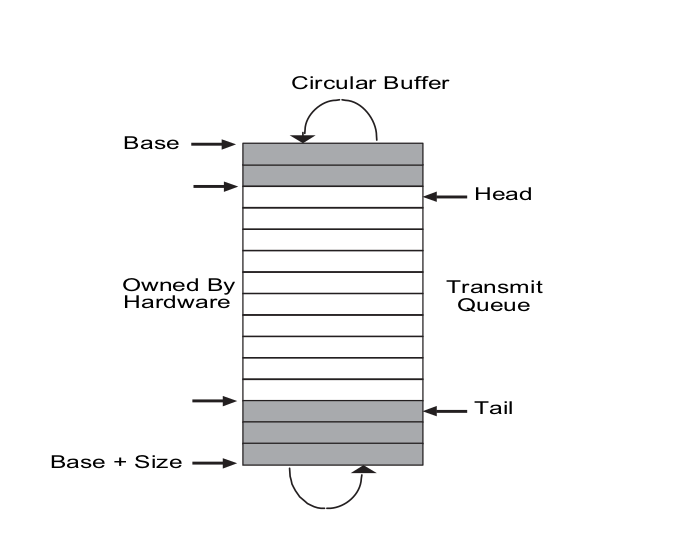
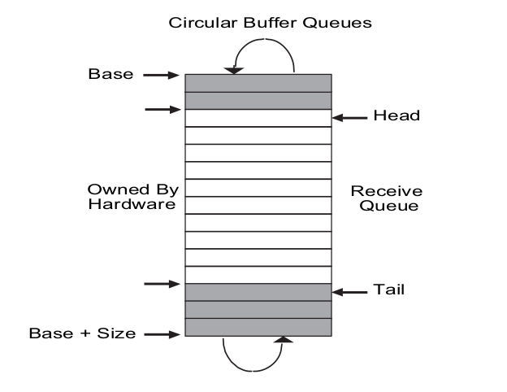

# 9.2 具体设备的驱动


```C
// virtio mmio interface
#define VIRTIO0 0x10001000
#define VIRTIO0_IRQ 1


// qemu puts UART registers here in physical memory.
#define UART0 0x10000000L
#define UART0_IRQ 10
```


## 1. VIRTIO0_IRQ 1 （磁盘设备）

虚拟IO

### 1. Qemo 如何启动 VORTO0

```C
// driver for qemu's virtio disk device.
// uses qemu's mmio interface to virtio.
//
// qemu ... -drive file=fs.img,if=none,format=raw,id=x0 -device virtio-blk-device,drive=x0,bus=virtio-mmio-bus.0
```


参数详解

1. -drive file=fs.img,if=none,format=raw,id=x0
   1. `file=fs.img`: 指定虚拟驱动器使用的磁盘镜像文件，这里的文件名是 `fs.img`。
   2. `if=none`: 这个选项表示该驱动器不直接连接到任何特定的虚拟硬件接口。这通常用于后续通过另一个参数手动指定一个设备。
   3. `format=raw`: 指定磁盘镜像的格式为 `raw`，这是一种没有任何元数据封装的基本磁盘镜像格式。
   4. `id=x0`: 为这个驱动器实例指定一个标识符，这里使用的是 `x0`。此ID用于后续的配置中引用这个磁盘。
2. -device virtio-blk-device,drive=x0,bus=virtio-mmio-bus.0
   1. `virtio-blk-device`: 指定创建一个 virtio 块设备。Virtio 是一种为虚拟机提供高效的I/O性能的标准，`virtio-blk` 是用于块设备的接口（如硬盘）。
   2. `drive=x0`: 这里通过之前定义的驱动器ID (`id=x0`) 将虚拟块设备与 `fs.img` 镜像文件关联起来。
   3. `bus=virtio-mmio-bus.0`: 指定这个设备应该连接到的总线。`virtio-mmio-bus` 是一种基于 memory-mapped I/O 的virtio总线，这里指定的是总线的第一个接口。

使用场景

这组参数的用途是在QEMU虚拟机中配置一个虚拟硬盘，使用 Virtio 作为接口来提高性能，特别适用于需要高性能I/O的场景，如需要频繁磁盘读写的服务器应用。


### 2. virtio 信息

```C
// virtio device definitions.
// for both the mmio interface, and virtio descriptors.
// only tested with qemu.
//
// the virtio spec:
// https://docs.oasis-open.org/virtio/virtio/v1.1/virtio-v1.1.pdf
//

// virtio mmio control registers, mapped starting at 0x10001000.
// from qemu virtio_mmio.h
#define VIRTIO_MMIO_MAGIC_VALUE   0x000 // 0x74726976
#define VIRTIO_MMIO_VERSION   0x004 // version; should be 2
#define VIRTIO_MMIO_DEVICE_ID   0x008 // device type; 1 is net, 2 is disk
#define VIRTIO_MMIO_VENDOR_ID   0x00c // 0x554d4551
#define VIRTIO_MMIO_DEVICE_FEATURES 0x010
#define VIRTIO_MMIO_DRIVER_FEATURES 0x020
#define VIRTIO_MMIO_QUEUE_SEL   0x030 // select queue, write-only
#define VIRTIO_MMIO_QUEUE_NUM_MAX 0x034 // max size of current queue, read-only
#define VIRTIO_MMIO_QUEUE_NUM   0x038 // size of current queue, write-only
#define VIRTIO_MMIO_QUEUE_READY   0x044 // ready bit
#define VIRTIO_MMIO_QUEUE_NOTIFY  0x050 // write-only
#define VIRTIO_MMIO_INTERRUPT_STATUS  0x060 // read-only
#define VIRTIO_MMIO_INTERRUPT_ACK 0x064 // write-only
#define VIRTIO_MMIO_STATUS    0x070 // read/write
#define VIRTIO_MMIO_QUEUE_DESC_LOW  0x080 // physical address for descriptor table, write-only
#define VIRTIO_MMIO_QUEUE_DESC_HIGH 0x084
#define VIRTIO_MMIO_DRIVER_DESC_LOW 0x090 // physical address for available ring, write-only
#define VIRTIO_MMIO_DRIVER_DESC_HIGH  0x094
#define VIRTIO_MMIO_DEVICE_DESC_LOW 0x0a0 // physical address for used ring, write-only
#define VIRTIO_MMIO_DEVICE_DESC_HIGH  0x0a4

// status register bits, from qemu virtio_config.h
// #define VIRTIO_CONFIG_S_ACKNOWLEDGE 1
// #define VIRTIO_CONFIG_S_DRIVER    2
// #define VIRTIO_CONFIG_S_DRIVER_OK 4
// #define VIRTIO_CONFIG_S_FEATURES_OK 8

/* Status byte for guest to report progress, and synchronize features. */
/* We have seen device and processed generic fields (VIRTIO_CONFIG_F_VIRTIO) */
#define VIRTIO_CONFIG_S_ACKNOWLEDGE     1
/* We have found a driver for the device. */
#define VIRTIO_CONFIG_S_DRIVER          2
/* Driver has used its parts of the config, and is happy */
#define VIRTIO_CONFIG_S_DRIVER_OK       4
/* Driver has finished configuring features */
#define VIRTIO_CONFIG_S_FEATURES_OK     8
/* We've given up on this device. */
#define VIRTIO_CONFIG_S_FAILED          0x80

// device feature bits
#define VIRTIO_BLK_F_RO              5  /* Disk is read-only */
#define VIRTIO_BLK_F_SCSI            7  /* Supports scsi command passthru */
#define VIRTIO_BLK_F_CONFIG_WCE     11  /* Writeback mode available in config */
#define VIRTIO_BLK_F_MQ             12  /* support more than one vq */
#define VIRTIO_F_ANY_LAYOUT         27
#define VIRTIO_RING_F_INDIRECT_DESC 28
#define VIRTIO_RING_F_EVENT_IDX     29

// this many virtio descriptors.
// must be a power of two.
#define NUM 8

// a single descriptor, from the spec.
struct virtq_desc {
  uint64 addr;
  uint32 len;
  uint16 flags;
  uint16 next;
};
#define VRING_DESC_F_NEXT  1 // chained with another descriptor
#define VRING_DESC_F_WRITE 2 // device writes (vs read)

// the (entire) avail ring, from the spec.
struct virtq_avail {
  uint16 flags; // always zero
  uint16 idx;   // driver will write ring[idx] next
  uint16 ring[NUM]; // descriptor numbers of chain heads
  uint16 unused;
};

// one entry in the "used" ring, with which the
// device tells the driver about completed requests.
struct virtq_used_elem {
  uint32 id;   // index of start of completed descriptor chain
  uint32 len;
};

struct virtq_used {
  uint16 flags; // always zero
  uint16 idx;   // device increments when it adds a ring[] entry
  struct virtq_used_elem ring[NUM];
};

// these are specific to virtio block devices, e.g. disks,
// described in Section 5.2 of the spec.

#define VIRTIO_BLK_T_IN  0 // read the disk
#define VIRTIO_BLK_T_OUT 1 // write the disk

// the format of the first descriptor in a disk request.
// to be followed by two more descriptors containing
// the block, and a one-byte status.
struct virtio_blk_req {
  uint32 type; // VIRTIO_BLK_T_IN or ..._OUT
  uint32 reserved;
  uint64 sector;
};
```


备注：virtio 属性详情：

1. VIRTIO_BLK_F_RO (5):
   1. 含义：表示磁盘设备是只读的。如果这个位被设置，那么虚拟机将不能写入磁盘。
2. VIRTIO_BLK_F_SCSI (7):
   1. 含义：支持 SCSI 命令透传。这意味着虚拟块设备可以处理 SCSI 命令，允许更复杂的存储操作和兼容性。
3. VIRTIO_BLK_F_CONFIG_WCE (11):
   1. 含义：配置中可设置写回模式（Writeback Cache Enabled）。这个特性允许更改块设备的缓存策略，比如在写回和直写之间切换，这影响数据如何从操作系统缓冲区传输到磁盘。
4. VIRTIO_BLK_F_MQ (12):
   1. 含义：支持多队列（Multi-Queue）。这表明虚拟块设备可以创建多个虚拟队列来处理请求，从而提高并发性和性能。
5. VIRTIO_F_ANY_LAYOUT (27):
   1. 含义：表示设备不对缓冲区的布局有特定要求。这提供了更高的灵活性，允许客户端以任何它选择的方式来排列缓冲区。
6. VIRTIO_RING_F_INDIRECT_DESC (28):
   1. 含义：支持间接描述符。这允许更复杂的描述符链结构，可以减少对虚拟化环境中中断的需求，从而提高效率。
7. VIRTIO_RING_F_EVENT_IDX (29):
   1. 含义：支持事件索引特性，这是一种优化通知机制，可以减少虚拟环境中的中断次数，进一步提高I/O处理的效率。


virtio_desk 信息

```C
// the address of virtio mmio register r.
#define R(r) ((volatile uint32 *)(VIRTIO0 + (r)))

static struct disk {
  // a set (not a ring) of DMA descriptors, with which the
  // driver tells the device where to read and write individual
  // disk operations. there are NUM descriptors.
  // most commands consist of a "chain" (a linked list) of a couple of
  // these descriptors.
  // 内存的描述符集合
  struct virtq_desc *desc;

  // a ring in which the driver writes descriptor numbers
  // that the driver would like the device to process.  it only
  // includes the head descriptor of each chain. the ring has
  // NUM elements.
  // driver(驱动)写入描述符号，然后告诉设备去执行
  struct virtq_avail *avail;

  // a ring in which the device writes descriptor numbers that
  // the device has finished processing (just the head of each chain).
  // there are NUM used ring entries.
  // 设备写入描述符号，表示已经完成了过程
  struct virtq_used *used;

  // our own book-keeping.
  char free[NUM];  // is a descriptor free?
  uint16 used_idx; // we've looked this far in used[2..NUM].

  // track info about in-flight operations,
  // for use when completion interrupt arrives.
  // indexed by first descriptor index of chain.
  // 记录当中断时，正在执行中的操作信息
  struct {
    struct buf *b;
    char status;
  } info[NUM];

  // disk command headers.
  // one-for-one with descriptors, for convenience.
  // disk command header, virtio 协议
  struct virtio_blk_req ops[NUM];
  
  struct spinlock vdisk_lock;
  
} disk;
```


### 3. virtio_disk_rw 函数

这里的具体磁盘读写操作，基本上是发出一个请求，然后进入sleep状态，等待磁盘通过中断进行返回，模式和键盘很类似

```C
void
virtio_disk_rw(struct buf *b, int write)
{
  uint64 sector = b->blockno * (BSIZE / 512);

  acquire(&disk.vdisk_lock);

  // the spec's Section 5.2 says that legacy block operations use
  // three descriptors: one for type/reserved/sector, one for the
  // data, one for a 1-byte status result.

  // allocate the three descriptors.
  int idx[3];
  while(1){
    if(alloc3_desc(idx) == 0) {
      break;
    }
    sleep(&disk.free[0], &disk.vdisk_lock);
  }

  // format the three descriptors.
  // qemu's virtio-blk.c reads them.

  struct virtio_blk_req *buf0 = &disk.ops[idx[0]];

  if(write)
    buf0->type = VIRTIO_BLK_T_OUT; // write the disk
  else
    buf0->type = VIRTIO_BLK_T_IN; // read the disk
  buf0->reserved = 0;
  buf0->sector = sector;

  disk.desc[idx[0]].addr = (uint64) buf0;
  disk.desc[idx[0]].len = sizeof(struct virtio_blk_req);
  disk.desc[idx[0]].flags = VRING_DESC_F_NEXT;
  disk.desc[idx[0]].next = idx[1];

  disk.desc[idx[1]].addr = (uint64) b->data;
  disk.desc[idx[1]].len = BSIZE;
  if(write)
    disk.desc[idx[1]].flags = 0; // device reads b->data
  else
    disk.desc[idx[1]].flags = VRING_DESC_F_WRITE; // device writes b->data
  disk.desc[idx[1]].flags |= VRING_DESC_F_NEXT;
  disk.desc[idx[1]].next = idx[2];

  disk.info[idx[0]].status = 0xff; // device writes 0 on success
  disk.desc[idx[2]].addr = (uint64) &disk.info[idx[0]].status;
  disk.desc[idx[2]].len = 1;
  disk.desc[idx[2]].flags = VRING_DESC_F_WRITE; // device writes the status
  disk.desc[idx[2]].next = 0;

  // record struct buf for virtio_disk_intr().
  b->disk = 1;
  disk.info[idx[0]].b = b;

  // tell the device the first index in our chain of descriptors.
  // 这里的ring[id] 就是后面 intrepret handle时，disk.used->ring[id].id里面的值。
  // 保留的一个上下文  chain
  disk.avail->ring[disk.avail->idx % NUM] = idx[0];

  __sync_synchronize();

  // tell the device another avail ring entry is available.
  disk.avail->idx += 1; // not % NUM ...

  __sync_synchronize();

  *R(VIRTIO_MMIO_QUEUE_NOTIFY) = 0; // value is queue number

  // Wait for virtio_disk_intr() to say request has finished.
  while(b->disk == 1) {
    sleep(b, &disk.vdisk_lock);
  }

  disk.info[idx[0]].b = 0;
  free_chain(idx[0]);

  release(&disk.vdisk_lock);
}
```


### 4. virtio_disk_intr函数

```C
void
virtio_disk_intr()
{
  acquire(&disk.vdisk_lock);

  // the device won't raise another interrupt until we tell it
  // we've seen this interrupt, which the following line does.
  // 需要这样设置一次，才能触发另外一个 interrupt
  // this may race(竞争) with the device writing new entries to
  // the "used" ring, in which case we may process the new
  // completion entries in this interrupt, and have nothing to do
  // in the next interrupt, which is harmless.
  // 翻译:这可能会与设备将新条目写入“已用”ring 竞争，在这种情况下，我们可能会在该中断中处理
  //      新的完成条目，而在下一个中断中没有任何事情可做，这是无害的。
  // 可能会与新的任务写入 used ring竞争，然后在这个interpret中完成新条目的处理
  // 在下一个中断中无事可做，是无害的
  *R(VIRTIO_MMIO_INTERRUPT_ACK) = *R(VIRTIO_MMIO_INTERRUPT_STATUS) & 0x3;

  __sync_synchronize();

  // the device increments disk.used->idx when it
  // adds an entry to the used ring.
  // used->idx 会被device递增，和 used_idx 一起标记唯一的中断处理
  while(disk.used_idx != disk.used->idx){
    __sync_synchronize();
    int id = disk.used->ring[disk.used_idx % NUM].id;

    // 完成之后，会把这个值设置为0
    if(disk.info[id].status != 0)
      panic("virtio_disk_intr status");

    struct buf *b = disk.info[id].b;
    b->disk = 0;   // disk is done with buf

    // ? 为何增加一行打印会panic ?
    // 加载会报，加载页错误  Instruction Page Fault (0xc)：指令页错误
    // 原因未知
    // printf("virtio_disk_intr, wakeup, pid: %d\n", myproc()->pid);
    printf("virtio_disk_intr, wakeup\n");
    wakeup(b);

    disk.used_idx += 1;
  }

  release(&disk.vdisk_lock);
}
```


## 2. UART0_IRQ  10   (字符输入输出设备)

UART  通用异步收发报机

The UART hardware appears to software as a set of *memory-mapped* control registers. That is, there are some physical addresses that RISC-V hardware connects to the UART device, so that loads and stores interact with the device hardware rather than RAM.

UART 和 RISC-V 通讯的是用一些在物理地址上，表示映射的寄存器来完成的。

The memory-mapped addresses for the UART start at 0x10000000, or UART0 (kernel/memlayout.h:21). There are a handful of UART control registers, each the width of a byte. Their offsets from UART0 are defined in (kernel/uart.c:22)


### 1. 定义的register列表：

```C
// the UART control registers are memory-mapped
// at address UART0. this macro returns the
// address of one of the registers.
#define Reg(reg) ((volatile unsigned char *)(UART0 + reg))

// the UART control registers.
// some have different meanings for
// read vs write.
// see http://byterunner.com/16550.html
#define RHR 0                 // receive holding register (for input bytes)
#define THR 0                 // transmit holding register (for output bytes)
#define IER 1                 // interrupt enable register
#define IER_RX_ENABLE (1<<0)
#define IER_TX_ENABLE (1<<1)
#define FCR 2                 // FIFO control register
#define FCR_FIFO_ENABLE (1<<0)
#define FCR_FIFO_CLEAR (3<<1) // clear the content of the two FIFOs
#define ISR 2                 // interrupt status register
#define LCR 3                 // line control register
#define LCR_EIGHT_BITS (3<<0)
#define LCR_BAUD_LATCH (1<<7) // special mode to set baud rate
#define LSR 5                 // line status register           
#define LSR_RX_READY (1<<0)   // input is waiting to be read from RHR
#define LSR_TX_IDLE (1<<5)    // THR can accept another character to send

#define ReadReg(reg) (*(Reg(reg)))
#define WriteReg(reg, v) (*(Reg(reg)) = (v))
```

>  Each time one is read, the UART hardware deletes it from an internal FIFO of waiting characters, and clears the “ready” bit in LSR when the FIFO is empty

**留意：只有当读完之后，LSR才会清理掉**


### 2. UART0 pull_in

专用于  input

```C
struct {
  struct spinlock lock;
  
  // input
#define INPUT_BUF_SIZE 128
  char buf[INPUT_BUF_SIZE];
  uint r;  // Read index
  uint w;  // Write index
  uint e;  // Edit index
} cons;
```


方向：**设备中的数据 -->  buffer  -->  user**


#### consoleread 函数

用于系统调用的read 函数

consoleread waits for input to arrive (via interrupts) and be buffered in cons.buf, copies the input to user space, and (after a whole line has arrived) returns to the user process. If the user hasn’t typed a full line yet, any reading processes will **wait in the sleep call** (kernel/console.c:96) (Chapter 7 explains the details of sleep).

当buffer没有满时，read process 将进入sleep call的阶段

```C
//
// user read()s from the console go here.
// copy (up to) a whole input line to dst.
// user_dist indicates whether dst is a user
// or kernel address.
//
int
consoleread(int user_dst, uint64 dst, int n)
{
  uint target;
  int c;
  char cbuf;

  target = n;
  acquire(&cons.lock);
  while(n > 0){
    // wait until interrupt handler has put some
    // input into cons.buffer.
    while(cons.r == cons.w){
      if(killed(myproc())){
        release(&cons.lock);
        return -1;
      }
      sleep(&cons.r, &cons.lock);
    }

    c = cons.buf[cons.r++ % INPUT_BUF_SIZE];

    if(c == C('D')){  // end-of-file
      if(n < target){
        // Save ^D for next time, to make sure
        // caller gets a 0-byte result.
        cons.r--;
      }
      break;
    }

    // copy the input byte to the user-space buffer.
    // 也是一个字符一个字符地拷贝
    cbuf = c;
    if(either_copyout(user_dst, dst, &cbuf, 1) == -1)
      break;

    dst++;
    --n;

    if(c == '\n'){
      // a whole line has arrived, return to
      // the user-level read().
      break;
    }
  }
  release(&cons.lock);

  return target - n;
}
```


#### uartintr 函数

> **When the user types a character, the UART hardware asks the RISC-V to raise an interrupt, which activates xv6’s trap handler.** The trap handler calls devintr (kernel/trap.c:178), which looks at the RISC-V scause register to discover that the interrupt is from an external device. Then it asks a hardware unit called the PLIC  to tell it which device interrupted (kernel/trap.c:187). **If it was the UART, devintr calls uartintr.** 
>
> 当用户（注意，需要在用户空间）输入一个字符，UART硬件会ask RISC-V一个中断，最终通过PLIC的类型判断，如果是UART类型，那么则会调用uartintr。PLIC机制见：trap篇的介绍
>
> 
>
> uartintr (kernel/uart.c:176) reads any waiting input characters from the UART hardware and hands them to consoleintr (kernel/console.c:136); **it doesn’t wait for characters, since future input will raise a new interrupt**. The job of consoleintr is to accumulate input characters in cons.buf until a whole line arrives. consoleintr treats backspace and a few other characters specially. **When a newline arrives, consoleintr wakes up a waiting consoleread (if there is one).**
>
> 当接收到数据后，调用 consoleintr，它不等待字符，因为将来的输入将引发新的中断，consoleintr 会累加字符，当一个新行收到，将wake up 一个 wait状态的consoleread
>
> 
>
> Once woken, consoleread will observe a full line in cons.buf, copy it to user space, and return (via the system call machinery) to user space.


```C
// read one input character from the UART.
// return -1 if none is waiting.
int
uartgetc(void)
{
  // #define LSR_RX_READY (1<<0)   // input is waiting to be read from RHR
  // 表示可以从RHR中读取了，设备已经将数据拿了出来，准备好了
  if(ReadReg(LSR) & 0x01){
    // input data is ready.
    // #define RHR 0  // receive holding register (for input bytes)
    return ReadReg(RHR);
  } else {
    return -1;
  }
}


// handle a uart interrupt, raised because input has
// arrived, or the uart is ready for more output, or
// both. called from devintr().
// 同时用于读写的中断处理
void
uartintr(void)
{
  // read and process incoming characters.
  while(1){
    int c = uartgetc();
    if(c == -1)
      break;
    consoleintr(c);
  }

  // send buffered characters.
  acquire(&uart_tx_lock);
  uartstart();
  release(&uart_tx_lock);
}
```


#### consoleintr 函数

```C
//
// the console input interrupt handler.
// uartintr() calls this for input character.
// do erase/kill processing, append to cons.buf,
// wake up consoleread() if a whole line has arrived.
//
void
consoleintr(int c)
{
  acquire(&cons.lock);

  switch(c){
  case C('P'):  // Print process list.  ctrl-p
    procdump();
    break;
  case C('U'):  // Kill line.    将输入的行信息清理掉 ctrl-U
    while(cons.e != cons.w &&
          cons.buf[(cons.e-1) % INPUT_BUF_SIZE] != '\n'){
      cons.e--;
      consputc(BACKSPACE);
    }
    break;
  case C('H'): // Backspace   删除前一个输入的命令
  case '\x7f': // Delete key
    if(cons.e != cons.w){
      cons.e--;
      consputc(BACKSPACE);
    }
    break;
  default:
    if(c != 0 && cons.e-cons.r < INPUT_BUF_SIZE){
      c = (c == '\r') ? '\n' : c;

      // echo back to the user.
      // 显示在屏幕上，是一个字符一个字符地显示
      // 而每一个字符都是由中断来产生的
      // 所以和kernel的日志一起打印时，总是会被分割，原因找到了。
      consputc(c);

      // store for consumption by consoleread().
      // 一个字符一个字符地缓存命令
      cons.buf[cons.e++ % INPUT_BUF_SIZE] = c;

      // 攒了一行后，然后通知读进程来读取
      if(c == '\n' || c == C('D') || cons.e-cons.r == INPUT_BUF_SIZE){
        // wake up consoleread() if a whole line (or end-of-file)
        // has arrived.
        // 将增长后的e赋值给w，
        cons.w = cons.e;
        wakeup(&cons.r);
      }
    }
    break;
  }
  
  release(&cons.lock);
}
```


#### consputc 函数（输出到cons上）

```C
//
// send one character to the uart.
// called by printf(), and to echo input characters,
// but not from write().
//
void
consputc(int c)
{
  if(c == BACKSPACE){
    // if the user typed backspace, overwrite with a space.
    uartputc_sync('\b'); uartputc_sync(' '); uartputc_sync('\b');
  } else {
    uartputc_sync(c);
  }
}
```


#### uartputc_sync 函数

```C
// alternate version of uartputc() that doesn't 
// use interrupts, for use by kernel printf() and
// to echo characters. it spins waiting for the uart's
// output register to be empty.
// 过程中不能支持中断
void
uartputc_sync(int c)
{
  push_off();

  if(panicked){
    for(;;)
      ;
  }

  // wait for Transmit Holding Empty to be set in LSR
  // 它是当可以输出后，就 spin 式地写入一个字符
  while((ReadReg(LSR) & LSR_TX_IDLE) == 0)
    ;
  WriteReg(THR, c);

  pop_off();
}
```


### 2. UART0 pull_out

```C
// the transmit output buffer.
struct spinlock uart_tx_lock;
#define UART_TX_BUF_SIZE 32
char uart_tx_buf[UART_TX_BUF_SIZE];
uint64 uart_tx_w; // write next to uart_tx_buf[uart_tx_w % UART_TX_BUF_SIZE]
uint64 uart_tx_r; // read next from uart_tx_buf[uart_tx_r % UART_TX_BUF_SIZE]
```


方向：**user -->  buffer  -->  设备中**


#### consolewrite 函数

```C
//
// user write()s to the console go here.
//
int
consolewrite(int user_src, uint64 src, int n)
{
  int i;

  for(i = 0; i < n; i++){
    char c;
    // 一个字符一个字符的拷贝
    if(either_copyin(&c, user_src, src+i, 1) == -1)
      break;
    uartputc(c);
  }

  return i;
}
```


#### uartputc 函数（输出到uart设备上）

当 consolewrite 函数循环调用 uartputc的时候，大概率是只真正发送了一个字符进去，后面的因为 LSR_TX_IDLE 为0.所以字节退出，所以会缓存在 uart_tx_buf 中，等发送完成后，再由 uartintr 回调 uartstart来重新触发字符的发送

```C
#define UART_TX_BUF_SIZE  32

// add a character to the output buffer and tell the
// UART to start sending if it isn't already.
// blocks if the output buffer is full.
// because it may block, it can't be called from interrupts; 
// it's only suitable for use by write().

void
uartputc(int c)
{
  acquire(&uart_tx_lock);

  if(panicked){
    for(;;)
      ;
  }
  while(uart_tx_w == uart_tx_r + UART_TX_BUF_SIZE){
    // buffer is full.
    // wait for uartstart() to open up space in the buffer.
    sleep(&uart_tx_r, &uart_tx_lock);
  }
  uart_tx_buf[uart_tx_w % UART_TX_BUF_SIZE] = c;
  uart_tx_w += 1;
  uartstart();
  release(&uart_tx_lock);
}
```


>  calls **uartstart** to start the device transmitting (if it isn’t already), and returns. The only situation in which uartputc waits is if the buffer is already full.

等append character 同buffer, 调用 **uartstart** 开始设备传输，只有当buffer 满了，才会sleep 等待


#### uartstart 函数

用于发送字符的一个函数，如果设备对应的register 在忙，那么会退出，后面等发送后，会自动触发一个中断来重新执行到这里


```C
// if the UART is idle, and a character is waiting
// in the transmit buffer, send it.
// caller must hold uart_tx_lock.
// called from both the top- and bottom-half.
// 往往第一个字符由 top-half 发送
// 之后的字符由  bottom-half 发送
void
uartstart()
{
  while(1){
    if(uart_tx_w == uart_tx_r){
      // transmit buffer is empty.
      return;
    }
    
    if((ReadReg(LSR) & LSR_TX_IDLE) == 0){
      // the UART transmit holding register is full,
      // so we cannot give it another byte.
      // it will interrupt when it's ready for a new byte.
      // 也就是发送后，会自动触发一个中断，然后再由 uartintr来调用到这里
      // 这里退出后，字符暂时会保存到 uart_tx_buf 里面，如果满了，那么会直接sleep
      return;
    }
    
    // 从 tx out_buffer 中读取一个字符，然后将读取的索引++
    int c = uart_tx_buf[uart_tx_r % UART_TX_BUF_SIZE];
    uart_tx_r += 1;
    
    // maybe uartputc() is waiting for space in the buffer.
    // 唤醒 发送部分
    wakeup(&uart_tx_r);
    // // transmit holding register (for output bytes)
    // 放在里面，应该就会被发送出去
    WriteReg(THR, c);
  }
}
```


#### uartintr 函数

> Each time the UART finishes sending a byte, it generates an interrupt. **uartintr** calls **uartstart**, which checks that the device really has finished sending, and hands the device the next buffered output character. Thus if a process writes multiple bytes to the console, typically the first byte will be sent by uartputc’s call to uartstart, and the remaining buffered bytes will be sent by uartstart calls from uartintr as transmit complete interrupts arrive.

等待UART发送完一个字符，也会触发一个中断，由uartintr调用 uartstart. 检查是否已经发送完成，以及一些处理操作.   将下一个缓冲输出字符交给设备。

如果向console写入多个字符，典型的，第一个字符将由uartputc 调用 uartstart. 

当传输中断到达时，剩下的buffer字符也会由来自uartintr的 uartstart 调用，


问题：

1. 为什么在不使用 consolewrite的时候，也会持续触发  uartintr 函数？

这个是因为在kernel里面，调用了下面的这个**`uartputc_sync`** 函数来打印日志，

会不断地执行 ` WriteReg(THR, c);` 那么当发送成功后，其实和 uartstart 函数中，发送完一个字符，触发中断的场景一样的。所以这里在打印字符的时候，其实也会持续触发，不过因为 **uart_tx_w == uart_tx_r** 没有满足，也就直接退出了，没有什么影响。


#### uartputc_sync 函数

```C
// alternate version of uartputc() that doesn't 
// use interrupts, for use by kernel printf() and
// to echo characters. it spins waiting for the uart's
// output register to be empty.
// 虽然这个函数没有使用中断，使用的是同步等待的发送方式，但是也会额外触发uartintr的中断处理函数
void
uartputc_sync(int c)
{
  push_off();

  if(panicked){
    for(;;)
      ;
  }

  // wait for Transmit Holding Empty to be set in LSR.
  while((ReadReg(LSR) & LSR_TX_IDLE) == 0)
    ;
  WriteReg(THR, c);

  pop_off();
}
```


## 3. E1000_IRQ    33 （网络设备）

E1000 网卡

E1000 网卡，即 Intel 82540EM 千兆以太网控制器，是一种广泛用于虚拟化环境中的虚拟网络设备。它模拟了 Intel 的硬件网卡，主要用于虚拟机和虚拟网络中。


### 1. init 相关

todo


### 2. Register 相关

todo


### 3. Tx 相关

总的方案，使用 pointer -length 的pair 组成一个描述符链，软件只需要组装数据到这个描述符上，

然后将**片上传输尾部指针**更新到描述符。

> Output packets are made up of pointer–length pairs constituting a descriptor chain (so called descriptor based transmission). Software forms transmit packets by assembling the list of pointer–length pairs, storing this information in the transmit descriptor, and then updating the on–chip transmit tail pointer to the descriptor.

问题：如何更新尾部指针？


implementations copy the header(s) and packet data into one buffer and use only one descriptor per transmitted packet.

发送过程中，每次发送数据，头部和实际数据使用一个文件描述符


#### Transmit descriptor Ring Structure

> A pair of hardware registers maintains the transmit queue. **New descriptors are added to the ring by writing descriptors into the circular buffer memory region and moving the ring’s tail pointer.** The tail pointer points one entry beyond the last hardware owned descriptor (but at a point still within the descriptor ring). Transmission continues up to the descriptor where head equals tail at which point the queue is empty.

> Descriptors passed to hardware should not be manipulated by software until the head pointer has advanced past them.




Shaded boxes in Figure 3-4(上图) represent descriptors that have been transmitted but not yet reclaimed

by software. Reclaiming involves freeing up buffers associated with the descriptors.


In general, hardware prefetches packet data prior to transmission. Hardware typically updates the value of the head pointer after storing data in the transmit FIFO

总是在处理完数据后，才更新 head pointer


The process of checking for completed packets consists of one of the following:

• Scan memory for descriptor status write-backs.

• Take an interrupt. An interrupt condition can be generated whenever a transmit queue goes empty (ICR.TXQE). Interrupts can also be triggered in other ways.


### 4. Rx 相关

#### Receive descriptor Ring Struct

> Hardware maintains a circular ring of descriptors and writes back used descriptors just prior to advancing the head pointer.  Head and tail pointers wrap back to base when “size” descriptors have been processed.

1. 硬件会先更新描述符，然后才是移动head指针

2.  当所有的描述符处理后，head和tail都会移动到基准的位置

   

> Software adds receive descriptors by writing the tail pointer with the index of the entry beyond the last valid descriptor. As packets arrive, they are stored in memory and the head pointer is incremented by hardware. When the head pointer is equal to the tail pointer, the ring is empty. Hardware stops storing packets in system memory until software advances the tail pointer, making more receive buffers available.

软件通过将尾指针写入最后一个有效描述符**之外（++）**的条目的索引来添加接收描述符。

当数据包到达时，它们被存储在内存中，并且头指针由硬件增加。(head 方向的数据是新的，tail是旧的)

当头指针等于尾指针时，环为空(？没有空闲数据)。硬件停止将数据包存储在系统内存中，直到软件推进尾指针(**++**)，从而提供更多可用的接收缓冲区。


**Shaded boxes** in the figure represent descriptors that have stored incoming packets but have not yet been recognized by software.




End of Packet

EOP indicates whether this is the last descriptor for an incoming packet.

EOP指示这是否是传入数据包的最后一个描述符。


Descriptor Done

Indicates whether hardware is done with the descriptor. When set along with EOP, the received packet is complete in main memory.

指示硬件是否已完成描述符。当与EOP一起设置时，接收到的数据包在主存储器中是完整的。


### 5. Interrupt 相关

todo


