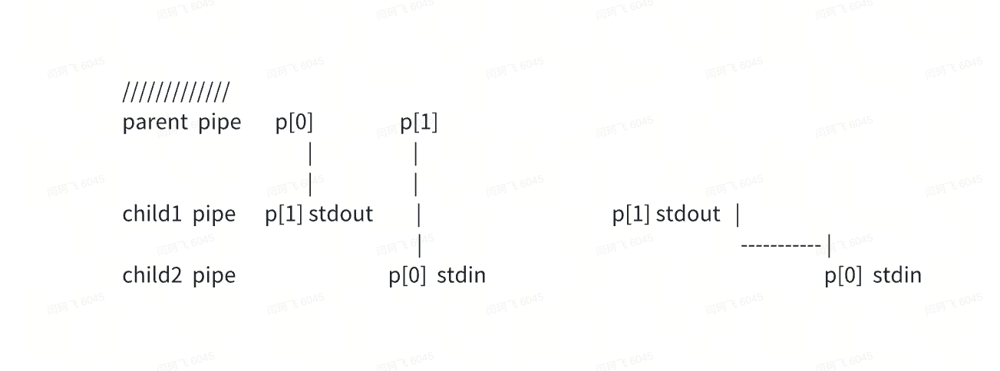

# 10.1 Input


文件描述符：

在UNIX和类UNIX系统中，0 表示标准输入、1 表示标准输出、2 表示标准错误。


## 1. I/O 重定位


**问题：为何fork  和  exec 要分开设计：**

因为如果在进行I/O 重定位时，将自己身的I/O进行修改，然后再恢复，将是非常不方便的

> Now it should be clear why it is helpful that fork and exec are separate calls: between the two, **the shell has a chance to redirect the child’s** **I/O** **without disturbing the I/O setup of the main shell**. One could instead imagine a hypothetical combined forkexec system call, but the options for doing I/O redirection with such a call seem awkward. The shell could modify its own I/O setup before calling forkexec (and then un-do those modifications); or forkexec could take instructions for I/O redirection as arguments; or (least attractively) every program like cat could be taught to do its own I/O redirection. 


## 2. 重定位时close 的作用：

> The close system call releases a file descriptor, making it free for reuse by a future open, pipe, or dup system call (see below). A newly allocated file descriptor i**s always the lowest numbered unused descriptor of the current process.**

close除了释放一个已有的文件描述符，而且还将带来一个很重要的特性，就是紧接着，创建的文件描述符，将会用当前存在的最小文件描述符。经常被用于替换 0，1，2这三个特殊的标准文件描述符。

用于实现IO redirection  重定位的功能:


 Here is a simplified version of the code a shell runs for the command cat < input.txt:

代码：

```C
char *argv[2]; 
argv[0] = "cat"; 
argv[1] = 0; 
if(fork() == 0) { 
    close(0); 
    open("input.txt", O_RDONLY); 
    exec("cat", argv); 
} 
```


## 3. Fork 会对输出做排序

fork之后，文件的偏移量是共用的

Each underlying file offset is shared between parent and child.

```C
if(fork() == 0) { 
    write(1, "hello ", 6); 
    exit(0); 
} else { 
    wait(0); 
    write(1, "world\n", 6); 
} 
```


会输出  `hello  word`

>  This behavior helps produce sequential output from sequences of shell commands, like :
>
>   (echo hello; echo world) >output.txt. 


## 4. Dup 另外一种公用文件偏移量的方法

> The dup system call duplicates an existing file descriptor, returning a new one that refers to the same underlying I/O object. **Both file descriptors share an offset**, just as the file descriptors duplicated by fork do. This is another way to write hello world into a file: 

```C
fd = dup(1); 
write(1, "hello ", 6); 
write(fd, "world\n", 6); 
```


> Two file descriptors share an offset if they were derived from the same original file descriptor by a sequence of **fork and dup calls**. Otherwise, file descriptors do not share offsets, even if they result from open calls for the same file. 

打开一个文件后，能共用文件偏移量的调用，只有 fork 和dup 两个函数。


### 允许这种重定位操作：

> dup allows shells to implement commands like this:
>
>  ls existing-file non-existing-file > tmp1 2>&1. 
>
> The 2>&1 tells the shell to give the command **a file descriptor 2 that is a duplicate of descriptor 1.** Both the name of the existing file and the error message for the non-existing file will show up in the file tmp1

实现起来，应该是先关闭2，然后再  fd = dup(1)；那么  fd基本上就是为1

一个简单的实现：

```C
#include <stdio.h>
#include <unistd.h>

int main() {
    // 关闭标准错误输出
    close(STDERR_FILENO);

    // 复制标准输出文件描述符到标准错误文件描述符
    int dup_result = dup(STDOUT_FILENO);
    if (dup_result == -1) {
        perror("dup");
        return 1;
    }

    // 以下是一些输出，它们将被重定向到标准输出
    printf("这是一个输出\n");
    fprintf(stderr, "这是一个错误消息\n");

    return 0;
}


// 运行这个代码，发现保存标准错误abc的文件是空的
./test 2> abc  
```


在shell编程中，`2>&1` 是一种用于重定向标准错误输出的方法。让我解释一下：

-  是重定向输出的符号。
- `2` 表示标准错误流。
- `&1` 表示将输出重定向到与标准输出相同的位置。

所以 `2>&1` 的含义是将标准错误输出重定向到标准输出的位置。这意味着错误信息将与正常的输出信息一样处理，通常会一同显示在屏幕上或者重定向到同一个文件中。


## 5. pipe 的作用：

有名管道和无名管道都是半双工的。


### **无名管道**：

pipe 创建的，可用于父子进程间通讯

fd[1] 写入，fd[0] 读出


```C
int p[2]; 
char *argv[2]; 
argv[0] = "wc"; 
argv[1] = 0; 
pipe(p); 
if(fork() == 0) { 
    close(0); 
    dup(p[0]); 
    close(p[0]); 
    // 非常重要
    close(p[1]); 
    // 关闭pipe后，wc从标准输入 0 接收数据
    exec("/bin/wc", argv); 
} else { 
    close(p[0]); 
    // 向p[1]中写入数据
    write(p[1], "hello world\n", 12); 
    close(p[1]); 
} 
```


如果write端关闭，read端将收到一个0

> The fact [that read blocks until it is impossible for new data to arrive] is one reason that it’s important for the child to close the write end of the pipe before executing wc above: if one of wc ’s file descriptors referred to the write end of the pipe, wc would never see end-of-file.

之所以必须将child里面的write 端关闭，然后再执行wc, 是因为如果read端会在write端没有数据写入时，阻塞。

如果child没有关闭 write端，那么wc的read端永远不会看到 end-of-file 的状态，从而一直阻塞，无法退出


sh.c 中的一个例子

```C
  case PIPE: 
  {
    pcmd = (struct pipecmd*)cmd;
    if(pipe(p) < 0)
      panic("pipe");
    // 执行fork 
    if(fork1() == 0){
      close(1);
      dup(p[1]);  // 复制标准输出，写入
      close(p[0]);
      close(p[1]);
      runcmd(pcmd->left);
    }
    // 再次执行frok, 来执行 右边的操作，
    if(fork1() == 0){
      close(0);
      dup(p[0]); // 复制标准输入，读取
      close(p[0]);
      close(p[1]);
      runcmd(pcmd->right);
    }
    // ? 作用究竟是什么？
    // 就像下面的图所示，parent进程和 child2 child1进程的 p[0], p[1] 的pid是一样的，因为公用
    // 所有的文件描述符
    // 那么经过上面的这些操作，
    // 已经将 p[0] stdin 以及 p[1] stdout 重定向设置好了
    // 然后执行下面的close操作，那么将多余的fd关闭，就得到了理想的两个child通讯的手段
    close(p[0]);
    close(p[1]);

    // waits for both to finish
    wait(0);
    wait(0);
    break;
  }
```




 the pipeline 

```C
echo hello world | wc 
```

could be implemented without pipes as 

```C
echo hello world >/tmp/xyz; wc </tmp/xyz
```

Pipeline 的作用等同于使用临时文件，不过pipeline有很多好处：

1. 不需要自动清理
2. pipeline可以传递任意数量的数据，而不需要考虑文件空间
3. pipeline 支持并行执行，而文件操作，只能前一个完成后，才能执行下一个步骤


### **有名管道：(内容拓展)**

**有名管道在文件系统中是可见的**，可以像其他文件一样被查找、打开和操作。

创建管道文件：首先，使用系统调用 `mkfifo()` 或者命令行工具 `mkfifo` 来创建一个管道文件。这个文件可以在文件系统中的任何位置创建，可以像普通文件一样被查找和打开。

读写：

```C
char buffer[BUFSIZE];
read(fd, buffer, BUFSIZE); // 从管道中读取数据
write(fd, data, data_size); // 将数据写入管道
```


区别：

有名管道（命名管道）和无名管道之间有几个主要区别：

1. 命名：有名管道有一个名称，可以在文件系统中找到，因此可以被多个进程打开和使用。无名管道没有名称，只能在相关联的进程间使用。
2. 持久性：有名管道是持久的，意味着它们可以在进程退出后继续存在。无名管道是临时的，只能在创建它们的进程或其相关子进程中使用。
3. 关联进程：有名管道通常用于在不相关的进程之间传输数据，因为它们是持久的，并且可以由不同的进程打开。无名管道通常用于在相关的父子进程之间进行通信，因为它们是通过调用 `pipe()` 函数创建的，并且只能由调用 `pipe()` 的进程及其子进程使用。
4. 文件系统中的可见性：有名管道在文件系统中是可见的，可以像其他文件一样被查找、打开和操作。无名管道不在文件系统中可见，只能通过文件描述符来引用它们。


## 6. 文件 file

### fstat 系统调用

The fstat system call retrieves information from the inode that a file descriptor refers to. It fills in a struct stat, defined in stat.h (kernel/stat.h) as: 

```C
#define T_DIR 1 // Directory 
#define T_FILE 2 // File 
#define T_DEVICE 3 // Device 
struct stat { 
    int dev; // File system’s disk device 
    uint ino; // Inode number 
    short type; // Type of file 
    short nlink; // Number of links to file   link后，会递增
    uint64 size; // Size of file in bytes 
};
```


### Link 系统调用：

读写相当于是同一个 inode节点。

The link system call creates another file system name referring to the same inode as an existing file. This fragment creates a new file named both a and b. 

```C
open("a", O_CREATE|O_WRONLY); 
link("a", "b"); 
```

**Reading from or writing to a is the same as reading from or writing to b**. Each inode is identified by a unique *inode number*. After the code sequence above, it is possible to determine that a and b refer to the same underlying contents by inspecting the result of fstat: both will return the same inode number (ino), and the nlink count will be set to 2. 


### unlink 系统调用

rm 删除操作，就是调用的unlink 系统调用

The unlink system call removes a name from the file system. The file’s inode and the disk space holding its content are only freed when the file’s link count is zero and no file descriptors refer to it. Thus adding 

```C
unlink("a"); 
```

to the last code sequence leaves the inode and file content accessible as b. 

下面是一种创建临时inode节点的方法，当进程退出，会自动清理掉

```C
fd = open("/tmp/xyz", O_CREATE|O_RDWR); 
unlink("/tmp/xyz"); 
```

Furthermore, is an idiomatic way to create a temporary inode with no name that will be cleaned up when the process closes fd or exits. 
