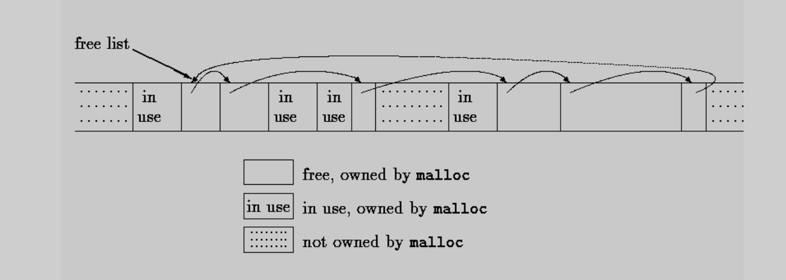
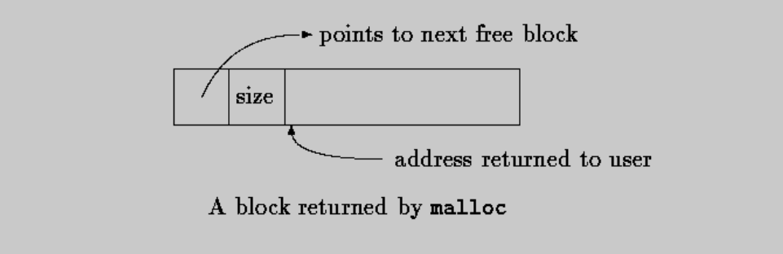
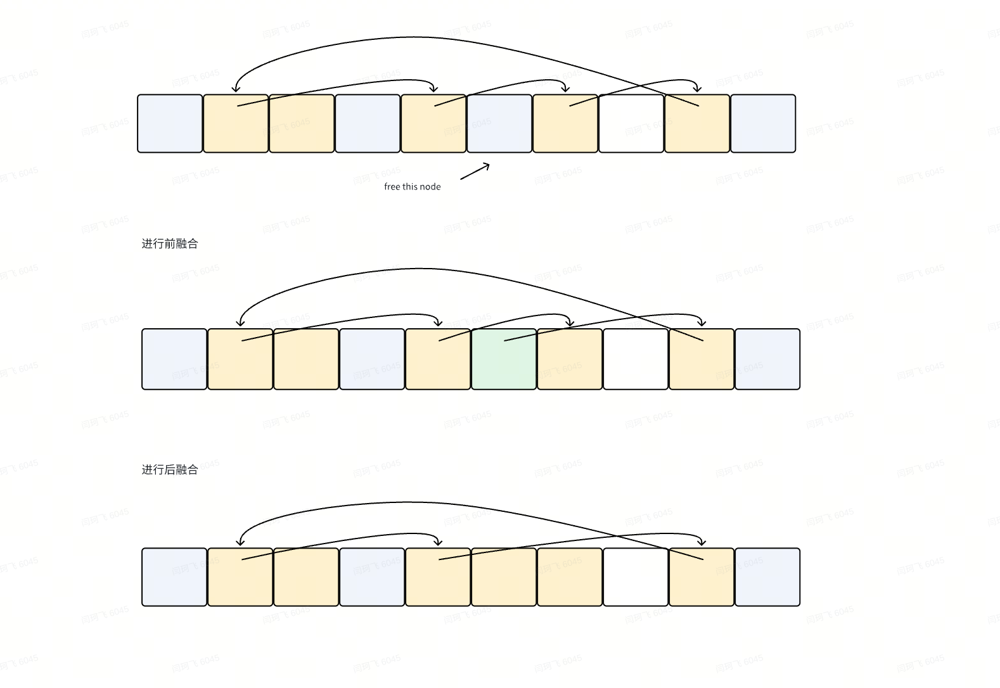
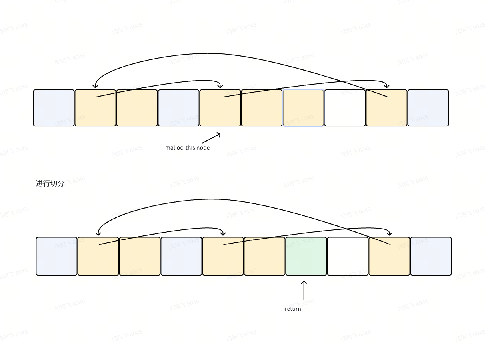
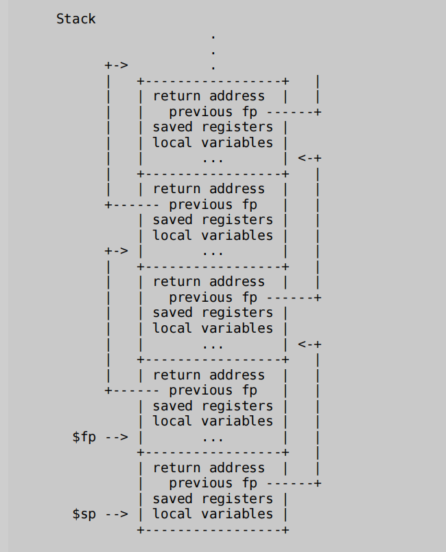
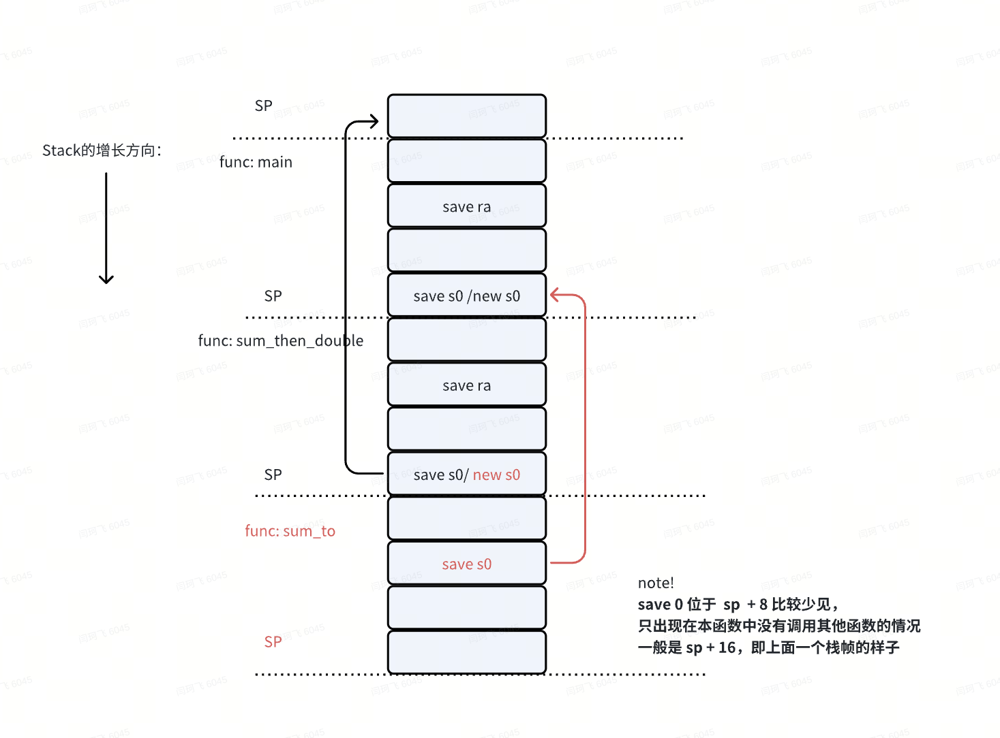

# 11.1 工具相关：

在完成lab的过程中，真的需要海量的查找资料，以及各种debug尝试，过程不易，这里将一些工具相关的都进行记录


##  1. 常用gdb命令：

### 一：关于多线程调试：

当使用GDB调试多线程程序时，对线程的行为和控制方式需要特别注意。GDB提供了对多线程程序的调试支持，包括控制线程的执行方式。当在一个线程中执行单步调试时，**GDB的默认行为是挂起（冻结）所有其他线程，仅让当前线程执行单步操作。这样做可以确保调试过程的一致性和可预测性，避免由于其他线程的并行执行引发的竞态条件和其他并发问题。**

线程行为控制

1. 默认行为：如前所述，GDB默认在单步执行时挂起其他所有线程。这意味着，除了正在被单步执行的线程之外，其他所有线程都不会在这个时间点内前进。
2. 配置线程调试行为：如果你想要在单步调试时让其他线程也能运行，GDB提供了设置选项来调整这种行为。你可以使用`set scheduler-locking`命令来控制这一行为：
   1. `set scheduler-locking on`：在单步调试或继续执行时，只有当前线程会运行，其他线程保持挂起状态。
   2. `set scheduler-locking off`：允许所有线程在调试会话中自由运行，即使在单步调试时也是如此。
   3. `set scheduler-locking step`：仅在单步调试时挂起其他线程，而在使用`continue`命令时不挂起。


### 二：打点以及常用命令：

```C
break userinit
break proc.c:471

Modify breakpoints using delete, disable, enable

cond <number> <condition> adds a condition on an existing breakpoint.


//  常用命令

stepi   ==  si  单步执行一条机器指令
```

`step` 和 `next` 更多用于源代码级别的调试，关注于代码行的执行。

而 `stepi` 和 `nexti` 适用于需要更低级别、更精确的汇编指令级别的调试，关注于CPU执行的每一条指令。

使用 `step` 和 `stepi` 可以查看函数内部的执行细节，而使用 `next` 和 `nexti` 则不会进入函数内部。


### 三：打印 register信息：

```C
info registers
info register pc
p &pc

# 16进制打印寄存器的值
p /x  $sstatus
```


### 四： 关于调试中断 trap

todo


### 五： 执行代码到某个地方 advance

```C
advance location
       运行至指定的地方，如函数，指定行，指定地址。
例如：
advance list_display    //运行至list_display 函数出
advance 23              //运行至23行
```


### 六：watch 命令

```C
watch <expression> will stop execution whenever the expression’s value changes. 


watch -l <address> will stop execution whenever the contents of the specifified memory address change. 


rwatch [-l] <expression> will stop execution whenever the value of the expression is read.
```


### 七：多窗口查看源码

```C
# 单独启动一个窗口查看源码

layout src：显示源代码窗口

layout asm：显示汇编窗口

layout regs：显示源代码和寄存器窗口

layout split：显示源代码和汇编窗口

layout next：显示下一个layout

layout prev：显示上一个layout

Ctrl + L：刷新窗口

Ctrl + x，再按1：单窗口模式，显示一个窗口

Ctrl + x，再按2：双窗口模式，显示两个窗口

Ctrl + x，再按a：回到传统模式，即退出layout，回到执行layout之前的调试窗口。


ref：https://blog.csdn.net/qq_52434033/article/details/123158040
```


### 八： 如何在操作系统中调试 user里面的进程,  **重要**

```C
file user/_call     可以对一个单独的程序做gdb调试操作

# 一种对kernel里面单独进程的调试方法：
Let's try it out: demo1.S 
 (gdb) file user/_demo1 
 (gdb) break main 
 (gdb) continue 
 Why does it stop before running demo1? 不清楚。。。确实会自动停在这里，但是不如主动
  runing demo1 时，调试效果稳定
 
 (gdb) layout split 
 (gdb) stepi 
 (gdb) info registers 
 (gdb) p $a0 
 (gdb) advance 18 
 (gdb) si 
 (gdb) p $a0
```


## 2. script 工具

Linux 中的 `script` 命令用于记录终端会话中的所有活动，非常适用于会话记录、演示或教育目的。当你运行 `script` 命令时，它会创建一个新的 shell 进程，并捕获你在该 shell 中执行的所有命令和输出，直到你退出 shell。

基本用法

**启动记录**：

```Bash
script output.txt
```

- 这条命令开始记录会话，所有输出都会被保存到 `output.txt` 文件中。
- 如果没有指定文件名，输出通常会被保存到 `typescript` 这个默认文件。

**结束记录**：

- 记录会持续到你在记录的 shell 中输入 `exit` 命令或使用 Ctrl+D 来结束会话。
- 

**查看记录的内容**：

```Bash
cat output.txt
```

- 使用 `cat` 或任何文本查看器来查看记录的会话内容。

高级选项

**追加模式**：

```Bash
script -a output.txt
```

- 使用 `-a` 选项将内容追加到指定文件中，而不是覆盖已有内容。

**静默模式**：

```Bash
script -q output.txt
```

- 使用 `-q` 或 `--quiet` 选项可以禁止 `script` 命令在开始和结束时显示提示信息。

**指定命令**：

```Bash
script -c "ls -l" output.txt
```

- 使用 `-c` 选项可以指定一个命令，该命令将在 `script` 中运行并记录。命令运行结束后，`script` 也会结束。

**使用时间戳**：

```Bash
script -t 2> timing.log output.txt
```

- 使用 `-t` 选项可以将时间信息记录到一个额外的文件（在本例中是 `timing.log`），这对于后续重新演示会话内容非常有用。

重放会话

如果你使用了 `-t` 选项记录了时间信息，你可以使用 `scriptreplay` 命令来准确地按照原来的速度重放整个会话：

```Bash
scriptreplay timing.log output.txt
```

- 这会根据记录的时间戳来重放 `output.txt` 中的会话内容，让重放的动作与实际发生时的速度相匹配。

  

总结：`script` 是一个非常实用的工具，用于记录和重放命令行会话，帮助用户保存和共享会话内容。


## 3. addr2line 工具

`addr2line` 是一个在Linux环境下用于将程序中的地址转换为源代码文件中的行号和函数名的工具。这个命令通常用于调试，特别是在分析程序崩溃时的核心转储（core dump）或调试符号表（debugging symbols）时。`addr2line` 可以帮助开发者从二进制可执行文件中追踪错误的具体位置。

基本用法

基本的命令格式是：

```Bash
addr2line [options] addresses
```

- **addresses**：十六进制的地址，通常来源于程序的崩溃报告或核心转储。

常用选项

- `-e <executable>` 或 `--exe=<executable>`：指定要分析的二进制可执行文件或对象文件。这是一个必需的选项，除非在命令行中设置了环境变量。
- `-f` 或 `--functions`：显示函数名。这个选项会使 `addr2line` 尝试解析地址对应的函数名称。
- `-s` 或 `--basenames`：仅显示每个文件的基本名称，而不是完整的路径。
- `-C` 或 `--demangle[=style]`：美化 C++ 符号名称。这对于C++程序特别有用，因为它将使得符号名称更易读。
- `-i` 或 `--inlines`：如果地址位于内联函数中，显示所有内联函数的调用堆栈。

示例

假设你有一个程序 `example`，它崩溃了，并且在崩溃报告中给出了一些内存地址。你想知道这些地址对应源代码中的哪些行：

```Bash
addr2line -e example -f 0x12345
```

这个命令将会输出导致崩溃的那个地址（例如，`0x12345`）在源代码中对应的文件名和行号，如果使用了 `-f` 选项，还会显示函数名。

适用情况

`addr2line` 对于以下情况特别有用：

- **调试程序崩溃**：当程序崩溃并生成核心转储文件时，`addr2line` 可以帮助你快速定位问题所在的源代码位置。
- **分析性能问题**：在性能分析（例如使用 `perf` 工具）后，可以用 `addr2line` 解析特定地址，了解性能瓶颈在代码的哪个部分。
- **开发者调试**：在开发过程中，对于难以通过调试器定位的问题，`addr2line` 可以提供一个快速查找代码位置的方法。

总之，`addr2line` 是Linux下一个强大的工具，用于将执行时的地址映射回源代码的具体位置，是开发和调试中不可或缺的一部分。


## 4. user中的umalloc 库

代码实现地非常优雅，而且逻辑很完备，值得好后学习

### 头部协议定义：





Ref: [The C programming Language, 2nd ed.  Section 8.7.](https://venkivasamsetti.github.io/ebookworm.github.io/Books/cse/C Programming Language (2nd Edition).pdf)


> One problem, which we alluded(暗示) to in Chapter 5, is to ensure that the storage returned by malloc is aligned properly for the objects that will be stored in it. Although machines vary(变化), for each machine there is a most restrictive type: if the most restrictive type can be stored at a particular address, all other types may be also. On some machines, the most restrictive type is a double; on others, int or long suffices. 

之所以需要对齐，是因为需要将返回的地址，进行对齐，以便一个对象可以保存在里面。

这里会选择一个最限制的类型，long, 保证了它，那么其他所有的类型也都可以放下

A free block contains a pointer to the next block in the chain, a record of the size of the block, and then the free space itself; the control information at the beginning is called the ``header.'' To simplify alignment, **all blocks are multiples of the header size, and the header is aligned properly.** This is achieved by a union that contains the desired header structure and **an instance of the most restrictive alignment type**, which we have arbitrarily made a long: 


```C
// Memory allocator by Kernighan and Ritchie,
// The C programming Language, 2nd ed.  Section 8.7.

typedef long Align; /* for alignment to long boundary */ 

union header { /* block header */ 
     struct { 
         union header *ptr; /* next block if on free list */ 
         unsigned size; /* size of this block */ 
     } s; 
     Align x; /* force alignment of blocks */ 
}; 
 
typedef union header Header; 

static Header base;
static Header *freep;
```

> The Align field is never used; it just forces each header to be aligned on a worst−case boundary.

### free 代码：

注意：free参数的节点指针，有可能是一个完全新的节点，同样可以添加进去

释放时，如果相邻的块是空闲的，需要合并



```C
// 注意，ap指针前面的header，只需要size有效就可以了
void
free(void *ap)
{
  Header *bp, *p;

  bp = (Header*)ap - 1;  /* point to block header */
  // 寻找待插入节点的位置
  // bp >p   && pb < p->s.ptr   -- 是确认 pb 是否在p，以及p->str 的范围内

  // 如果一开始没有任何节点，p 和 p->s.ptr 是一个值
  for(p = freep; !(bp > p && bp < p->s.ptr); p = p->s.ptr)
    // p >= p->s.ptr 就是指向前面节点的情况，以及初始节点的情况
    // 而且 p 和 p->s.ptr 就是整个申请区间的边界了。
    // 只有没在这个范围内的，才会直接break
    if(p >= p->s.ptr && (bp > p || bp < p->s.ptr))
      break;  /* freed block at start or end of arena */

  if(bp + bp->s.size == p->s.ptr){    /* join to upper nbr */
    bp->s.size += p->s.ptr->s.size;
    bp->s.ptr = p->s.ptr->s.ptr;
  } else
    bp->s.ptr = p->s.ptr;

  // 这里对bp->s.ptr 的取值，是上面进行的赋值
  if(p + p->s.size == bp){            /* join to lower nbr */
    p->s.size += bp->s.size;
    p->s.ptr = bp->s.ptr;
  } else
    p->s.ptr = bp;

  // 上一次释放的定点位置
  freep = p;
}
```


### malloc 代码：

对足够大小的空闲块的搜索从找到最后一个块的点（freep）开始；

>  In any case, the free list is then searched. The search for a free block of adequate size begins at the point (freep) where the last block was found;

```C
static Header*
morecore(uint nu)
{
  char *p;
  Header *hp;

  if(nu < 4096)
    nu = 4096;
  // 不过返回的p, 也是需要假定是可以正常解析，已经对齐过的
  p = sbrk(nu * sizeof(Header));
  // 强制类型转换使函数相对不受不同机器上指针表示细节的影响。
  if(p == (char*)-1)
    return 0;
  hp = (Header*)p;
  hp->s.size = nu;
  free((void*)(hp + 1));     //  add 到空闲list 中
  return freep;
}
```


>  There is still one assumption, however, that pointers to different blocks returned by sbrk can be meaningfully compared.

然而，仍然有一种假设，即指向sbrk返回的不同块的指针可以进行有意义的比较。


```C
void*
malloc(uint nbytes)
{
  Header *p, *prevp;
  uint nunits;

  // sizeof(Header): 16
  // 需要额外多申请一个Header的空间，用于保存头部信息
  // 0byte, uints为1
  // 1byte, uints 为2
  // 2bytes, uints为2
  // 3, 2
  // ...
  // 16, 2
  // 17, 3
  // 18, 3
  // ...
  // 32, 3
  // 33, 4
  // ...
  nunits = (nbytes + sizeof(Header) - 1)/sizeof(Header) + 1;

   /* no free list yet */ 
  if((prevp = freep) == 0){
    base.s.ptr = freep = prevp = &base;
    base.s.size = 0;
  }
  for(p = prevp->s.ptr; ; prevp = p, p = p->s.ptr){
    // first fit
    if(p->s.size >= nunits){      /* big enough */
      if(p->s.size == nunits)      /* exactly */ 
        prevp->s.ptr = p->s.ptr;
      else {            /* allocate tail end  进行切分, 从尾部开始，更简单 */
        p->s.size -= nunits;
        p += p->s.size;
        p->s.size = nunits;
      }
      freep = prevp;
      return (void*)(p + 1);
    }
    if(p == freep)       /* wrapped around free list */
      if((p = morecore(nunits)) == 0)
        return 0;        /* none left */
  }
}
```





## 5. 常用的汇编指令

下面是出现过的汇编指令的解释，这些都是基于RISC-V架构的汇编指令：

1. **`addi`** - "Add Immediate":
   1. 用法：`addi rd, rs1, imm`
   2. 功能：将一个立即数（imm）加到一个寄存器（rs1）的值上，并将结果存入另一个寄存器（rd）。
   3. 示例：`addi sp, sp, -16` 将栈指针`sp`减16。

1. **`sd`** - "Store Doubleword":
   1. 用法：`sd rs2, offset(rs1)`
   2. 功能：将一个双字（64位值）从寄存器（rs2）存储到由基址寄存器（rs1）加偏移量（offset）指定的内存地址。
   3. 示例：`sd s0, 8(sp)` 将寄存器`s0`的值存储到栈指针`sp`加8字节处的内存地址。

1. **`ld`** - "Load Doubleword":
   1. 用法：`ld rd, offset(rs1)`
   2. 功能：从由基址寄存器（rs1）加偏移量（offset）指定的内存地址加载一个双字（64位值）到寄存器（rd）。
   3. 示例：`ld s0, 8(sp)` 从栈指针`sp`加8字节处的内存地址加载一个双字到寄存器`s0`。

1. **`addiw`** - "Add Immediate Word":
   1. 用法：`addiw rd, rs1, imm`
   2. 功能：将一个立即数（imm）加到一个寄存器（rs1）的值上，将结果截断为32位后符号扩展到64位，并存储到另一个寄存器（rd）。
   3. 示例：`addiw a0, a0, 3` 将寄存器`a0`的值加3，结果存回`a0`。

1. **`ret`** - "Return":
   1. 用法：`ret`
   2. 功能：从当前函数返回。这通常涉及跳转到在寄存器`ra`（返回地址寄存器）中存储的地址。
   3. 示例：`ret` 从当前函数返回到调用它的函数的位置。

1. **`li`** - "Load Immediate":
   1. 用法：`li rd, imm`
   2. 功能：将一个立即数（imm）加载到寄存器（rd）。
   3. 示例：`li a0, 0` 将立即数0加载到寄存器`a0`。

1. **`auipc`** - "Add Upper Immediate to PC":
   1. 用法：`auipc rd, imm`
   2. 功能：将当前程序计数器（PC）的值与一个20位的立即数（左移12位）相加，结果存储在寄存器（rd）中。常用于形成跳转和调用指令的地址。
   3. 示例：`auipc a0, 0x0` 将PC的值加0（实际上是NOP操作）并存入`a0`。

1. **`jalr`** - "Jump And Link Register":
   1. 用法：`jalr rd, offset(rs1)`
   2. 功能：将下一条指令的地址存入寄存器`rd`，然后跳转到由基址寄存器`rs1`加偏移量`offset`指定的地址。通常用于函数调用。
   3. 示例：`jalr 1554(ra)` 跳转到`ra`加1554地址处的函数。

这些指令构成了RISC-V程序的基本操作集，用于函数调用、参数传递、数据移动等操作。


## 6. RISC-V is little-endian

For example, consider the number 1025 (2 to the tenth power plus one) stored in a 4-byte integer:

00000000 00000000 00000100 00000001

| Address                    | Big-Endian representation of 1025                  | Little-Endian representation of 1025               |
| -------------------------- | -------------------------------------------------- | -------------------------------------------------- |
| 00<br />01<br />02<br />03 | 00000000<br />00000000<br />00000100<br />00000001 | 00000001<br />00000100<br />00000000<br />00000000 |


## 7. stack frame

Ref: 

https://pdos.csail.mit.edu/6.1810/2023/lec/l-riscv.txt 

### 函数调用栈帧介绍：

*栈帧由编译器控制*

 Each stack frame(栈帧) consists of the return address and a "frame pointer"(帧指针) to the caller's stack frame. Register **s0** contains a pointer to the current stack frame (it actually points to the address [*of the saved return address on the stack*] plus 8).

寄存器 s0 指向 stack frame,  它实际上指向堆栈上保存的返回地址的地址加8，（ s0 = ra + 8）


 Note that the return address lives at a fixed offset (-8) from the frame pointer of a stackframe, and that the saved frame pointer lives at fixed offset (-16) from the frame pointer.

请注意，返回地址ra 位于离堆栈帧的帧指针的固定偏移量（-8）处，而保存的帧指针(上一个栈帧的帧指针)位于离帧指针的定偏移量（-16）处。


The GCC compiler stores the frame pointer of the currently executing function in the register s0

GCC 将当前函数的帧指针保存在了s0中


Stack 增长的方向向下:



如何理解？

`sp` 寄存器用于指向当前的栈顶位置。

`s0/fp` 寄存器用于指向当前函数栈帧的开始位置，即当前函数的局部变量和调用者保存的寄存器的存储位置。

`ra` 寄存器保存当前函数的返回地址

当一个函数被调用时，以下步骤通常会发生：

1. 保存返回地址：调用指令（如 `jal` 或 `jalr`）自动将返回地址（即调用指令后的下一条指令地址）保存到 `ra` 寄存器中。
2. 调整栈指针：`sp`（栈指针）被调整来为即将调用的函数分配空间。这包括为局部变量、可能的保存寄存器和其他必需的栈帧元素腾出空间。
3. 保存旧的帧指针：当前函数的帧指针（`s0` 或 `fp`）通常被保存到新的栈帧中，以便恢复到调用者的栈帧结构。
4. 设置新的帧指针：`s0`（新的帧指针）被设置为当前的 `sp` 值或其他相关偏移，这样在函数内部可以通过 `s0` 访问所有局部变量和保存的寄存器。


```C
000000000000009e <sum_to>:
// 注意，这里保存s0的方式不固定，当sum_to 里面增加一个函数调用，如printf 的时候
// 将会是另外一种保存方式，所以，对栈帧的追踪，只能通过  s0 指针来完成
9e:    1101           addi      sp,sp,-32
a0:    ec06             sd      ra,24(sp)    #  ra -> sp + 24  # ra 和新s0相差8
a2:    e822             sd      s0,16(sp)    #  s0 -> sp + 16  # 新旧s0相差16
a4:    e426             sd      s1,8(sp)
a6:    1000           addi      s0,sp,32     #  s0 <-  sp + 32 还是原来sp的位置


int sum_to(int n) {
  9e: 1141                  addi  sp,sp,-16    # sp  <-  sp - 16  开辟栈帧
  a0: e422                  sd  s0,8(sp)       # s0  ->  sp + 8   保存旧的栈指针
  a2: 0800                  addi  s0,sp,16     # s0  <-  sp + 16  新的栈帧位于之前sp的位置，
  int acc = 0;
  for (int i = 0; i <= n; i++) {
  a4: 00054d63            bltz  a0,be <sum_to+0x20>
  a8: 0015071b            addiw a4,a0,1
  ac: 4781                  li  a5,0
  int acc = 0;
  ae: 4501                  li  a0,0
      acc += i;
  b0: 9d3d                  addw  a0,a0,a5
  for (int i = 0; i <= n; i++) {
  b2: 2785                  addiw a5,a5,1
  b4: fee79ee3            bne a5,a4,b0 <sum_to+0x12>
  }
  return acc;
}
  b8: 6422                  ld  s0,8(sp)          # s0 <- sp + 8   恢复 s0的值
  ba: 0141                  addi  sp,sp,16        # sp <- sp + 16  退栈
  bc: 8082                  ret
  int acc = 0;
  be: 4501                  li  a0,0
  c0: bfe5                  j b8 <sum_to+0x1a>
  


00000000000000c2 <sum_then_double>:

// ra   返回地址寄存器，下一行指令的地址
// sp   栈指针，指向栈顶的位置
// s0/fp   帧指针，指向当前函数栈帧的基地址，在函数调用时被设置，通常指向栈上的一个固定位置（起始位置）
        在整个函数执行期间，帧指针保持不变

int sum_then_double(int n) {
  c2: 1141                  addi  sp,sp,-16      # sp  <-  sp - 16  开辟栈帧
                            // 下面两行都是保存之前的返回值或帧指针
  c4: e406                  sd  ra,8(sp)         # ra  ->  sp + 8   保存返回地址，用于退出时的复原，只有调用函数时，才会保存ra
  c6: e022                  sd  s0,0(sp)         # s0  ->  sp + 0   保存上一个栈帧的s0,     
  c8: 0800                  addi  s0,sp,16       # s0  <-  sp + 16  新的栈帧位于之前sp的位置
  int acc = sum_to(n);
  ca: 00000097            auipc ra,0x0
  ce: fd4080e7            jalr  -44(ra) # 9e <sum_to>
  acc *= 2;
  return acc;
}
  d2: 0015151b            slliw a0,a0,0x1
  d6: 60a2                  ld  ra,8(sp)         #  ra  <-  sp + 8   恢复 ra的地址
  d8: 6402                  ld  s0,0(sp)         #  s0  <-  sp       恢复s0
  da: 0141                  addi  sp,sp,16       #  sp  <-  sp + 16  恢复栈顶的位置
  dc: 8082                  ret


00000000000000de <main>:

void main(void) {
  de:        1141                        addi        sp,sp,-16
  e0:        e406                        sd        ra,8(sp)
  e2:        e022                        sd        s0,0(sp)
  e4:        0800                        addi        s0,sp,16

  /*ret = */sum_then_double(i);
```




### Register 介绍：


### Running example: sum_to(n) 

```C
int sum_to(int n) { 
    int acc = 0; 
    for (int i = 0; i <= n; i++) { 
        acc += i; 
    } 
    return acc; 
} 
 
What does this look like in assembly code? 

 # sum_to(n) 
 # expects argument in a0 
 # returns result in a0 
 sum_to: 
     mv t0, a0    # t0 <- a0 
     li a0, 0     # a0 <- 0 
 loop: 
     add a0, a0, t0    # a0 <- a0 + t0 
     addi t0, t0, -1   # t0 <- t0 - 1  # 从后向前递减
     bnez t0, loop     # if t0 != 0: pc <- loop 
     ret 
```


### How would another function call sum_to and coll return?

```C
 int main () {
     sum_to(10);
 }
 
 main:
    li a0, 10       # a0 <- 10
    call sum_to 
What are the semantics of call?
  call label :=
    ra <- pc + 4    ; ra <- address of next instruction # ra 保存返回地址
    pc <- label     ; jump to label
    


What are the semantics of return? 
 ret := 
    pc <- ra
```


## 8. 汇编文件的语法：

 ### 汇编代码的头部定义：

汇编文件头部 的定义， .text  和   .section .text 功能一致

```C
在 RISC-V 汇编语言中，.section .text 和 .text 通常有相同的含义，都是用来指定代码段的开始。然而，使用 .section .text 更为通用和明确。下面是两者的解释：
.section .text：
.section 指令用于定义接下来的一段代码或数据所属的段（section）。
.text 是段名，表示这部分代码属于可执行的指令段。
使用 .section .text 更加明确地告诉汇编器你要开始一个新的代码段，这在处理多个段时尤其重要。
.text：
这是一个简化的写法，通常在很多汇编器中等同于 .section .text。
这个简写主要是为了方便使用，但在一些严格的汇编器或特定环境下，可能会有差异。
```

 ### 关于临时寄存器

在 RISC-V 汇编语言中，`t0` 寄存器确实是一个临时寄存器，专门用于短期用途。RISC-V 定义了一些寄存器用于不同的用途，其中一些寄存器可以用作临时寄存器，而不需要担心它们会被调用者保存和恢复。

RISC-V 寄存器使用约定

以下是一些可以作为临时寄存器使用的寄存器，它们在函数调用之间不需要保存：

- `t0` - `t2` (寄存器 x5, x6, x7)
  - 通常用于短期计算和存储，调用者不需要在函数调用之间保存这些寄存器。
- `t3` - `t6` (寄存器 x28, x29, x30, x31)
  - 也可以用于短期计算和存储，调用者同样不需要在函数调用之间保存这些寄存器。


## 9. 嵌入式模块介绍

1. ### BAR

系统中的每个设备中，对地址空间的大小和访问方式可能有不同的需求，例如，一个设备可能有256字节的内部寄存器/存储，应该可以通过IO地址空间访问，而另一个设备可能有16KB的内部寄存器/存储，应该可以通过基于MMIO的设备访问。哪些地址应该使用哪种方式（IO或Memory）来访问它们的内部位置，这是系统软件（即BIOS和OS内核）的工作**。因此设备必须为系统软件提供一种方法来确定设备的地址空间需求。这种需求就是是通过配置空间头部中的Base Address register （BAR）实现的**。一旦系统软件知道设备在地址空间方面的需求，系统软件将分配一个适当类型(IO, NP-MMIO或P-MMIO)的可用地址范围给该设备。

简单描述，就是告诉系统，如何访问这个设备的地址空间，过程就涉及到初始化的逻辑

ref:

https://blog.csdn.net/u013253075/article/details/119361574

https://blog.csdn.net/u013253075/article/details/119485466


## 10. mmap 介绍

### Mmap 系统调用功能介绍

`mmap` 是 Linux 系统中的一个系统调用，用于将文件或设备映射到进程的虚拟内存地址空间。它提供了一种高效的文件 I/O 方式，允许进程直接通过内存访问文件内容，而无需反复调用 read/write 等传统 I/O 函数。

**`mmap`** **的功能**

1. **文件映射**：`mmap` 可以将文件的内容映射到进程的虚拟内存地址空间，使文件内容和内存中的数据保持同步。这意味着对映射区域的修改会直接反映到文件中，而不需要显式地调用写操作。
2. **匿名映射**：`mmap` 也可以创建匿名内存区域，这些区域不与文件或设备相关联，常用于为进程分配大块的内存空间。
3. **共享内存**：多个进程可以使用 `mmap` 共享同一个文件或设备的映射，从而实现进程间通信或数据共享。
4. **内存映射** **I/O**：`mmap` 可以将设备内存（如显卡、I/O 设备的寄存器）映射到进程的虚拟地址空间，使得用户态程序可以直接访问硬件资源。

**`mmap`** **的常用场景**

1. **文件** **I/O** **加速**：将大文件映射到内存中进行访问，避免频繁的系统调用，从而提高文件读写性能，尤其是对大数据文件的随机访问场景。
2. **内存映射数据库**：如 SQLite 等数据库系统，利用 `mmap` 将整个数据库文件映射到内存中，方便数据库的快速访问和更新。
3. **共享内存实现**：多个进程通过 `mmap` 映射同一个文件，或使用匿名映射结合 `fork` 创建共享内存，用于进程间通信。
4. **内存分配优化**：使用 `mmap` 分配内存时可以避免分配器带来的开销，常用于分配大块内存或高性能应用中的内存管理。
5. **设备内存映射**：将硬件设备的物理内存映射到进程的虚拟内存空间，方便用户态程序直接操作硬件设备。
6. **虚拟内存管理**：操作系统的分页机制和内存管理也依赖 `mmap` 提供的功能，如在程序加载时将可执行文件的代码段、数据段等映射到内存中。

`mmap` 提供了一种灵活、高效的文件与内存之间的桥梁，在系统级编程中具有广泛的应用。

### Mmap 映射文件的问题：

如果用 PROT_WRITE 的方式mmap一个文件，然后立即将这个文件删除，那么后面更改内存数据，munmap到文件时是否会报错？

如果你用 `PROT_WRITE` 的方式通过 `mmap` 将一个文件映射到内存，然后立即删除该文件，后续更改内存数据并 `munmap` 时不会报错。具体来说：

1. **文件删除后的行为**：在 Unix/Linux 系统中，当一个文件被删除（即使用 `unlink` 函数删除），文件的元数据（如文件名）和目录项会被移除，但是如果有任何进程仍然打开该文件，文件的数据仍然存在，直到所有引用该文件的文件描述符或映射被关闭或解除。

1. **内存映射的有效性**：即使文件被删除，内存映射仍然有效，你可以继续读写这个内存区域。这是因为内存映射文件时，内核实际上已经将文件的数据加载到内存中，或者映射到页表上。只要映射存在，删除文件不会影响内存中的数据。

1. **修改内存数据并** `**munmap**`：你可以修改内存中的数据，`munmap` 之后，数据不会被写回文件，因为文件已经被删除。但是不会产生错误。`munmap` 只是解除映射，并不会导致试图写回到已删除文件的行为。

总结来说，文件删除后，你仍然可以安全地访问和修改映射的内存区域，并 `munmap`，不会产生错误。但需要注意的是，修改的数据将无法再通过原文件路径访问。
