# 11.2 实验记录：

目前已经将2023版的所有10个lab的作业全部实现，下面是一些记录和通过截图


## Lab 1: **Xv6 and Unix utilities**

primes

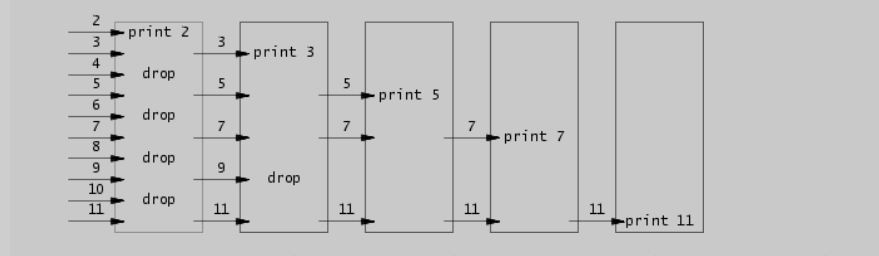

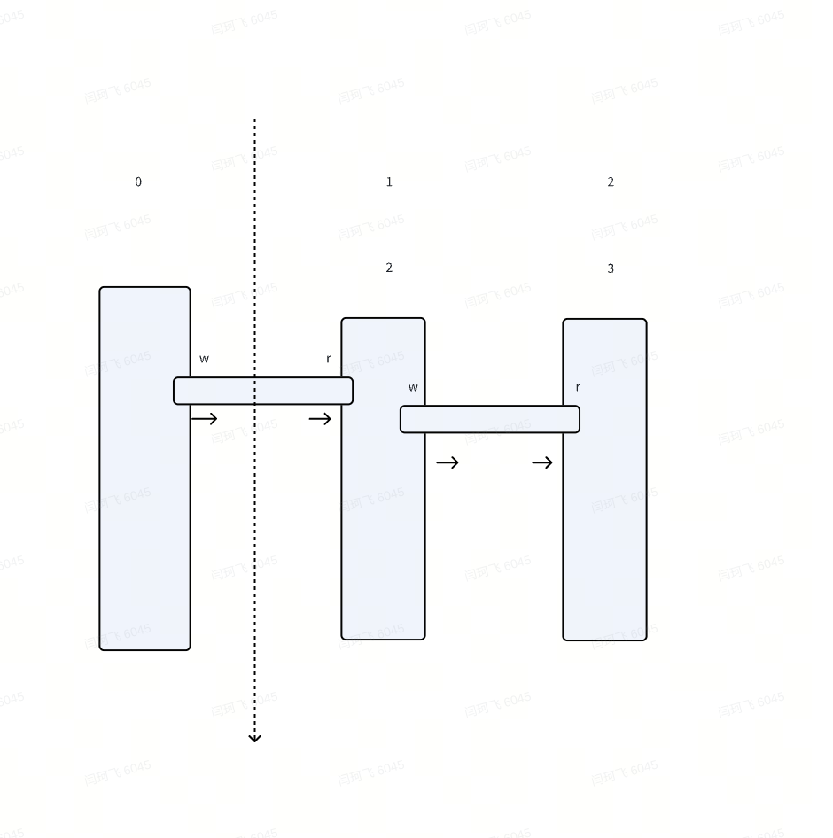

Result: pass

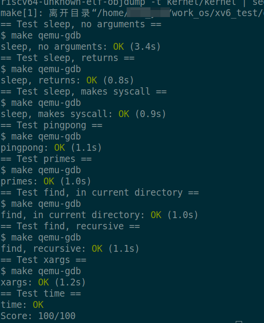

## Lab2: syscall

Result: pass

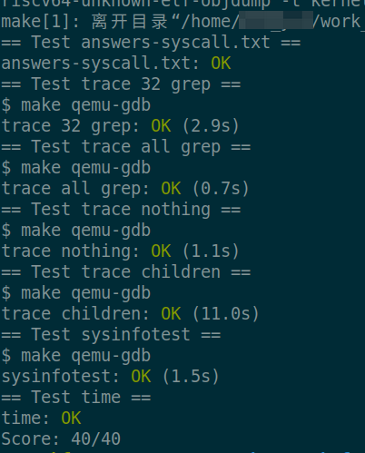

## Lab 3: page table

Result: pass

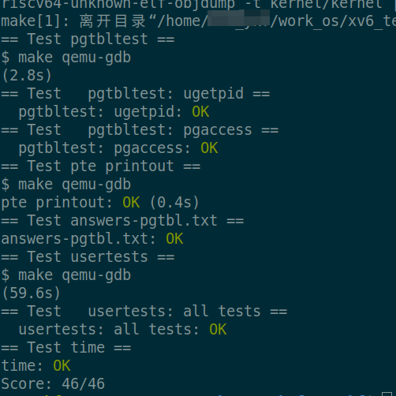


## Lab 4: Traps

 You'll be implementing a primitive form of user-level interrupt/fault handlers; you could use something similar to handle page faults in the application, for example.

您将实现用户级中断/故障处理程序的原始形式；例如，您可以使用类似的方法来处理应用程序中的页错误。

You'll need to modify usertrap() so that when a process's alarm interval expires, the user process  executes the handler function. When a trap on the RISC-V returns to user space, what determines the instruction address（指令地址） at which user-space code resumes execution（用户空间代码恢复执行）?

To fix this, you must ensure that, when the alarm handler is done, control returns to the *instruction at which the user program was originally interrupted by the timer interrupt* (用户程序最初被计时器中断的指令). You must ensure that the register contents are restored to the values they held at the time of the interrupt, so that the user program can continue undisturbed after the alarm. Finally, you should "re-arm" the alarm counter after each time it goes off, so that the handler is called periodically

问题： 当前的xv6 是如何处理缺页中断的？

当前的页映射方式，是全映射的，不是lazy allocation, 所以不会出现缺页中断


查看地址的函数名以及行号信息

```C
riscv64-unknown-elf-addr2line -e kernel/kernel  // 回车，然后再粘贴堆栈信息
```


Result: pass

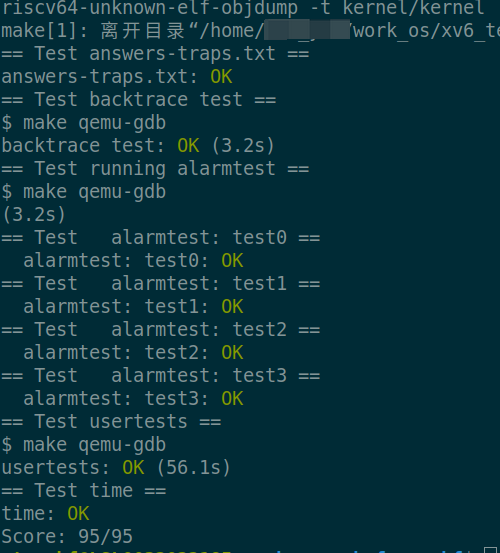


## Lab 5: Cow

 There is a saying in computer systems that any systems problem can be solved with a level of indirection. 


For example, you could index(进行索引，动词) the array with the page's physical address divided by 4096, and give the array a number of elements(数组的元素数) equal to *highest physical address of any page [placed on the free list by kinit() in kalloc.c]*

例如，你可以用页面的物理地址除以4096对数组进行索引，并通过kalloc中的kinit()为数组提供等于空闲列表上任何页面的最高物理地址的元素数

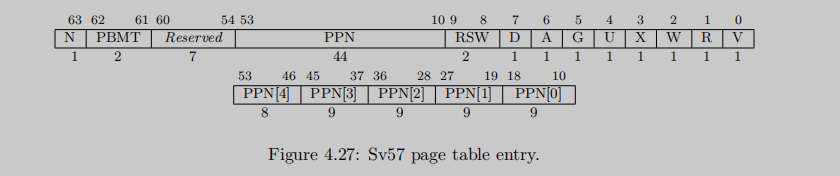

​    1              0          1 0 1  1 0 1 1

 HIDE_W    COW


RISC-V distinguishes three kinds of page fault: load page faults (when a load instruction cannot translate its 

virtual address), store page faults (when a store instruction cannot translate its virtual address), and instruction page faults (when the address in the program counter doesn’t translate). The **scause** register indicates the type of the page fault and the **stval（重要）** register contains the address that couldn’t be translated.


Uvmcopy在 fork后，如果父进程的page被修改，那么子进程的page也需要立即被alloc更新。

**策略：**

所有可能性：

| Parent 类型   | R    | W                            |      | COW_W                        | HIDE_W                       |
| ------------- | ---- | ---------------------------- | ---- | ---------------------------- | ---------------------------- |
| Uvmcopy 后    |      |                              |      |                              |                              |
| Parnet 变化   | R    | HIDE_W                       |      | COW_W                        | HIDE_W                       |
| Child 变化    | R    | COW_W                        |      | COW_W                        | COW_W                        |
|               |      |                              |      |                              |                              |
| Parent exit后 |      |                              |      |                              |                              |
| Child 变化    |      | COW_W, 不能继续 fork... 否则 |      | COW_W, 不能继续 fork... 否则 | COW_W, 不能继续 fork... 否则 |


1. 父page (cow) + 子page(cow)     不可保持，待处理

​      发生场景：**父被cow后，立即继续cow一个子进程**

​      处理方式：父page 被写入，new page + 子 new page

​                        子 page 被写入， 子 new page

2. 父page (伪cow)  +       子page(cow)     不可保持，待处理

发生场景：**父指向实际的page, 然后cow一个子进程**

处理方式：父page 被写入， 增加 w  +  子 new page

​                          子 page 被写入，子 new page,only

3. 父page (r) + 子page(r)                  可保持，可不处理

4. 父page(w) + 子 page(W)               可保持，已处理


如果被修改的是父进程：

1. 如果父进程没有cow的状态，只需要打开 w即可，而且同时将它相关的所有子进程的cow页面全部alloc更新

2. 如果父进程有cow状态，那也就是它也是一个cow的page页面，那么立即更新当前父进程的page,  而且下游的页面也需要立即被更新，因为不能等到父进程被更新后，还保持cow的状态，否则就不再是之前的状态，和copy_on_write 的语义不符。

   

如果被修改的是子进程：

1. 如果是子进程的page被修改了，那么只需要对应的子进程的page进行alloc更新即可


**注意：**

所有多进程的操作，必须进行加锁处理，否则会引起非常多的异常问题，加锁集中在：

1. process中的操作，需要加 **acquire(&wait_lock);**

```C
  /**
   * 当父进程的page被写入后，需要同时通知所有子进程的对应page来创建
  */
  struct proc* cow_child_list[NPROC];  // 最多支持 NPROC 个child proc的记录，用于cow的恢复处理
  int cow_child_num;
```


1. kalloc里面，需要对索引页面进行加锁

```C
  // start from KERNBASE to PHYSTOP
uint8 mem_alloc_ref[USER_PAGE_NUM];
  
  // 必须增加，否则会导致kalloc异常，保护mem_alloc_ref
  struct spinlock alloc_ref_lock;
```


Result: pass

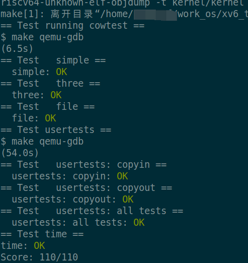


## Lab 6: multithreading

 在risc-v 操作系统中，进行gdb， 使用 file user/_xxx加载一个用户程序，然后打断点，这个断点有可能在执行到这个位置之前就触发了，为何会这样？

> **可能的原因**：多次加载同一地址空间
>
> 在某些情况下，操作系统在用户程序执行前可能多次使用相同的虚拟地址空间。这种情况下，设置的断点可能会在其他使用相同地址空间的代码执行时被触发。

 One goal is to ensure that when thread_schedule() runs a given thread for the first time, the thread executes  the function passed to thread_create(), on its own stack.

> 一个目标是确保，当一个给定线程第一次执行thread_schedule() 时，这个线程，在自己的堆栈上，执行作为参数传递给thread_create()的函数指针 

 Another goal is to ensure that thread_switch saves the registers of the thread being switched away from, restores the registers of the thread being switched to, and returns to the point in the latter thread's  instructions where it last left off. 

> 另一个目标是，保证thread_switch 保存要切换的线程的寄存器，恢复切换到线程的寄存器，然后返回到后者上一次离开的线程的指令位置


thread_switch needs to save/restore only the callee-save registers. Why? 

只需要维护，callee-save（被调用者维护）的寄存器


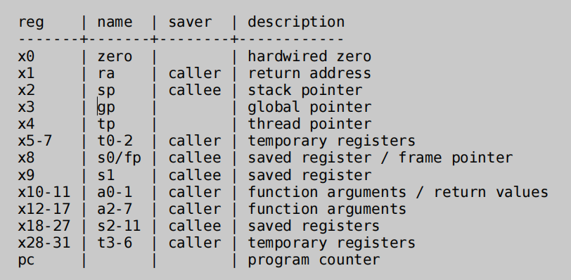

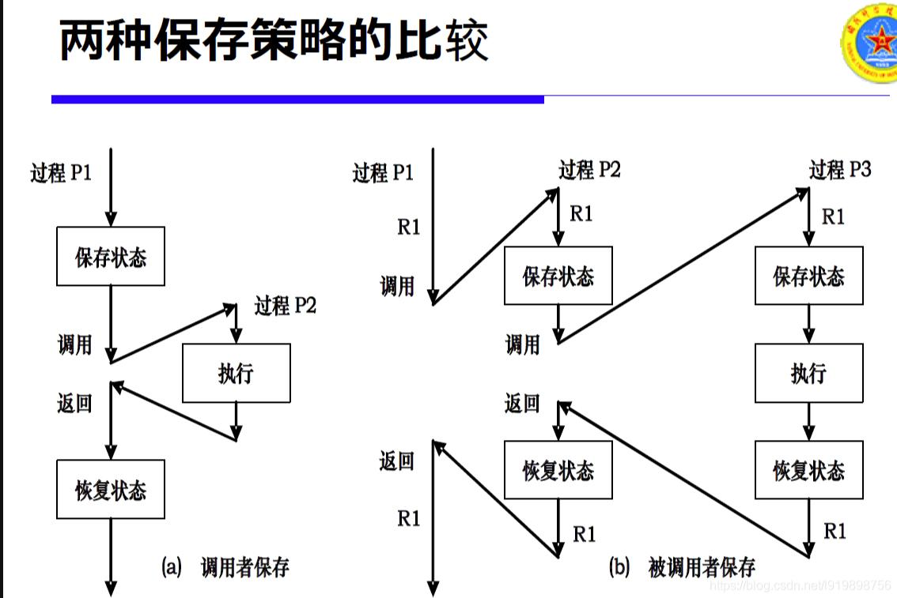


因为caller的寄存器，在线程切换后，不需要考虑它的返回，因为它执行的将是新的代码，所以可以直接覆盖。

而callee 的寄存器，则需要后面切换时，再恢复，因为需要使用到，所以需要保存

切换线程需要做的事情：

1. 保存之前的寄存器，切换为待执行的寄存器
2. 保存之前的堆栈，将待执行的堆栈内容拷贝实际的栈中
3. 状态信息的保存

打印一段内存的方法：

```C
(gdb) x /50xb     0xbfc0, 0xbf90
0xbf90:    0x23   0x20   0x00   0x00        0x00        0x00        0x00        0x00
0xbf98:    0x20   0x00   0x00   0x00        0x00        0x00        0x00        0x00
0xbfa0:        0x63        0x00        0x00        0x00        0x00        0x00        0x00        0x00
0xbfa8:        0x50        0x4f        0x01        0x00        0x00        0x00        0x00        0x00
0xbfb0:        0xd0        0xbf        0x00        0x00        0x00        0x00        0x00        0x00
0xbfb8:        0x6e        0x01        0x00        0x00        0x00        0x00        0x00        0x00
0xbfc0:        0xe0        0xbf
```


Result: pass

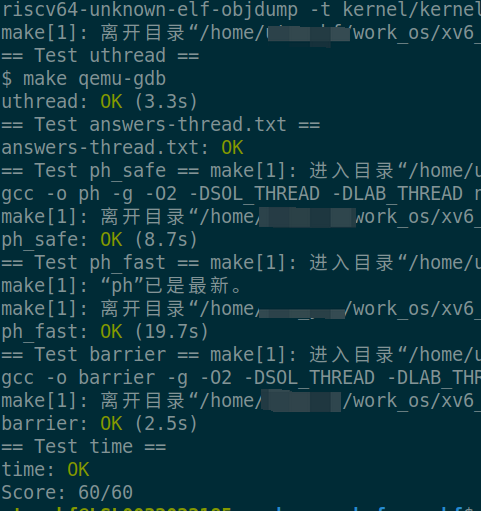


## Lab 7: network

### 什么是PCI?

在 RISC-V 架构中，PCI（Peripheral Component Interconnect）是一种标准的总线接口规范，用于连接计算机系统的外部设备和扩展卡。PCI 提供了一种高速数据传输的通用接口，允许不同厂商开发的硬件设备与计算机系统进行通信和交互。

### E1000 网卡

E1000 网卡，即 Intel 82540EM 千兆以太网控制器，是一种广泛用于虚拟化环境中的虚拟网络设备。它模拟了 Intel 的硬件网卡，主要用于虚拟机和虚拟网络中。

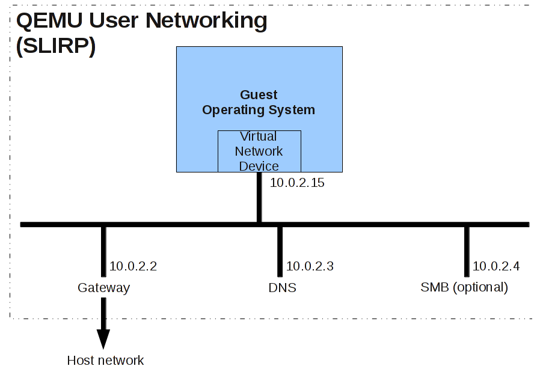


Display pcap:

```C
tcpdump -XXnr packets.pcap
```

Result：  pass

 **注： 某些网络下，最后的DNS测试可能会失败，解析出异常EDNS数据**

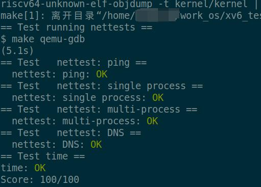


## Lab 8: locks

Result: pass

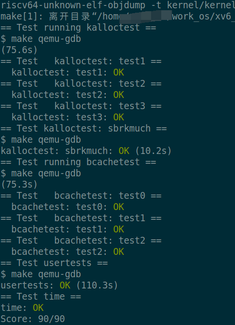

## Lab 9: file system

Result: pass

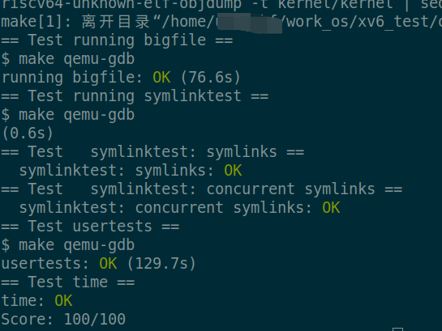

## Lab 10: mmap

Result: pass  第一个方案的结果：

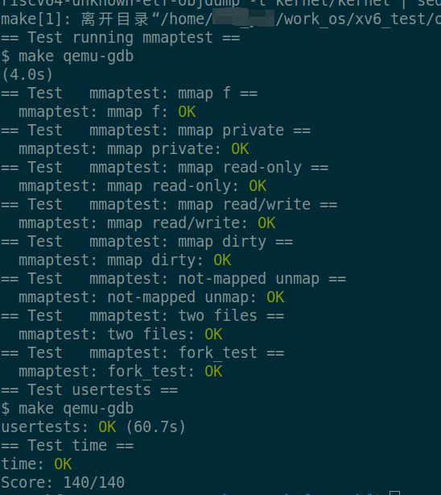

Result: pass  第二个方案的结果：

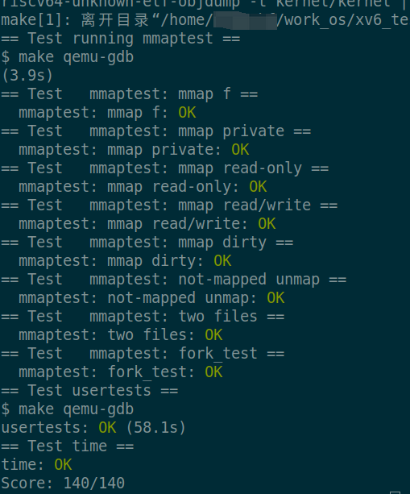


## lab github 地址：

[os_homework_from_ykf](https://github.com/Yankefei/os_homework_from_ykf)

