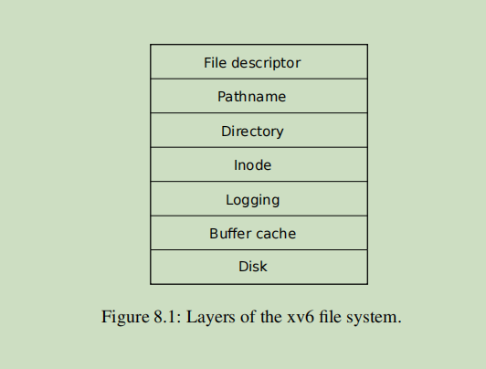

# File system


risc-v 操作系统里面的文件系统，分为下面这些逻辑分层



在磁盘中，block块的分布如下：


1.  Disk                     磁盘驱动.  物理设备
2. Buffer Cache        用户读写磁盘过程中设置的缓存
3. logging                 

​            第一：用于将多次的读写过程，进行事务化，统一commit, 减少磁盘IO的操作次数

​            第二：也有利于事务失败后，对数据进行恢复的操作

1. Inode            主要是磁盘中的dinode结构, 以及内存中的inode结构
2. Directory       目录，信息，也会保存在磁盘最后面的data block结构中
3. Pathname    由一层层的目录所组成的文件目录结构，是对上一个 directory的封装
4. File descriptor


## 0. Parm 解释


```C++
#define NOFILE       16  // open files per process
#define NFILE       100  // open files per system
#define NINODE       50  // maximum number of active i-nodes
#define NDEV         10  // maximum major device number


#define ROOTINO  1   // root i-number
#define ROOTDEV       1  // device number of file system root disk


// 注释下面每个枚举值的定义
#define MAXOPBLOCKS  10  // max # of blocks any FS op writes
#define LOGSIZE      (MAXOPBLOCKS*3)  // max data blocks in on-disk log
#define NBUF         (MAXOPBLOCKS*3)  // size of disk block cache
#define FSSIZE       2000  // size of file system in blocks
#define MAXPATH      128   // maximum file path name
```


NOFILE：一个进程能打开的最多文件数目，默认16个

NFILE：  操作系统多能支持的最多文件数量，100 个

NINODE:  操作系统最多支持的 inode 节点的个数，默认50个

 inode 的作用？

 ROOTINO  1   // root i-number  根目录的inode 从1 开始 

NDEV： 最大的主要设备ID号，用于mkmod

 \#define CONSOLE 1

 \#define STATS   2  // ? 状态统计的设备

ROOTINO：  root 的inode节点号，默认为1,

> Find the inode with number inum on device dev.


ROOTDEV：用于表示存放文件系统的磁盘的ID, 目前主要用在 inode里面的dev字段， buf缓存的dev 字段，以及log 事务中 

```C++
  int dev;   // dev 的字段定义
```

  **这个字段主要是用于以后文件系统可能会有多个，用来区分当前使用的ROOT 磁盘版本，所以会看到，很多层的数据中，都会有这个字段**


MAXOPBLOCKS： 表示最多一次文件操作，可以涉及的block的块数，默认为10 块

**todo**， 如何使用,  主要用于避免写入时，一次写入太多，导致log层的不够放，一般都会远小于log的block数

LOGSIZE:  表示log层最多能缓存的block_id的数量，默认为 3 * MAXOPBLOCKS, 即 30

NBUF：表示磁盘block块 cache 的数量，默认为 3 * MAXOPBLOCKS， 即30

FSSIZE： 表示文件系统中，block块的数量，默认为 2000.

MAXPATH：表示最大的文件路径名称长度，默认为128