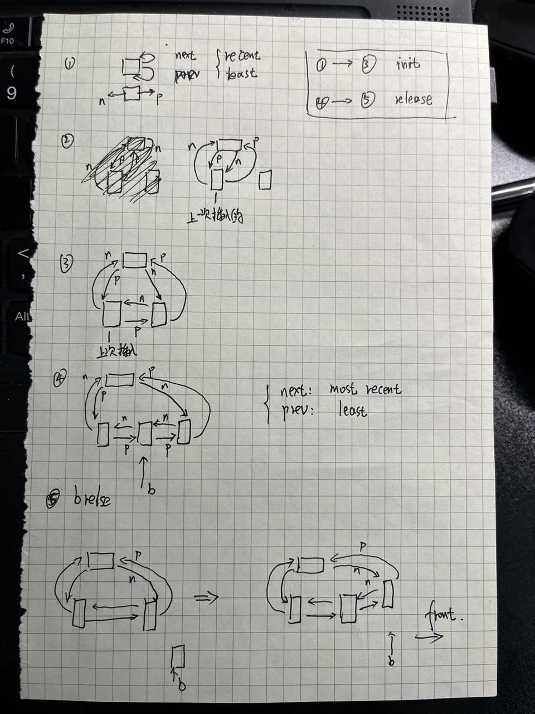

## 一：Buffer cache

### 一句话描述：

Buffer cache 用来直接封装具体的磁盘设备的操作，并对重复的读取操作进行缓存操作，使用引用计数来进行维护，减少读取的次数，针对写入，目前没有做优化，调用一次  bwrite， 则会写入一次

提供给上面使用层更高效，更友好的接口

初始化分配1000个节点的双向链表，每一个块的 data数据是1024 个byte(uchar), 主要起到cache 的作用


cache结构体：

```c
struct {
  struct spinlock lock;         // lock the buf list
  struct buf buf[NBUF];

  // Linked list of all buffers, through prev/next.
  // Sorted by how recently the buffer was used.
  // head.next is most recent, head.prev is least.
  struct buf head;
} bcache;
```


### buf 结构体：

下面的data 字段数组，将会把磁盘中，一个完整的block块的内容都放在里面。

```C
struct buf {
  int valid;   // has data been read from disk?
  int disk;    // does disk "own" buf?
  uint dev;
  uint blockno;
  struct sleeplock lock;
  uint refcnt;
  struct buf *prev; // LRU cache list, least
  struct buf *next; // recent
  uchar data[BSIZE];
};
```





### binit 函数 (1 - 4 图)

```C++
void
binit(void)
{
  struct buf *b;

  initlock(&bcache.lock, "bcache");

  // Create linked list of buffers
  // init head
  bcache.head.prev = &bcache.head;
  bcache.head.next = &bcache.head;
  
  for(b = bcache.buf; b < bcache.buf+NBUF; b++){
    // 每次插入，都向 head -> next 的方向插入
    b->next = bcache.head.next;   // 
    b->prev = &bcache.head;       // 
    initsleeplock(&b->lock, "buffer");
    bcache.head.next->prev = b;
    bcache.head.next = b;
  }
}
```


### bget 函数

> ​      It is safe for bget to acquire the buffer’s sleep-lock outside of the bcache.lock critical(关键) section, since the non-zero b->refcnt prevents the buffer from being re-used for a different disk block.

​      当release bcache.lock 和 acquiresleep b->lock 之间，b->refcnt非零 可以避免映射到同一块缓存buf.(主要是用于下面初次申请 refcnt == 0的场景)

​      而当获取相同的块时，如这个代码块，那么可以不用保护，因为 b->dev == dev && b->blockno == blockno 本身就标志他们是同样的缓存

> ​      **The sleep-lock protects reads and writes of the block’s buffered content, while the bcache.lock protects information about which blocks are cached.**

​      那么下面的 acquiresleep(&b->lock) 是做什么的？ 是用于保护buf里面的data数据，避免不同进程同时读写。

​      这也解释了为什么 brelse 先releasesleep了 b->lock, 然后才是获取bcache.lock， 因为上一个进程已经读写完毕，当前的进程可以继续读写了。

​      也说明了两个锁保护的维护完全不同。


```C
// Look through buffer cache for block on device dev.
// If not found, allocate a buffer.
// In either case, return locked buffer.
static struct buf*
bget(uint dev, uint blockno)
{
  struct buf *b;

  acquire(&bcache.lock);

  // Is the block already cached?
  for(b = bcache.head.next; b != &bcache.head; b = b->next){
    if(b->dev == dev && b->blockno == blockno){
      b->refcnt++;
      release(&bcache.lock);
      // 见上面的文字描述
      acquiresleep(&b->lock);
      return b;
    }
  }

  // Not cached.
  // Recycle the least recently used (LRU) unused buffer.
  for(b = bcache.head.prev; b != &bcache.head; b = b->prev){
    if(b->refcnt == 0) {
      b->dev = dev;
      b->blockno = blockno;
      b->valid = 0;
      b->refcnt = 1;
      release(&bcache.lock);
      // 见上面的文字描述
      acquiresleep(&b->lock);
      return b;
    }
  }
  panic("bget: no buffers");
}
```


### bread 函数

```C
// Return a locked buf with the contents of the indicated block.
struct buf*
bread(uint dev, uint blockno)
{
  struct buf *b;

  // bget 只是获取到一个目前使用，或者 least recently used（LRU，最新最少使用）的未使用的缓存节点
  b = bget(dev, blockno);
  if(!b->valid) {
    // 真正的从磁盘中填充buf, 是在这里
    virtio_disk_rw(b, 0);
    b->valid = 1;
  }
  return b;
}
```

### bwrite 函数

```C
// Write b's contents to disk.  Must be locked.
void
bwrite(struct buf *b)
{
  if(!holdingsleep(&b->lock))
    panic("bwrite");
  virtio_disk_rw(b, 1);
}
```


### brelse 函数

将申请到的buffer缓存节点放在head的next位置，表示最进刚更新完毕

​       和 bget是逆操作

```C
// Release a locked buffer.
// Move to the head of the most-recently-used list.
void
brelse(struct buf *b)
{
  if(!holdingsleep(&b->lock))
    panic("brelse");

  // 这里为何要release？, 见 bget 函数的描述文字
  releasesleep(&b->lock);

  acquire(&bcache.lock);
  b->refcnt--;
  if (b->refcnt == 0) {
    // no one is waiting for it.
    // 将b从链中剥离开
    b->next->prev = b->prev;
    b->prev->next = b->next;
    // 重新插入到 最新的next位置
    b->next = bcache.head.next;
    b->prev = &bcache.head;
    bcache.head.next->prev = b;
    bcache.head.next = b;
  }
  
  release(&bcache.lock);
}
```

