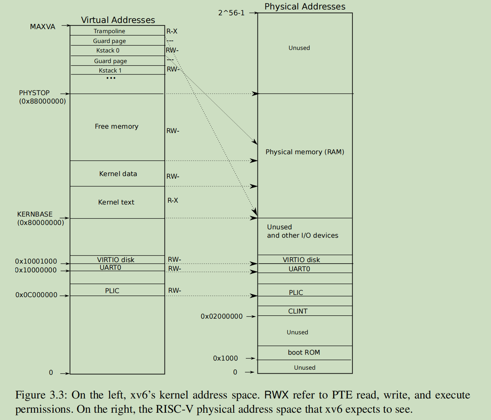

# Kernal address space

## 内核地址空间信息：

```c
// qemu -machine virt is set up like this,
// based on qemu's hw/riscv/virt.c:
//
// 00001000 -- boot ROM, provided by qemu
// 02000000 -- CLINT
// 0C000000 -- PLIC
// 10000000 -- uart0 
// 10001000 -- virtio disk 
// 80000000 -- boot ROM jumps here in machine mode
//             -kernel loads the kernel here
// unused RAM after 80000000.

// the kernel uses physical memory thus:
// 80000000 -- entry.S, then kernel text and data
// end -- start of kernel page allocation area（end 是位于kernel data 和 FreeMemory之间）
// PHYSTOP -- end RAM used by the kernel


MAXVA:
// one beyond the highest possible virtual address.
// MAXVA is actually one bit less than the max allowed by
// Sv39, to avoid having to sign-extend virtual addresses
// that have the high bit set.
#define MAXVA (1L << (9 + 9 + 9 + 12 - 1)) // 0x0000004000000000

Element:
#define PGSIZE 4096 // bytes per page
```

## **direct mapping**

The kernel gets at RAM and memory-mapped device registers using “**direct mapping**;”

## **indirect mapping**

1.  trampoline page

   A physical page (holding the trampoline code) is  mapped twice in the virtual address space of the kernel: once at top of the virtual address  space and once with a direct mapping.

1. Kernel stack pages

​     The kernel stack pages. Each process has its own kernel stack, which is mapped high so  that below it xv6 can leave an unmapped *guard page*.

The kernel maps the pages for the trampoline and the kernel text with the permissions PTE_R  and PTE_X. The kernel reads and executes instructions from these pages. The kernel maps the other pages with the permissions PTE_R and PTE_W, so that it can read and write the memory in those  pages. The mappings for the guard pages are **invalid.** 

下面的 Trampoline 和 kStack0 的映射，需要考虑到 **R-W-X** 的权限，那么从这一点看映射 Guard page 是非法的，因为Guard page 没有任何权限。


## 内核空间的图示：

MAXVA:   **0x0000004000000000**



重新理解了下 **`Trampoline`** 和 **`Kstack0`** 这两个地方向下指向Physical memory的两个箭头的含义：

1. trampoline所需要映射的 trampoline.S的内容，所以在内部有定义下面的语句

   ```C
   .section trampsec
   ```

​	用来让kernel.ld 将trampsec段对齐到page boundary上

​	这样做，是为了方便在kernel启动时，在kvmmake中，将trampoline 映射到地址 TRAMPOLINE 上，所以才有了上面的向下指向的箭头，表示这部分是从下面的text中映射的，而且还可以方便用户进程启动的时候，也能映射到同样的地址 TRAMPOLINE 上，便于后面执行trap handle的处理

2. Kstack0 之所以映射到 FreeMemory上，也就是因为后面会将所有进程的栈空间进行预先映射，智能从FreeMemory中申请物理内存，所以也就有一个箭头指向了FreeMemory部分

> Early in the boot sequence, main calls kvminit (kernel/vm.c:54) to create the kernel’s page table using kvmmake (kernel/vm.c:20). This call occurs before xv6 has enabled paging on the RISC-V, so addresses refer directly to physical memory. kvmmake first allocates a page of physical memory to hold the root page-table page. Then it calls kvmmap to install the translations that the kernel needs. The translations include the kernel’s instructions and data, physical memory up to PHYSTOP,  and memory ranges which are actually devices. proc_mapstacks (kernel/proc.c:33) allocates a kernel stack for each process. It calls kvmmap to map each stack at the virtual address generated  by KSTACK, which leaves room for the invalid stack-guard pages.


## 关键函数：

### Kminithart 函数

>  **After this the CPU will translate addresses using the kernel page table**. Since the kernel uses an identity mapping, the now virtual  address of the next instruction will map to the right physical memory address. 

也就是说，清理TLB的地方有两个：

1. 在kvminithart 里面，重置了satp指针之后
2. 在进去用户空间之前，选择用户 page table 的时候

> Xv6 executes sfence.vma in kvminithart after reloading the satp register, and **in the trampoline code** that switches to a user page table before returning to user space (kernel/trampoline.S:89).

```C
// use riscv's sv39 page table scheme.
#define SATP_SV39 (8L << 60)   // 0x6000000000000000   表示开启page table

#define MAKE_SATP(pagetable) (SATP_SV39 | (((uint64)pagetable) >> 12))


// supervisor address translation and protection;
// holds the address of the page table.
static inline void 
w_satp(uint64 x)
{
  asm volatile("csrw satp, %0" : : "r" (x));
}


// Switch h/w page table register to the kernel's page table,
// and enable paging.
void
kvminithart()
{
  // wait for any previous writes to the page table memory to finish.
  sfence_vma();

  // 将root的page地址写入  satp 寄存器中，开启 paging
  w_satp(MAKE_SATP(kernel_pagetable));

  // flush stale entries from the TLB.
  sfence_vma();
}
```

> To avoid flushing the complete TLB, RISC-V CPUs may support address space identifiers (ASIDs) [3]. The kernel can then flush just the TLB entries for a particular address space. Xv6  does not use this feature.

Xv6 没有开启ASID, 也就是仅仅清理指定地址的TLB缓存的功能

### kvmmake 函数

occurs before xv6 has enabled paging on the RISC-V, so addresses refer directly to physical memory.

```C
// Make a direct-map page table for the kernel.
pagetable_t
kvmmake(void)
{
  pagetable_t kpgtbl;

  kpgtbl = (pagetable_t) kalloc();  // for  root page-table page
  memset(kpgtbl, 0, PGSIZE);

  // uart registers
  kvmmap(kpgtbl, UART0, UART0, PGSIZE, PTE_R | PTE_W);

  // virtio mmio disk interface
  kvmmap(kpgtbl, VIRTIO0, VIRTIO0, PGSIZE, PTE_R | PTE_W);

  // PLIC
  kvmmap(kpgtbl, PLIC, PLIC, 0x400000, PTE_R | PTE_W);

  // map kernel text executable and read-only.
  kvmmap(kpgtbl, KERNBASE, KERNBASE, (uint64)etext-KERNBASE, PTE_R | PTE_X);

  // map kernel data and the physical RAM we'll make use of.
  kvmmap(kpgtbl, (uint64)etext, (uint64)etext, PHYSTOP-(uint64)etext, PTE_R | PTE_W);

  // map the trampoline for trap entry/exit to
  // the highest virtual address in the kernel.
  kvmmap(kpgtbl, TRAMPOLINE, (uint64)trampoline, PGSIZE, PTE_R | PTE_X);

  // allocate and map a kernel stack for each process.
  proc_mapstacks(kpgtbl);
  
  return kpgtbl;
}
```

### proc_mapstacks 函数

​      allocates a kernel stack for each process. It calls kvmmap to map each stack at the virtual address generated  by KSTACK, which leaves room for the invalid stack-guard pages.

宏：

```C
// map the trampoline page to the highest address,
// in both user and kernel space.
#define TRAMPOLINE (MAXVA - PGSIZE)          // 0x4000 000000L - 4096

// map kernel stacks beneath the trampoline,
// each surrounded by invalid guard pages.
#define KSTACK(p) (TRAMPOLINE - ((p)+1)* 2*PGSIZE)
```
```
// Allocate a page for each process's kernel stack.
// Map it high in memory, followed by an invalid
// guard page.
void
proc_mapstacks(pagetable_t kpgtbl)
{
  struct proc *p;
  
  for(p = proc; p < &proc[NPROC]; p++) {
    char *pa = kalloc();
    if(pa == 0)
      panic("kalloc");
    // 每次申请2个 PGSIZE的大小，一个是用户进程的stack, 另外一个是空的区域
    uint64 va = KSTACK((int) (p - proc));
    kvmmap(kpgtbl, va, (uint64)pa, PGSIZE, PTE_R | PTE_W);
  }
}
```

### walk 函数

finds the PTE for a virtual address,

宏：

```C
// extract the three 9-bit page table indices from a virtual address.
#define PXMASK          0x1FF // 9 bits   9bits的MASK值

#define PGSHIFT 12  // bits of offset within a page， 这个是从pa 中反推所需要偏移的位数

// level 取值 [0, 1, 2]
#define PXSHIFT(level)  (PGSHIFT+(9*(level)))   // 获取pa中第几级的  page-table值

// 只取 对应level 的9位 PPN（physical page number）的值
#define PX(level, va) ((((uint64) (va)) >> PXSHIFT(level)) & PXMASK)

// 将PTE的位数转换到pa，注意，这里不是取整，而只是将 PTE里面尾部的10位Flags去掉而已。
// 去掉后，左移12个字节，自然就和一个page的边界进行了对齐
#define PTE2PA(pte) (((pte) >> 10) << 12)
```

```C
// Return the address of the PTE in page table pagetable
// that corresponds to virtual address va.  If alloc!=0,
// create any required page-table pages.
//
// The risc-v Sv39 scheme has three levels of page-table
// pages. A page-table page contains 512 64-bit PTEs.
// A 64-bit virtual address is split into five fields:
//   39..63 -- must be zero.
//   30..38 -- 9 bits of level-2 index.
//   21..29 -- 9 bits of level-1 index.
//   12..20 -- 9 bits of level-0 index.
//    0..11 -- 12 bits of byte offset within the page.

typedef uint64 *pagetable_t; // 512 PTEs

/* va 是一个虚拟内存的地址，这个函数的作用，是通过虚拟地址，来寻找以及Alloc物理地址，
并最终返回一个实际指向PA的地址
*/
pte_t *
walk(pagetable_t pagetable, uint64 va, int alloc)
{
  if(va >= MAXVA)
    panic("walk");

  // 循环2次，而不是三次
  for(int level = 2; level > 0; level--) {
    // 过程中的 pagetable 是在不断变化中的
    // &pagetable[xxx] 的含义是：   使用数组下标法获取位于 pagetable数组中，第若干个元素的地址
    // 这个元素类型是uint64_t 并将结果返回,
    pte_t *pte = &pagetable[PX(level, va)];
    if(*pte & PTE_V) {                         // PTE_V  没有被使用的 page
      // 因为一个PTE数组是一个page, 所以理论上，直接对这个pte指向的地址取物理地址
      // 就可以得到*pte 指向的下一层级 page table的地址了，
      // 因为*pte 往往指向的都是page的起始位置，
      // 变量 pagetable 还可以继续使用
      // 注意： pte指针里面保存的值就是一个地址信息，经过转换，可以变成一个 pa的地址
      pagetable = (pagetable_t)PTE2PA(*pte);
    } else {
      // 从这里得到一个启示，pagetable里面的page有可能来自任意一个自由的page块
      
      // 当设置alloc为0后，直接返回 0，用来检测是否对应物理地址的映射关系是完整的
      if(!alloc || (pagetable = (pde_t*)kalloc()) == 0) 
        return 0;
      memset(pagetable, 0, PGSIZE);
      *pte = PA2PTE(pagetable) | PTE_V;
    }
  }
  // 等遍历2次后，得到最后L0的 pagetable地址，然后返回L0层级 PTE的地址，里面保存的就是PA的PPN值
  return &pagetable[PX(0, va)];
}
```

### walkaddr 函数

**返回的 physical address 不是准确的 va对应的地址，而是 pa地址所在的PPN的起始地址，如果要获取实际的物理地址，还需要拼接上后12位的offset, 显然这个函数没有这样做**

```C
// Look up a virtual address, return the physical address,
// or 0 if not mapped.
// Can only be used to look up user pages.
uint64
walkaddr(pagetable_t pagetable, uint64 va)
{
  pte_t *pte;
  uint64 pa;

  if(va >= MAXVA)
    return 0;

  pte = walk(pagetable, va, 0);
  if(pte == 0)
    return 0;
  if((*pte & PTE_V) == 0)
    return 0;
  if((*pte & PTE_U) == 0)
    return 0;
  pa = PTE2PA(*pte);
  return pa;
}
```

### mappages 函数

 installs PTEs for new mappings

宏定义：

```C
// 增长一个PAGE后，低12位，再被置为0，对齐 PGSIZE
#define PGROUNDUP(sz)  (((sz)+PGSIZE-1) & ~(PGSIZE-1))          // 


// 低12位，将被置为0，对齐 PGSIZE, 注意，这个只会让地址a的值减小，不会增加
#define PGROUNDDOWN(a) (((a)) & ~(PGSIZE-1))                    // 


// shift a physical address to the right place for a PTE.
// 物理地址 转换到  PTE的序号，清理尾部的12个偏移量的值，然后置空最后10个位置，和PTE向物理内存的
// 映射方式相对应
#define PA2PTE(pa) ((((uint64)pa) >> 12) << 10)
```

```C
// Create PTEs for virtual addresses starting at va that refer to
// physical addresses starting at pa. va and size might not
// be page-aligned. Returns 0 on success, -1 if walk() couldn't
// allocate a needed page-table page.

// 创建 PTEs，从va（对应的是pa）开始，一直到递增 size 为止
int
mappages(pagetable_t pagetable, uint64 va, uint64 size, uint64 pa, int perm)
{
  uint64 a, last;
  pte_t *pte;

  if(size == 0)
    panic("mappages: size");
  // 开始和结尾的地址，都是向下对齐page
  a = PGROUNDDOWN(va);
  last = PGROUNDDOWN(va + size - 1);
  for(;;){
    if((pte = walk(pagetable, a, 1)) == 0)
      return -1;
    // 注意。walk只会将L2, L1的page table 的page置位PTE_V, L0的还是不可用状态
    if(*pte & PTE_V)
      panic("mappages: remap");
    // 这里将 pa的物理地址转成 PTE的格式，然后赋值个pte指针的值，也就是L0里面的PPN，完成了初始化操作
    *pte = PA2PTE(pa) | perm | PTE_V;
    if(a == last)
      break;
    a += PGSIZE;
    pa += PGSIZE;
  }
  return 0;
}
```

## 关于 kernel space 的问题：

### 一：关于内核栈：

- **Q**: 内核空间中的 kstack0... 到 kstackN 的这些预分配的内核栈信息，后面是如何使用的？

​	**A**: 应该是只需要在当前进程从用户态切换到内核的时候，将寄存器 sp 指向当前进程关联的内核栈的顶地址即可 

```C
struct trapframe {
  /*   0 */ uint64 kernel_satp;   // kernel page table
  /*   8 */ uint64 kernel_sp;     // top of process's kernel stack
  /*  16 */ uint64 kernel_trap;   // usertrap()
  /*  24 */ uint64 epc;           // saved user program counter
  /*  32 */ uint64 kernel_hartid; // saved kernel tp
  /*  40 */ uint64 ra;
  /*  48 */ uint64 sp;
  ......
  
  
  
// 而在下面的从内核态返回用户态的trap handle中，会对 kernel_sp里面的kernel_sp进行对应的设置
// return to user space
//
void
usertrapret(void)
{
  // printf("usertrapret, pid: %d\n", myproc()->pid);
  struct proc *p = myproc();

  // we're about to switch the destination of traps from
  // kerneltrap() to usertrap(), so turn off interrupts until
  // we're back in user space, where usertrap() is correct.
  intr_off();

  // send syscalls, interrupts, and exceptions to uservec in trampoline.S
  uint64 trampoline_uservec = TRAMPOLINE + (uservec - trampoline);
  // printf("usertrapret: uservec address: %p\n", uservec - trampoline);
  w_stvec(trampoline_uservec);

  // set up trapframe values that uservec will need when
  // the process next traps into the kernel.
  p->trapframe->kernel_satp = r_satp();         // kernel page table
  p->trapframe->kernel_sp = p->kstack + PGSIZE; // process's kernel stack
  ......
```

从这里也可以看出，操作系统的任务是将栈空间分配好，sp指针设置好，至于实际的入栈出栈过程，基本上是由程序的代码段来完成的，也就是由编译器在编译时，就指定好了。

### 二： todo