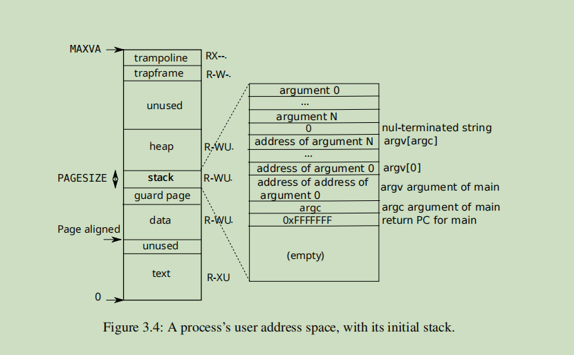
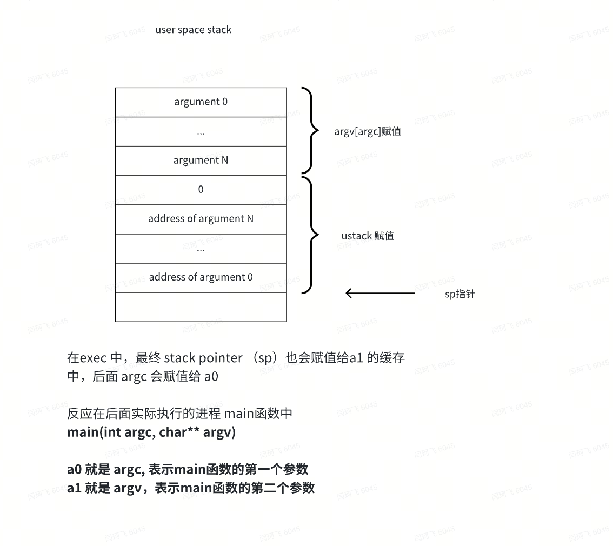

# xv6 note - process 篇

xv6 里面的进程相关的信息，从进程地址空间的分布，和加载和映射文件，都有涉及，和其他操作系统有区别的是，xv6的用户进程地址空间和内核进程地址空间

是完全分开的，与linux等操作系统很不一样。


## process memeory

进程需要申请的三种内存:

1. 虚拟的内存信息（这个在进程一开始就会生成完成），所以基本上无需申请，就可以使用

1. page table   页面，也属于物理内存的范畴

  属于每个进程所独有的，一般是随进程的初始化而申请，随进程的wait 等操作而释放

1. 实际的物理内存

1. 在需要的时候申请，包含了实际需要映射虚拟内存的部分，以及 用于page-table 的部分

  

内核进程所需要的物理内存

目前看代码，没有像普通进程一样的 uvmalloc 在物理内存开坡空间的过程，具体如何做？

```C
        # qemu -kernel loads the kernel at 0x80000000
        # and causes each hart (i.e. CPU) to jump there.
        # kernel.ld causes the following code to
        # be placed at 0x80000000.
```

因为物理内存对于内核来说有权限进行访问，只要权限足够，基本没有需要开辟这一说，对于risc-v来说是这样，而且基本都是申请的静态结构体。而且，我尝试在内核代码中调用 uvmalloc，可以可以生效的，只能说原始代码中没有涉及到而已。


普通进程所需要的物理内存

1. 普通的进程使用物理内存的过程，在exec函数中，使用 uvmalloc 函数，将读取到文件中的段信息，先在物理内存上开辟空间，

然后将具体的文件数据映射到已经开辟好的物理内存上

1. 在risc-v中，调用 malloc，也会通过系统调用 sbrk，来间接使用 uvmalloc 函数


## user space process 

### 用户空间的图示：



实际的 user stack 的内容：



请留意地址空间上面的两个地方：

- trampoline，这个部分是映射来自内核文件的text 数据，所以是RX权限
- trapframe, 这个是一个在内存中记录trap 过程的空间，需要用来读写，所以是 RW 权限


### fork 函数

```C
// Create a new process, copying the parent.
// Sets up child kernel stack to return as if from fork() system call.
int
fork(void)
{
  int i, pid;
  struct proc *np;
  struct proc *p = myproc();

  // Allocate process.
  // 新的进程是在这个函数中创建的
  if((np = allocproc()) == 0){
    return -1;
  }

  // Copy user memory from parent to child.
  if(uvmcopy(p->pagetable, np->pagetable, p->sz) < 0){
    freeproc(np);
    release(&np->lock);
    return -1;
  }
  np->sz = p->sz;

  // copy saved user registers.
  // 在allocproc中，新进程的trapframe已经完成创建好了对应的物理内存，而且完成了页表的映射
  // 这里会对整个结构体 trapframe 进行赋值
  *(np->trapframe) = *(p->trapframe);

  // Cause fork to return 0 in the child.
  //
  // 重要！！！因为在调度之后，新的进程不会通过fork的systemcall的方式返回
  // 而从kenel space 的执行结果，返回到 user space后，基本都走的通过寄存器a0来进行传递
  // 比如 systemcall
  // 这里提前对a0进行赋值，那么也就直接指明了后面新进程的返回值
  //
  np->trapframe->a0 = 0;

  // increment reference counts on open file descriptors.
  for(i = 0; i < NOFILE; i++)
    if(p->ofile[i])
      np->ofile[i] = filedup(p->ofile[i]);
  np->cwd = idup(p->cwd);

  safestrcpy(np->name, p->name, sizeof(p->name));

  pid = np->pid;

  release(&np->lock);

  acquire(&wait_lock);
  np->parent = p;
  release(&wait_lock);

  acquire(&np->lock);
  np->state = RUNNABLE;
  release(&np->lock);

  return pid;
}
```

创建一个新进程的逻辑：

1. 父进程调用fork后，在 allocproc中 会创建子进程相关的资源，比如 proc进程变量， trapframe 段的物理内存，以及pagetable 指针，**然后子进程会完全将父进程的 trapframe信息拷贝过来，作为后面执行的依据**，还有context上下文信息。其中，在 上下文的  ra 和  sp 变量中保存了起始执行的函数地址：forkret，以及调整栈地址到栈顶
2. 之后父进程将子进程的相关信息进行填充，设置为  RUNNABLE,  返回子进程的pid，结束。
3. 等子进程在scheduler中进行调度，然后将 RUNNABLE 设置为 RUNNING，那么将会开始执行位于ra寄存器的 forkret. 这个函数，主要是调用 usertrapret 函数，从内核空间返回到用户空间，并设置后面中断的处理方式。
4. 最后执行汇编函数  userret，加载来自 trapframe 里面缓存的信息到寄存器。在fork之后运行时，加载的是来自parent进程的trapframe中相关的信息，也就是说，等usertrapret结束后，会从父进程调用fork的地方开始继续执行


#### -- allocproc 函数

```C
// Look in the process table for an UNUSED proc.
// If found, initialize state required to run in the kernel,
// and return with p->lock held.
// If there are no free procs, or a memory allocation fails, return 0.
static struct proc*
allocproc(void)
{
  struct proc *p;

  for(p = proc; p < &proc[NPROC]; p++) {
    acquire(&p->lock);
    if(p->state == UNUSED) {
      goto found;
    } else {
      release(&p->lock);
    }
  }
  return 0;

found:
  p->pid = allocpid();
  p->state = USED;

  // Allocate a trapframe page.
  if((p->trapframe = (struct trapframe *)kalloc()) == 0){
    freeproc(p);
    release(&p->lock);
    return 0;
  }

  // An empty user page table.
  p->pagetable = proc_pagetable(p);
  if(p->pagetable == 0){
    freeproc(p);
    release(&p->lock);
    return 0;
  }

  // Set up new context to start executing at forkret,
  // which returns to user space.
  memset(&p->context, 0, sizeof(p->context));
  // 重要，因为这个里面将会在schdule之后，调用 usertrapret， 来完成从内核空间跳转到用户空间的操作
  p->context.ra = (uint64)forkret;
  // yes， 这个地方增加一个 PGSIZE, 只是为了 将栈指针放在栈顶
  
  // 另外， 这个地方给sp赋值的相当于内核栈的地址， p->kstack 是启动后，为每个进程所分配的栈空间的地址
  // 后面forkret调用后，也会在栈空间中执行
  p->context.sp = p->kstack + PGSIZE;

  return p;
}
```

上面关键的 frokret 函数的地址，为什么要赋值到 context的ra变量中，也就是实际的ra寄存器呢？

**这个是因为在risc-V中，`ret` 指令是一个伪指令，用于从函数返回到调用者，实际上，`ret`伪指令等价于`jalr`指令的一个特定用法，即跳转回到`ra`（返回地址寄存器，通常是`x1`寄存器）中保存的地址。因此，执行`ret`指令意味着当前执行流将返回到`ra`寄存器中存储的地址，也就是之前调用当前函数的地点。**


### exec 函数

```Go
int
exec(char *path, char **argv)
{
  char *s, *last;
  int i, off;
  uint64 argc, sz = 0, sp, ustack[MAXARG], stackbase;
  struct elfhdr elf;
  struct inode *ip;
  struct proghdr ph;
  pagetable_t pagetable = 0, oldpagetable;
  struct proc *p = myproc();

  begin_op();

  if((ip = namei(path)) == 0){
    end_op();
    return -1;
  }
  ilock(ip);

  // Check ELF header
  if(readi(ip, 0, (uint64)&elf, 0, sizeof(elf)) != sizeof(elf))
    goto bad;

  if(elf.magic != ELF_MAGIC)
    goto bad;

  if((pagetable = proc_pagetable(p)) == 0)
    goto bad;

  // Load program into memory.
  // 这里也说明了 ph 结构是需要被循环读取的
  for(i=0, off=elf.phoff; i<elf.phnum; i++, off+=sizeof(ph)){
    if(readi(ip, 0, (uint64)&ph, off, sizeof(ph)) != sizeof(ph))
      goto bad;
    if(ph.type != ELF_PROG_LOAD)
      continue;
    if(ph.memsz < ph.filesz)
      goto bad;
    if(ph.vaddr + ph.memsz < ph.vaddr)
      goto bad;
    if(ph.vaddr % PGSIZE != 0)   // 已经对 vaddr进行了校验，说明必须在链接时，对段进行对齐
      goto bad;
    uint64 sz1;
    // sz 是oldsz，初始化为0, 
    // ph.vaddr + ph.memsz 是新的sz, 将这一段虚拟内村映射到物理内存上，第一轮会从0开始映射
    // 
    if((sz1 = uvmalloc(pagetable, sz, ph.vaddr + ph.memsz, flags2perm(ph.flags))) == 0)
      goto bad;
    sz = sz1;

    // ph.vaddr    程序段的虚拟地址       va
    // ph.off      程序段在文件中的偏移量  offset
    // ph.filesz   程序段在文件中的大小    sz
    // 注意，映射之前，装载文件之前，需要先调用uvmalloc来开辟空间
    
    // 问题：如果处理 filesz < memsz 的问题？ 会在什么时候将 0 填充到间隙中
    if(loadseg(pagetable, ph.vaddr, ip, ph.off, ph.filesz) < 0)
      goto bad;
  }
  iunlockput(ip);
  end_op();
  ip = 0;

  p = myproc();
  uint64 oldsz = p->sz;

  // Allocate two pages at the next page boundary.
  // Make the first inaccessible as a stack guard.
  // Use the second as the user stack.
  sz = PGROUNDUP(sz);
  uint64 sz1;
  if((sz1 = uvmalloc(pagetable, sz, sz + 2*PGSIZE, PTE_W)) == 0)
    goto bad;
  sz = sz1;
  uvmclear(pagetable, sz-2*PGSIZE);
  sp = sz;
  // SP 寄存器是指栈指针寄存器（Stack Pointer Register）。
  // 栈指针寄存器主要用于指向程序执行过程中栈（Stack）的顶部，即栈顶
  stackbase = sp - PGSIZE;

  // Push argument strings, prepare rest of stack in ustack.
  for(argc = 0; argv[argc]; argc++) {
    if(argc >= MAXARG)
      goto bad;
    sp -= strlen(argv[argc]) + 1;
    sp -= sp % 16; // riscv sp must be 16-byte aligned
    if(sp < stackbase)
      goto bad;
    // kernel to user space
    if(copyout(pagetable, sp, argv[argc], strlen(argv[argc]) + 1) < 0)
      goto bad;
    ustack[argc] = sp;
  }
  ustack[argc] = 0;

  // push the array of argv[] pointers.
  sp -= (argc+1) * sizeof(uint64);
  sp -= sp % 16;
  if(sp < stackbase)
    goto bad;
  if(copyout(pagetable, sp, (char *)ustack, (argc+1)*sizeof(uint64)) < 0)
    goto bad;

  // arguments to user main(argc, argv)
  // argc is returned via the system call return
  // value, which goes in a0.
  // a0 ->  argc 表示第一个参数
  // a1 ->  argv 表示第二个参数
  p->trapframe->a1 = sp;

  // Save program name for debugging.
  for(last=s=path; *s; s++)
    if(*s == '/')
      last = s+1;
  safestrcpy(p->name, last, sizeof(p->name));
    
  // Commit to the user image.
  oldpagetable = p->pagetable;
  p->pagetable = pagetable;
  p->sz = sz;
  // entry 程序入口点地址
  // 重要，因为在调用了frok后，epc还是父进程的epc地址，只有在exec中，才会修改epc的值
  p->trapframe->epc = elf.entry;  // initial program counter = main
  p->trapframe->sp = sp; // initial stack pointer

  // 清理旧进程的相关进程信息
  // 也包括之前 fork的时候，从父进程所拷贝的物理内存
  proc_freepagetable(oldpagetable, oldsz);

  return argc; // this ends up in a0, the first argument to main(argc, argv)

 bad:
  if(pagetable)
    proc_freepagetable(pagetable, sz);
  if(ip){
    iunlockput(ip);
    end_op();
  }
  return -1;
}
```


 Xv6 performs a number of checks to avoid these risks. For example if(ph.vaddr + ph.memsz < ph.vaddr) checks for whether the sum overflows a 64-bit integer. The danger is that a user could construct an ELF binary with a ph.vaddr that points to a user-chosen address, and ph.memsz large enough that the sum overflows to 0x1000, which will look like a valid value. In an older version of xv6 in which the user address space also 

contained the kernel (but not readable/writable in user mode), the user could choose an address that corresponded to kernel memory and would thus copy data from the ELF binary into the kernel. **In the RISC-V version of xv6 this cannot happen, because the kernel has its own separate page table; loadseg loads into the process’s page table, not in the kernel’s page table**.

用户地址空间没有包含内核的page table，这或许是原因之一，避免一些不安全的加载操作


### proc_pagetable 函数

```C
// Create a user page table for a given process, with no user memory,
// but with trampoline and trapframe pages.
pagetable_t
proc_pagetable(struct proc *p)
{
  pagetable_t pagetable;

  // An empty page table.
  pagetable = uvmcreate();
  if(pagetable == 0)
    return 0;

  // map the trampoline code (for system call return)
  // at the highest user virtual address.
  // only the supervisor uses it, on the way
  // to/from user space, so not PTE_U.
  // trampoline 的虚拟地址，是文件中的符号的地址
  // 也就是说在编译时就已经确定了 0000000080007000
  if(mappages(pagetable, TRAMPOLINE, PGSIZE,
              (uint64)trampoline, PTE_R | PTE_X) < 0){
    uvmfree(pagetable, 0);
    return 0;
  }

  // map the trapframe page just below the trampoline page, for
  // trampoline.S.
  // 这里的 p->trapframe 是执行exec 进程的信息
  // 会在 allocproc 时已经调用 kalloc 申请好了
  if(mappages(pagetable, TRAPFRAME, PGSIZE,
              (uint64)(p->trapframe), PTE_R | PTE_W) < 0){
    uvmunmap(pagetable, TRAMPOLINE, 1, 0);
    uvmfree(pagetable, 0);
    return 0;
  }

  return pagetable;
}
```


### proc_freepagetable 函数

调用 proc_freepagetable 的函数，不仅有 freeproc，也就是wait函数，而且还有exec函数，用于在映射新的page-table后，

将fork出的旧的进程映射关系进行解除

```C
// Free a process's page table, and free the
// physical memory it refers to.
void
proc_freepagetable(pagetable_t pagetable, uint64 sz)
{
  // TRAMPOLINE 的 物理内存，普通进程和内核进程所公用，所以这里释放的时候，只是将
  // page-table的映射关系解除
  uvmunmap(pagetable, TRAMPOLINE, 1, 0);
  // 仅仅释放映射关系，具体的该进程所对应的物理内存，将在  wait 函数中进行释放
  // 调用 freeproc
  uvmunmap(pagetable, TRAPFRAME, 1, 0);
  // 不仅释放进程的除 TRAMPOLINE 和 TRAPFRAME的物理内存，而且还将这部分物理内存的page-table
  // 映射关系也进行解除
  uvmfree(pagetable, sz);
}
```


#### -- uvmfree 函数

```C
// Free user memory pages,
// then free page-table pages.
// 

void
uvmfree(pagetable_t pagetable, uint64 sz)
{
  if(sz > 0)
    uvmunmap(pagetable, 0, PGROUNDUP(sz)/PGSIZE, 1);
  freewalk(pagetable);
}
```


#### -- freewalk 函数

```C
// Recursively free page-table pages.
// All leaf mappings must already have been removed.

// 递归处理 页表的page信息
void
freewalk(pagetable_t pagetable)
{
  // there are 2^9 = 512 PTEs in a page table.
  for(int i = 0; i < 512; i++){
    pte_t pte = pagetable[i];
    if((pte & PTE_V) && (pte & (PTE_R|PTE_W|PTE_X)) == 0){
      // this PTE points to a lower-level page table.
      uint64 child = PTE2PA(pte);
      freewalk((pagetable_t)child);
      pagetable[i] = 0;
    } else if(pte & PTE_V){
      panic("freewalk: leaf");
    }
  }
  kfree((void*)pagetable);
}
```


### loadseg 函数

```C
// Load a program segment into pagetable at virtual address va.
// va must be page-aligned
// and the pages from va to va+sz must already be mapped.
// Returns 0 on success, -1 on failure.


// 将 文件部分的段内容，拷贝到 va 对应的物理内存中，va即 虚拟内存，实际应该指向 pa中
static int
loadseg(pagetable_t pagetable, uint64 va, struct inode *ip, uint offset, uint sz)
{
  uint i, n;
  uint64 pa;

  // 一次读取 PGSIZE 大小 4K
  for(i = 0; i < sz; i += PGSIZE){
    pa = walkaddr(pagetable, va + i);
    if(pa == 0)
      panic("loadseg: address should exist");
    if(sz - i < PGSIZE)
      n = sz - i;
    else
      n = PGSIZE;
    if(readi(ip, 0, (uint64)pa, offset+i, n) != n)
      return -1;
  }
  
  return 0;
}
```


# 关于 process 的相关问题：

## 一：关于内核 process

1. 当默认的-smp 设置为3时，也就是有三个逻辑的CPU，那么操作系统启动之后，正常情况下会有多少个内核进程，多少个用户进程，它们之间是如何划分和转化的？

​     目前看默认的进程数，由qemu 启动时的参数 `-smp` 来决定的 ，而且目前看，所有包含的进程数，都会在调度后，变成真正工作的进程，甚至包括默认的 initproc 进程，都是可以实际参与后面工作的

所以，xv6的工作方式，有点类似于固定进程数的任务轮询机制


注：

在Linux系统中，内核进程（也称为内核线程）是直接由内核管理和运行的进程，不属于任何用户空间程序。内核进程通常在系统启动时创建，用于执行各种底层任务，如硬件中断处理、系统调度、文件系统管理等。这些进程是Linux系统稳定运行和高效管理硬件资源的基础。

默认情况下，Linux系统会有多个内核进程，但具体数量取决于系统配置、正在运行的内核模块和硬件驱动等。一些常见的内核进程包括：

- kthreadd：内核线程的守护进程，负责启动其他内核线程。
- ksoftirqd：用于处理软件中断的内核线程。
- kworker：一个通用的内核工作线程，用于执行内核中的异步任务。
- rcu_sched和rcu_bh：用于实现RCU（Read-Copy-Update）同步机制的内核线程。
- migration：管理CPU之间的任务迁移。
- kdevtmpfs：负责/dev目录下设备文件的自动创建。
- khungtaskd：检测并报告系统中的挂起任务。

此外，还有许多特定功能的内核线程，如网络处理、定时器服务、块设备IO调度等。你可以通过在终端运行`ps -ef | grep '\['`命令查看系统中当前的内核线程。

值得注意的是，内核线程在`ps`命令的输出中通常被括号包围，以区别于用户空间的进程。由于Linux内核是可配置和可扩展的，所以默认运行的内核线程数量和类型可能会根据不同的内核配置和系统需求而有所不同。


## 二： todo

